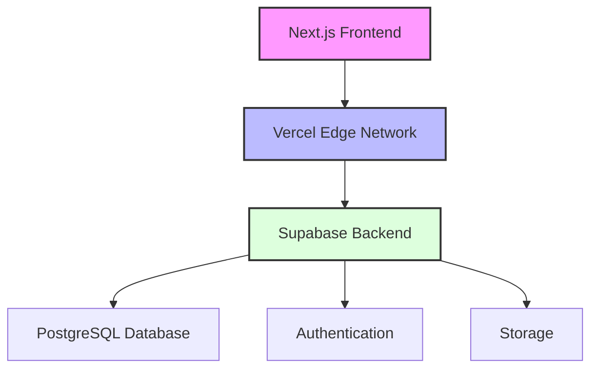

# 🚀 Neothink Platforms Ecosystem

Welcome to the future of integrated human achievement! This monorepo houses our family of transformative platforms, working together to unlock unprecedented potential in business, personal growth, and health optimization.

## 🎯 Core User Experience

Our platforms are designed to serve three essential roles in every member's journey:

### 1. 📚 The Subscriber
Access premium content and features across platforms:
- Complete learning materials
- Premium tools and resources
- Exclusive content libraries
- Platform-specific features

### 2. 👥 The Participant
Engage actively in platform communities:
- Live events and workshops
- Community discussions
- Implementation support
- Peer collaboration

### 3. 🌟 The Contributor
Shape and enhance the platform ecosystem:
- Share success stories
- Mentor other members
- Create valuable content
- Lead community initiatives

## ✨ Our Platforms

Each platform represents a powerful path to excellence, working together to create something truly extraordinary:

| Platform | Purpose | Access | Value |
|----------|---------|---------|---------|
| [🌟 Hub](https://go.neothink.io) | Prosper Happily Forever | Go Further, Faster, Forever | Your gateway to complete life mastery as a Superachiever |
| [💎 Ascender](https://www.joinascenders.org) | Greater Prosperity | Ascension + FLOW + Ascenders | Become wealthier and your wealthiest as a value creator ($99/m) |
| [🌱 Neothinker](https://www.joinneothinkers.org) | Greater Happiness | Neothink + Mark Hamilton + Neothinkers | Become happier and your happiest as an integrated thinker ($99/m) |
| [⚡ Immortal](https://www.joinimmortals.org) | Greater Longevity | Immortalis + Project Life + Immortals | Become healthier and your healthiest as a self-leader ($99/m) |

### 🎯 Superachiever Access
Unlock your full potential by being, doing, and having it all as a Superachiever - access all platforms for $297/m.

## 🏗️ Architecture

We've chosen the most powerful, modern tools to create an exceptional experience:



Built with:
- 🎨 **Next.js**: Creating beautiful, responsive interfaces
- 🔐 **Supabase**: Powering secure, real-time experiences
- 💅 **Tailwind CSS**: Crafting stunning, unique designs
- 🛡️ **TypeScript**: Ensuring rock-solid reliability
- 🚄 **Vercel**: Delivering lightning-fast performance

## 📁 Repository Structure

Our codebase is thoughtfully organized for maximum efficiency and clarity:

```
/
├── 🏢 Platform Applications
│   ├── 🌟 go.neothink.io/     # Your command center for complete life mastery
│   ├── 💎 joinascenders/      # Greater Prosperity platform
│   ├── 🌱 joinneothinkers/    # Greater Happiness platform
│   └── ⚡ joinimmortals/      # Greater Longevity platform
├── 📚 lib/                    # Shared Libraries
│   ├── 🎨 ui/                # Beautiful components
│   ├── 🔑 auth/              # Secure authentication
│   ├── 🔌 api/               # Powerful utilities
│   └── 🗃️ supabase/          # Database magic
├── 🔧 supabase/              # Database configuration
├── 📜 scripts/               # Utility scripts
├── 📖 docs/                  # Comprehensive Guides
└── 📦 types/                 # TypeScript definitions
```

## ⭐ Core Features

Experience the power of integration:

- 🔑 **Unified Authentication**: One key to unlock all platforms
- 🔄 **Cross-Platform Magic**: Seamless movement between experiences
- 🎨 **Shared Components**: Beautiful, consistent interfaces
- 🎯 **Platform-Specific Theming**: Unique identity for each journey
- 👥 **Role-Based Access**: The right features for every user
- 🌟 **Superachiever Bundle**: Ultimate access to everything

## 🚀 Getting Started

Ready to begin? Let's get you set up:

```bash
# Install the magic ✨
npm install

# Configure your environment 🔧
cp .env.example .env.local

# Launch your development journey 🚀
npm run dev
```

For detailed setup wisdom, see our [Monorepo Guide](docs/development/MONOREPO-GUIDE.md).

## 📚 Documentation

### For Visionaries
- [🎯 Unified Platform Overview](docs/UNIFIED-PLATFORM.md) - Discover the complete vision
- [⚡ Why Modern Stack](docs/WHY-MODERN-STACK.md) - Experience the power of modern technology

### For Creators
- [🔧 Technical Implementation](docs/TECHNICAL-IMPLEMENTATION.md) - Master the details
- [📖 Development Guides](docs/development/) - Learn the craft
- [🏗️ Technical Reference](docs/reference/) - Explore the architecture

## 🌊 Development Flow

Our development process is smooth and efficient:

1. 🔨 **Local Development**
   - Navigate with ease (`/hub`, `/ascenders`, etc.)
   - Work with live data

2. 🧪 **Staging**
   - Preview your changes instantly
   - Test with confidence

3. 🚀 **Production**
   - Deploy with precision
   - Monitor with clarity

## 🤝 Contributing

Join us in building something extraordinary:

1. 🌱 Branch from `main`
2. ✨ Create magic
3. 📬 Submit your work
4. ✅ Pass the tests
5. 👥 Get reviewed

## 📜 License

Proprietary © 2025 Neothink. All rights reserved.

---

<div align="center">

**Building the future of human achievement, one platform at a time.**

[Get Started](#getting-started) • [Read Docs](#documentation) • [Contribute](#contributing)

</div> 