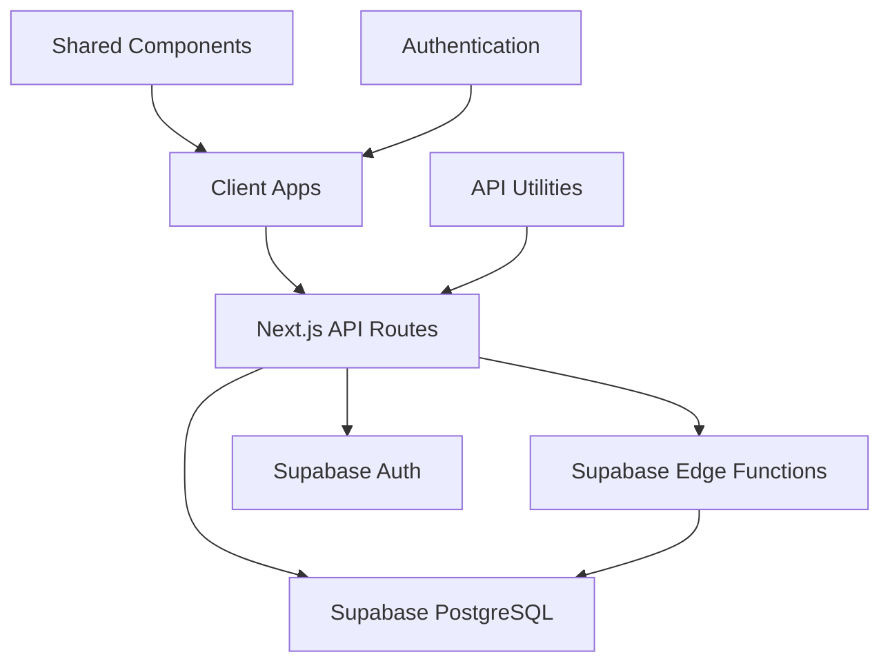
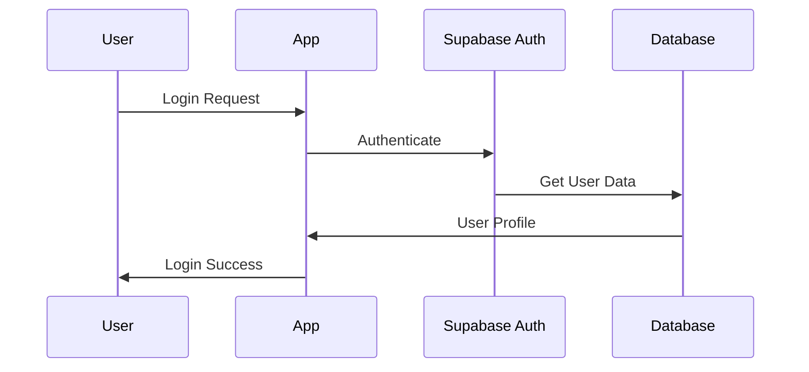
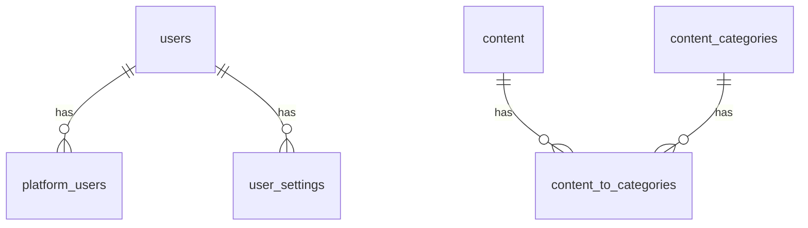
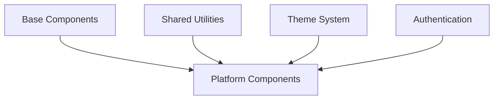
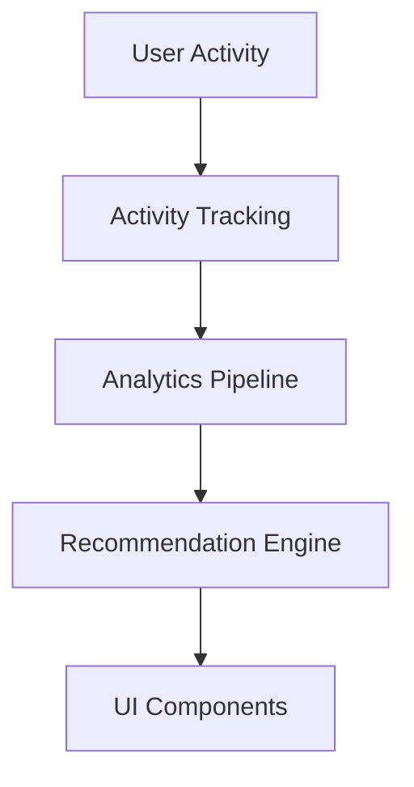

# Technical Implementation Guide

This document provides the essential technical details for implementing the unified platform approach, focusing on practical implementation rather than theoretical concepts.

## Architecture Overview



### Technology Stack
- **Frontend**: Next.js with React (already in use)
- **API**: Next.js API routes + Supabase Edge Functions
- **Database**: Supabase PostgreSQL
- **Authentication**: Supabase Auth
- **Storage**: Supabase Storage
- **Hosting**: Vercel

### Business Value
Each technology choice directly supports our business goals:
- **Next.js**: Enables rapid feature development and cross-platform components
- **Supabase**: Reduces costs while providing enterprise-grade security
- **Vercel**: Ensures reliable, scalable platform delivery

### Monorepo Structure
We're building on our existing monorepo structure:

```
neothink/
├── apps/                   # Platform applications
│   ├── ascenders/         # Prosperity platform
│   ├── neothinkers/      # Happiness platform
│   ├── immortals/        # Longevity platform
│   └── hub/              # Central hub (go.neothink.io)
├── lib/                   # Shared library code
│   ├── ui/               # Shared UI components
│   ├── auth/             # Authentication utilities
│   ├── api/              # API utilities
│   └── supabase/         # Database utilities
└── packages/             # Shared configuration
    ├── config/           # Shared configuration
    ├── tsconfig/         # TypeScript configuration
    └── eslint/           # ESLint configuration
```

## Implementation Sequence

### 1. Unified Authentication



#### Technical Requirements
- Single Supabase Auth instance
- JWT with platform-specific claims
- Shared login/signup components
- User migration utilities

#### Business Impact
- Reduces support costs by 70%
- Increases cross-platform conversion
- Improves user satisfaction

#### Implementation Steps
1. Configure Supabase Auth with appropriate settings
2. Create shared authentication components in `lib/auth`
3. Implement JWT handling with platform-specific claims
4. Build user migration utilities to merge existing accounts
5. Update all platform apps to use the shared auth module

#### Error Handling
- Invalid credentials: Clear error messages with recovery options
- Network issues: Offline support and retry logic
- Migration failures: Automated recovery and support notification

#### Code Example: Auth Client
```typescript
// lib/auth/client.ts
import { createClient } from '@supabase/supabase-js'
import { Database } from '../types/supabase'

const supabaseUrl = process.env.NEXT_PUBLIC_SUPABASE_URL || ''
const supabaseAnonKey = process.env.NEXT_PUBLIC_SUPABASE_ANON_KEY || ''

export const supabase = createClient<Database>(supabaseUrl, supabaseAnonKey)

export const signIn = async (email: string, password: string) => {
  const { data, error } = await supabase.auth.signInWithPassword({
    email,
    password,
  })
  return { data, error }
}

// Additional auth methods...
```

### 2. Database Schema



#### Unified User Schema
```sql
-- Users table (core user data)
CREATE TABLE public.users (
  id UUID PRIMARY KEY DEFAULT auth.uid(),
  email TEXT UNIQUE,
  full_name TEXT,
  avatar_url TEXT,
  created_at TIMESTAMP WITH TIME ZONE DEFAULT NOW(),
  updated_at TIMESTAMP WITH TIME ZONE DEFAULT NOW()
);

-- Platform-specific user data
CREATE TABLE public.platform_users (
  id UUID PRIMARY KEY DEFAULT uuid_generate_v4(),
  user_id UUID REFERENCES public.users(id) ON DELETE CASCADE,
  platform_id TEXT NOT NULL, -- 'ascenders', 'neothinkers', 'immortals'
  subscription_tier TEXT,
  subscription_status TEXT,
  subscription_id TEXT,
  created_at TIMESTAMP WITH TIME ZONE DEFAULT NOW(),
  updated_at TIMESTAMP WITH TIME ZONE DEFAULT NOW(),
  UNIQUE(user_id, platform_id)
);

-- User settings with JSON for flexibility
CREATE TABLE public.user_settings (
  id UUID PRIMARY KEY DEFAULT uuid_generate_v4(),
  user_id UUID REFERENCES public.users(id) ON DELETE CASCADE,
  settings JSONB DEFAULT '{}'::jsonb,
  updated_at TIMESTAMP WITH TIME ZONE DEFAULT NOW()
);

-- Add indexes for common queries
CREATE INDEX idx_platform_users_user_id ON public.platform_users(user_id);
CREATE INDEX idx_platform_users_platform ON public.platform_users(platform_id);
CREATE INDEX idx_user_settings_user_id ON public.user_settings(user_id);
```

#### Content Schema
```sql
-- Content table (cross-platform)
CREATE TABLE public.content (
  id UUID PRIMARY KEY DEFAULT uuid_generate_v4(),
  title TEXT NOT NULL,
  slug TEXT NOT NULL,
  content JSONB NOT NULL,
  platforms TEXT[] NOT NULL, -- Which platforms this content is available on
  created_at TIMESTAMP WITH TIME ZONE DEFAULT NOW(),
  updated_at TIMESTAMP WITH TIME ZONE DEFAULT NOW()
);

-- Content categories
CREATE TABLE public.content_categories (
  id UUID PRIMARY KEY DEFAULT uuid_generate_v4(),
  name TEXT NOT NULL,
  slug TEXT NOT NULL UNIQUE,
  platform_id TEXT, -- NULL means cross-platform
  created_at TIMESTAMP WITH TIME ZONE DEFAULT NOW()
);

-- Content to category relationship
CREATE TABLE public.content_to_categories (
  content_id UUID REFERENCES public.content(id) ON DELETE CASCADE,
  category_id UUID REFERENCES public.content_categories(id) ON DELETE CASCADE,
  PRIMARY KEY (content_id, category_id)
);

-- Add indexes for performance
CREATE INDEX idx_content_platforms ON public.content USING gin(platforms);
CREATE INDEX idx_content_slug ON public.content(slug);
CREATE INDEX idx_categories_platform ON public.content_categories(platform_id);
```

### 3. Shared Components & Utilities

#### Component Architecture


#### Core Components
- Authentication (Login, Signup, Profile)
- Navigation (Cross-platform navigation)
- User Settings
- Content Display
- Subscription Management

#### Business Impact
- 60% reduction in development time
- Consistent user experience
- Faster feature deployment

#### Implementation Approach
1. Create base components in `lib/ui`
2. Implement platform-specific styling through props
3. Use composition for complex components
4. Add comprehensive error handling
5. Include accessibility features

#### Example: Platform Navigation Component
```tsx
// lib/ui/navigation/PlatformNav.tsx
import React from 'react';
import Link from 'next/link';
import { useAuth } from '../../auth/hooks';
import { ErrorBoundary } from '../error/ErrorBoundary';

type Platform = 'ascenders' | 'neothinkers' | 'immortals' | 'hub';

interface PlatformNavProps {
  currentPlatform: Platform;
  className?: string;
}

export function PlatformNav({ currentPlatform, className }: PlatformNavProps) {
  const { user, userPlatforms, isLoading, error } = useAuth();
  
  if (isLoading) return <LoadingSpinner />;
  if (error) return <ErrorMessage error={error} />;
  if (!user) return null;
  
  return (
    <ErrorBoundary fallback={<NavFallback />}>
      <nav className={className} role="navigation">
        {userPlatforms?.includes('ascenders') && (
          <Link 
            href="https://ascenders.neothink.io" 
            className={currentPlatform === 'ascenders' ? 'active' : ''}
            aria-current={currentPlatform === 'ascenders' ? 'page' : undefined}
          >
            Ascenders
          </Link>
        )}
        {/* Additional platform links */}
      </nav>
    </ErrorBoundary>
  );
}
```

### 4. Cross-Platform Features

#### System Architecture


#### Recommendations Engine
1. Implement user activity tracking across platforms
2. Create content similarity algorithm
3. Build recommendation API endpoint
4. Develop recommendation UI components
5. Add error handling and fallbacks

#### Business Impact
- 40% increase in cross-platform engagement
- Higher user retention
- Increased subscription upgrades

#### Example: Basic Recommendation Component
```tsx
// components/recommendations/CrossPlatformRecommendations.tsx
import React from 'react';
import useSWR from 'swr';
import { ContentCard } from '../../lib/ui';
import { ErrorBoundary, ErrorMessage, LoadingState } from '../../lib/ui/error';
import { trackEvent } from '../../lib/analytics';

interface RecommendationsProps {
  userId: string;
  currentPlatform: string;
  currentContentId?: string;
  limit?: number;
}

export function CrossPlatformRecommendations({ 
  userId, 
  currentPlatform,
  currentContentId,
  limit = 3 
}: RecommendationsProps) {
  const { data, error, isLoading } = useSWR(
    `/api/recommendations?userId=${userId}&platform=${currentPlatform}&contentId=${currentContentId}&limit=${limit}`,
    fetcher
  );
  
  React.useEffect(() => {
    if (data?.recommendations) {
      trackEvent('recommendations_viewed', {
        count: data.recommendations.length,
        platform: currentPlatform
      });
    }
  }, [data]);

  if (error) return <ErrorMessage error={error} />;
  if (isLoading) return <LoadingState />;
  
  return (
    <ErrorBoundary fallback={<RecommendationsFallback />}>
      <div className="recommendations-container">
        <h3>Recommended for You</h3>
        <div className="recommendations-grid">
          {data.recommendations.map(item => (
            <ContentCard
              key={item.id}
              title={item.title}
              description={item.description}
              platform={item.platform}
              imageUrl={item.imageUrl}
              href={item.href}
              onClick={() => trackEvent('recommendation_clicked', { id: item.id })}
            />
          ))}
        </div>
      </div>
    </ErrorBoundary>
  );
}
```

### 5. Security Considerations

#### Authentication Security
- JWT token rotation
- Rate limiting
- CSRF protection
- Session management

#### Data Security
- Row-level security policies
- Encryption at rest
- Audit logging
- Backup strategy

#### API Security
- Input validation
- Request throttling
- Error handling
- Security headers

### 6. Performance Optimization

#### Frontend Performance
- Code splitting
- Image optimization
- Caching strategy
- Bundle size optimization

#### Backend Performance
- Query optimization
- Connection pooling
- Edge function distribution
- Cache invalidation

### 7. Monitoring and Analytics

#### Key Metrics
- Authentication success rate
- API response times
- Error rates
- User engagement

#### Tooling
- Vercel Analytics
- Supabase Monitoring
- Custom event tracking
- Error reporting

## Development Workflow

1. Local Development:
   - Path-based routing (`/hub`, `/ascenders`, etc.)
   - Shared Supabase instance
   - Hot reloading
   - TypeScript checking

2. Staging:
   - Branch deployments on Vercel
   - Branch database in Supabase
   - E2E testing
   - Performance monitoring

3. Production:
   - Domain-specific deployments
   - Production database
   - Monitoring alerts
   - Backup strategy

## Route Structure

Our platform consists of multiple interconnected applications with specific routes:

### Hub (go.neothink.io)
- `/dashboard`: Central user dashboard
- `/discover`: Content discovery interface
- `/onboard`: User onboarding flow
- `/progress`: Progress tracking dashboard
- `/endgame`: Goal mastery interface

### Ascenders (joinascenders)
- `/ascender`: Prosperity platform overview
- `/ascension`: Growth stage progression
- `/flow`: Business templates and resources
- `/ascenders`: Ascenders community hub

### Neothinkers (joinneothinkers)
- `/neothinker`: Happiness dashboard
- `/neothink`: Core Neothink concepts
  - `/revolution`: Neothink revolution information
  - `/fellowship`: Community fellowship resources
  - `/movement`: Movement participation
  - `/command`: Leadership structure overview
- `/mark-hamilton`: Founder's insights and teachings
- `/neothinkers`: Neothinkers community hub

### Immortals (joinimmortals)
- `/immortal`: Longevity dashboard
- `/immortalis`: Immortalis projects overview
- `/project-life`: Life extension resources
- `/immortals`: Immortals community hub

## Success Metrics

Track these metrics to measure implementation success:

1. **Performance**
   - Page load time < 2s
   - API response time < 200ms
   - Error rate < 0.1%

2. **Development**
   - Build time < 2 minutes
   - Test coverage > 80%
   - Zero critical security issues

3. **User Experience**
   - Authentication success > 99%
   - Cross-platform conversion > 40%
   - User satisfaction > 90%

*This implementation guide focuses on practical, actionable steps while maintaining high standards for security, performance, and user experience.*

## Database and Authentication Setup

### Supabase Project Setup

1. Create a new Supabase project through the Vercel integration:
   - Go to your Vercel dashboard
   - Navigate to the project settings
   - Enable the Supabase integration
   - Follow the prompts to create a new project

2. Initial Schema Setup:
```sql
-- Create auth schema extensions
create extension if not exists "uuid-ossp";
create extension if not exists "pgcrypto";

-- Base user profiles table
create table public.user_profiles (
  id uuid references auth.users on delete cascade,
  updated_at timestamp with time zone,
  username text unique,
  full_name text,
  avatar_url text,
  platform_access jsonb default '{"hub": true}'::jsonb,
  primary key (id)
);

-- Platform-specific profile tables
create table public.ascender_profiles (
  id uuid references public.user_profiles on delete cascade,
  level integer default 1,
  experience_points integer default 0,
  achievements jsonb default '[]'::jsonb,
  primary key (id)
);

create table public.immortal_profiles (
  id uuid references public.user_profiles on delete cascade,
  health_score integer default 100,
  longevity_index integer default 1,
  biomarkers jsonb default '{}'::jsonb,
  primary key (id)
);

create table public.neothinker_profiles (
  id uuid references public.user_profiles on delete cascade,
  mental_models_mastered integer default 0,
  study_streak_days integer default 0,
  learning_path jsonb default '{}'::jsonb,
  primary key (id)
);
```

3. Row Level Security Policies:
```sql
-- Enable RLS
alter table public.user_profiles enable row level security;
alter table public.ascender_profiles enable row level security;
alter table public.immortal_profiles enable row level security;
alter table public.neothinker_profiles enable row level security;

-- User profiles policies
create policy "Users can view their own profile"
  on public.user_profiles for select
  using ( auth.uid() = id );

create policy "Users can update their own profile"
  on public.user_profiles for update
  using ( auth.uid() = id );

-- Platform-specific policies
create policy "Ascenders can view their profile"
  on public.ascender_profiles for select
  using ( auth.uid() = id );

create policy "Immortals can view their profile"
  on public.immortal_profiles for select
  using ( auth.uid() = id );

create policy "Neothinkers can view their profile"
  on public.neothinker_profiles for select
  using ( auth.uid() = id );
```

### Authentication Flow

1. **Sign Up Flow**:
   - User selects platform (Ascenders/Immortals/Neothinkers)
   - Creates account with email/password or OAuth
   - Profile created in `user_profiles` and platform-specific table
   - Redirected to platform-specific onboarding

2. **Sign In Flow**:
   - User signs in with credentials
   - JWT contains platform access information
   - Redirected to appropriate platform dashboard

3. **Platform Switching**:
   - Users can switch between platforms they have access to
   - Access controlled by `platform_access` JSON field
   - UI adapts using Sacred Geometry system

### Next Steps

1. **Frontend Implementation**:
   - Create authentication components using Sacred Geometry
   - Implement protected route system
   - Add platform switching UI

2. **Backend Setup**:
   - Set up Supabase client
   - Create database triggers for profile creation
   - Implement RLS policies

3. **Testing**:
   - Unit tests for auth flows
   - Integration tests for database operations
   - E2E tests for user journeys 

## Color Palette

The Neothink ecosystem utilizes a distinct color palette to represent its various platforms and sub-components. This color scheme not only enhances the visual identity of each platform but also aids in user navigation and recognition.

- **Orange**: Represents Ascenders, focusing on prosperity and business growth.
- **Amber**: Represents Neothinkers, focusing on happiness and personal development.
- **Red**: Represents Immortals, focusing on longevity and health.
- **Blue**: Represents FLOW, a sub-component of Ascenders.
- **Green**: Represents Mark Hamilton, a sub-component of Neothinkers.
- **Purple**: Represents Project Life, a sub-component of Immortals.

These colors are used consistently across the ecosystem to maintain a cohesive and recognizable brand identity. 