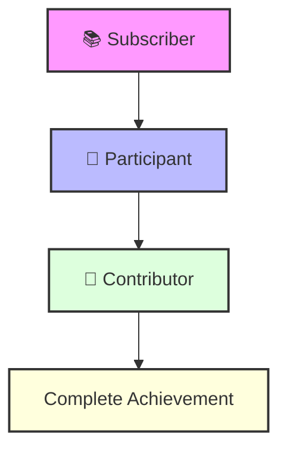
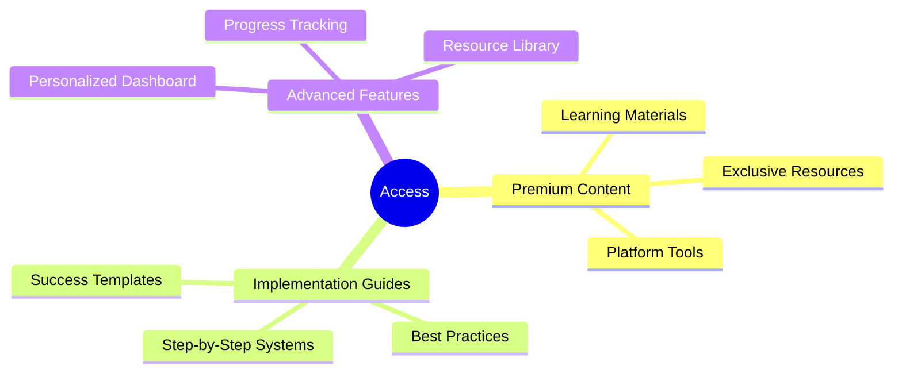
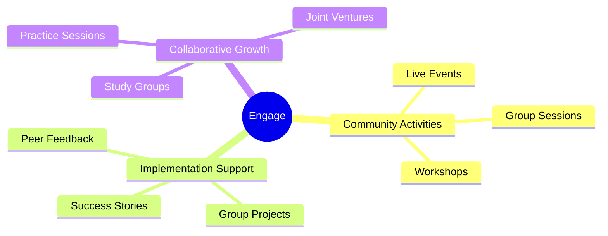
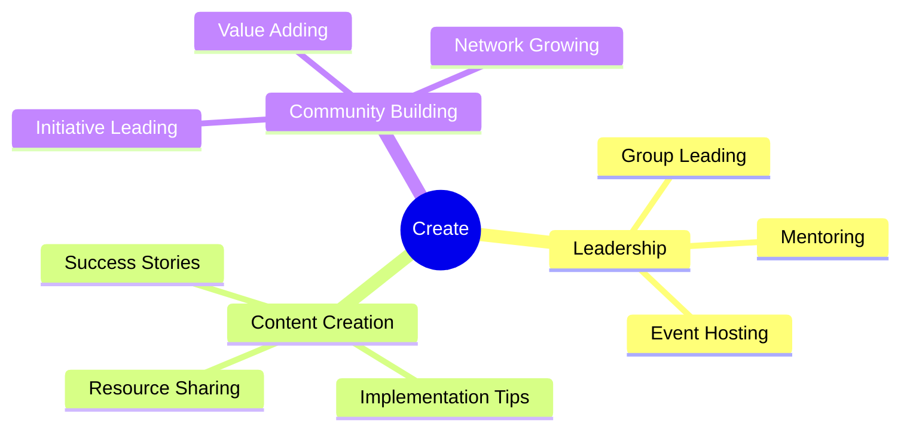

# 🌟 The Neothink Unified Platform Vision

## 🎯 Executive Summary

Our unified platform empowers members through three essential roles:

Each platform supports this journey:

- **💎 Ascender**: Greater Prosperity through value creation
  - Subscribe to Ascension + FLOW + Ascenders
  - Participate in business growth activities
  - Contribute to entrepreneurial success

- **🌱 Neothinker**: Greater Happiness through integrated thinking
  - Subscribe to Neothink + Mark Hamilton + Neothinkers
  - Participate in personal development
  - Contribute to collective wisdom

- **⚡ Immortal**: Greater Longevity through self-leadership
  - Subscribe to Immortalis + Project Life + Immortals
  - Participate in health optimization
  - Contribute to longevity research

## 🌈 The Power of Integration

When these roles work together across platforms, transformation happens:

### The Subscriber Journey

### The Participant Journey

### The Contributor Journey

## 🚀 Platform Integration

We support each role through:

### 1. Subscriber Success 📚
- Unified access to all content
- Seamless platform navigation
- Integrated learning paths
- Premium feature access

### 2. Participant Growth 👥
- Cross-platform events
- Unified community access
- Collaborative opportunities
- Implementation support

### 3. Contributor Impact 🌟
- Leadership opportunities
- Content creation tools
- Mentorship programs
- Value recognition

## 💫 Success Metrics

We measure success through:

| Role | Metrics | Impact |
|------|---------|--------|
| 📚 Subscriber | Content Engagement, Feature Usage | Knowledge Growth |
| 👥 Participant | Event Attendance, Community Activity | Implementation Success |
| 🌟 Contributor | Value Creation, Community Impact | Ecosystem Growth |

## 🌅 The Future

Together, we're building a platform where:
- Subscribers access transformative knowledge
- Participants implement and grow together
- Contributors shape the future of achievement

---

### 🌟 Join Us in Transforming Lives

[Subscribe Now](#) • [Start Participating](#) • [Become a Contributor](#)

 