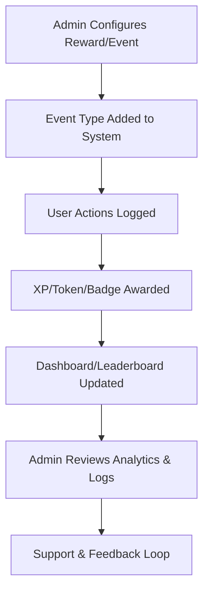

# Platform Administration Guide

Welcome to the Neothink Platform administration guide. This comprehensive documentation will help you manage all aspects of the unified platform serving Hub, Immortals, Ascenders, and Neothinkers applications.

## Quick Navigation

- [Admin Continuous Improvement](CONTINUOUS_IMPROVEMENT.md)
- [Security & RLS](../../SECURITY.md)
- [Gamification & Tokenomics API](../api/gamification.md)
- [Database & Schema](../architecture/database.md)
- [Monitoring & Analytics](../monitoring/README.md)
- [Feedback & Support](../support/README.md)

## Platform Overview

The Neothink Platform consists of four integrated applications:

1. **Hub** (go.neothink.io)
   - Central knowledge repository
   - User management hub
   - Cross-platform navigation
   - System-wide analytics

2. **Immortals** (joinimmortals.com)
   - Health tracking
   - Legacy creation
   - Immortal society features
   - Health data integration

3. **Ascenders** (joinascenders.com)
   - Business goal tracking
   - Neo-Tech business implementation
   - Performance metrics
   - Business value creation

4. **Neothinkers** (joinneothinkers.com)
   - Learning management
   - Thought exercises
   - Progress tracking
   - Knowledge integration

## ✨ Admin Experience (2025 Update)

**For Admins:**
- Access actionable dashboards for user, content, and reward management.
- Tune gamification multipliers, onboarding rewards, and app-specific challenges.
- Monitor engagement, analytics, and system health in real time.
- Review audit logs, enforce RLS, and manage compliance.
- Leverage continuous improvement rituals and analytics for platform evolution.

**For Users:**
- Transparent admin actions: see how governance, content, and rewards are managed.
- Clear escalation paths for support, feedback, and issue resolution.

## 🚀 What’s New?
- Centralized admin controls for all apps and shared Supabase database.
- Enhanced analytics and monitoring tools.
- Step-by-step guides for onboarding, tuning, and compliance.
- Real-time feedback and audit trails.

## 🗺️ Admin & User Journeys
- **Admins:**
  1. Monitor onboarding, engagement, and analytics
  2. Tune reward logic and multipliers
  3. Manage users, permissions, and content
  4. Review feedback, compliance, and iterate
- **Users:**
  1. See transparent admin actions
  2. Escalate issues and provide feedback

## 🧭 User vs. Admin Comparison Table

| Feature/Capability      | Users (Players)                                                                                   | Admins (Game Masters)                                                                                 |
|------------------------|--------------------------------------------------------------------------------------------------|------------------------------------------------------------------------------------------------------|
| Earn Points/Tokens     | Complete actions, challenges, referrals, cross-app events                                         | Configure/tune rewards, add new event types                                                          |
| Spend Points/Tokens    | Unlock features, vote, participate in crowdfunding, make purchases                                | Monitor token sinks, approve large spends, refund/adjust in rare cases                               |
| Level Up/Progress      | Progress through tiers, earn badges, see dashboard/leaderboard                                    | Set progression rules, define badge criteria, monitor leaderboards                                   |
| View Badges/Rewards    | See earned badges, streaks, and rewards in profile                                                | Create/manage badge types, audit badge issuance, handle disputes                                     |
| Privacy & Data Rights  | Data protected by RLS, can request corrections, see audit logs for own actions                    | Enforce RLS, review all event logs, handle data requests, manage incident response                   |
| Support & Troubleshoot | Access FAQ, troubleshooting, and support channels                                                 | Respond to support tickets, investigate user issues, monitor system health                           |
| Analytics/Insights     | See personal stats, progress, and rankings                                                        | Access full analytics, engagement dashboards, and cohort analysis                                    |
| Governance             | Vote, propose ideas, participate in DAO/Coop governance                                           | Set up proposals, manage voting, enforce quadratic/delegated voting, handle vetoes                   |
| Feedback               | Submit feedback, suggest improvements, participate in surveys                                     | Review feedback, iterate reward logic, update docs, communicate changes                              |

## 🏆 How It Works: Admin Journey Example

1. **Configure Rewards:** Use the admin dashboard to set up new rewards, multipliers, and onboarding flows.
2. **Monitor Events:** Review all logs in the gamification_events and related tables for audit and analytics.
3. **Tune & Improve:** Use analytics to iterate reward logic, optimize engagement, and address feedback.
4. **Handle Incidents:** Respond to support tickets, investigate discrepancies, and enforce RLS/security.
5. **Governance:** Set up proposals, manage voting, and oversee DAO/Coop operations.
6. **Continuous Improvement:** Update docs, policies, and flows based on analytics and user/admin input.

## ❓ FAQ & Troubleshooting (Expanded)

**For Admins:**
- How do I add a new event/reward type?
- How do I tune multipliers or streaks?
- How do I audit a user’s actions or investigate a support ticket?
- How do I manage badge criteria and disputes?
- How do I enforce RLS and security best practices?
- How do I use analytics to improve engagement?

## 📈 Visual Diagram: Admin Action Flow (Markdown)



## 🔄 Continuous Improvement
- Admin docs, dashboards, and flows are reviewed and updated regularly based on feedback and analytics.
- All changes are tracked in the [Changelog](../../CHANGELOG.md).

## Administrative Responsibilities

### 1. User Management
- User account administration
- Role-based access control
- Permission management
- User support and assistance

### 2. Content Management
- Content moderation
- Version control
- Publishing workflow
- Content organization

### 3. Security
- Access control
- Security monitoring
- Threat detection
- Compliance management

### 4. System Health
- Performance monitoring
- Error tracking
- Resource optimization
- Backup management

### 5. Analytics
- Usage metrics
- User engagement
- Performance analytics
- Business insights

## Best Practices

### Security
- Regular security audits
- Multi-factor authentication enforcement
- Access review procedures
- Security incident response

### Performance
- Resource optimization
- Cache management
- Database maintenance
- Load balancing

### User Support
- Response time standards
- Issue escalation procedures
- User communication guidelines
- Support documentation

### Content Management
- Content review process
- Quality standards
- Version control practices
- Backup procedures

## Administrative Tools

### 1. Admin Dashboard
- User management interface
- Content management system
- Analytics dashboard
- System health monitoring

### 2. Security Tools
- Access control panel
- Security log viewer
- Threat detection system
- Compliance checker

### 3. Analytics Tools
- Usage metrics dashboard
- Performance analytics
- User engagement tracking
- Custom report builder

### 4. Content Tools
- Content management system
- Version control interface
- Publishing workflow
- Media management

## Common Administrative Tasks

### User Management
```typescript
// Example: Update user role
async function updateUserRole(userId: string, newRole: Role) {
  await supabase
    .from('user_roles')
    .update({ role: newRole })
    .match({ user_id: userId });
}
```

### Content Management
```typescript
// Example: Publish content
async function publishContent(contentId: string) {
  await supabase
    .from('content')
    .update({ status: 'published', published_at: new Date() })
    .match({ id: contentId });
}
```

### Security Management
```typescript
// Example: Lock user account
async function lockUserAccount(userId: string, reason: string) {
  await supabase
    .from('user_accounts')
    .update({ 
      status: 'locked',
      locked_at: new Date(),
      lock_reason: reason 
    })
    .match({ id: userId });
}
```

## Simulation Management

Admins can use the simulation feature to test changes to gamification and tokenomics before deploying them live. This enables data-driven decisions and continuous improvement.

### How to Run a Simulation
1. Go to the Simulation Dashboard (or use API).
2. Select or create a scenario (e.g., onboarding XP multiplier).
3. Adjust parameters and run the simulation (batch/Monte Carlo supported).
4. Review results in the `simulation_runs` table.
5. Capture learnings and iterate on platform logic.

### Best Practices
- Use scenario templates for repeatable tests.
- Compare results across multiple runs.
- Document learnings in the `notes` field.
- Use analytics to identify trends and outliers.

### Security & Compliance
- All simulation data is protected by RLS.
- Only authorized admins can view all simulation runs.
- Simulation results are auditable and can be exported for analysis.

## Troubleshooting

### Common Issues
1. User access problems
2. Content synchronization issues
3. Performance degradation
4. Security alerts

### Resolution Steps
1. Check system logs
2. Verify user permissions
3. Review recent changes
4. Monitor system metrics

## Support and Resources

### Technical Support
- Engineering team contact
- Emergency procedures
- Escalation matrix
- Documentation resources

### Training Resources
- Admin training materials
- Best practices guides
- Video tutorials
- Knowledge base

## Updates and Maintenance

### Scheduled Maintenance
- Database optimization
- Security updates
- Performance tuning
- Backup verification

### Emergency Procedures
- Incident response
- Communication protocols
- Recovery procedures
- Post-mortem analysis

## Compliance and Reporting

### Compliance Requirements
- Data protection
- Privacy regulations
- Security standards
- Industry compliance

### Regular Reports
- Usage statistics
- Security audits
- Performance metrics
- User analytics

## Contact Information

### Support Teams
- Technical support
- Security team
- Content team
- User support

### Emergency Contacts
- On-call engineer
- Security officer
- System administrator
- Database administrator 