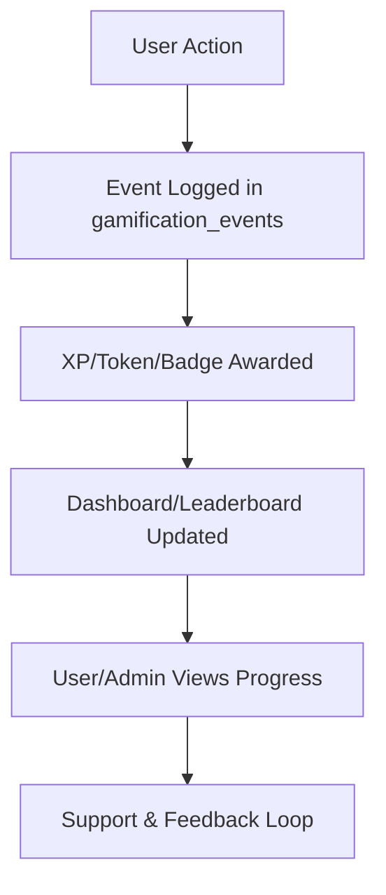

# Gamification & Tokenomics API

This page documents the core endpoints powering XP, tokens, badges, streaks, onboarding, and event logging for all user journeys (Ascender, Neothinker, Immortal, Superachiever).

---

## Endpoints

### 1. **Leaderboard**
- **GET** `/api/gamification/leaderboard`
  - Returns current leaderboard by XP, tokens, or badges.
  - Supports filters by archetype, timeframe, and team.

### 2. **Log Action**
- **POST** `/api/gamification/log-action`
  - Log a user action (e.g., quest, referral, event attendance).
  - **Body:** `{ userId, actionType, xp, tokens, metadata }`
  - Returns: `{ success, newXp, newTokens, eventId }`

### 3. **Log Census**
- **POST** `/api/gamification/log-census`
  - Log a census snapshot (e.g., streaks, daily activity, health check).
  - **Body:** `{ userId, snapshotType, value, metadata }`
  - Returns: `{ success, snapshotId }`

### 4. **Onboarding Event**
- **POST** `/api/gamification/onboarding-event`
  - Log onboarding progress (e.g., completed quest, tutorial step).
  - **Body:** `{ userId, step, completed, metadata }`
  - Returns: `{ success, eventId }`

### 5. **Profile**
- **GET** `/api/gamification/profile`
  - Returns gamification stats for the current user (XP, tokens, badges, streaks, referrals, level).

---

## 🧭 User vs. Admin Comparison Table

| Feature/Capability      | Users (Players)                                                                                   | Admins (Game Masters)                                                                                 |
|------------------------|--------------------------------------------------------------------------------------------------|------------------------------------------------------------------------------------------------------|
| Earn Points/Tokens     | Complete actions, challenges, referrals, cross-app events                                         | Configure/tune rewards, add new event types                                                          |
| Spend Points/Tokens    | Unlock features, vote, participate in crowdfunding, make purchases                                | Monitor token sinks, approve large spends, refund/adjust in rare cases                               |
| Level Up/Progress      | Progress through tiers, earn badges, see dashboard/leaderboard                                    | Set progression rules, define badge criteria, monitor leaderboards                                   |
| View Badges/Rewards    | See earned badges, streaks, and rewards in profile                                                | Create/manage badge types, audit badge issuance, handle disputes                                     |
| Privacy & Data Rights  | Data protected by RLS, can request corrections, see audit logs for own actions                    | Enforce RLS, review all event logs, handle data requests, manage incident response                   |
| Support & Troubleshoot | Access FAQ, troubleshooting, and support channels                                                 | Respond to support tickets, investigate user issues, monitor system health                           |
| Analytics/Insights     | See personal stats, progress, and rankings                                                        | Access full analytics, engagement dashboards, and cohort analysis                                    |
| Governance             | Vote, propose ideas, participate in DAO/Coop governance                                           | Set up proposals, manage voting, enforce quadratic/delegated voting, handle vetoes                   |
| Feedback               | Submit feedback, suggest improvements, participate in surveys                                     | Review feedback, iterate reward logic, update docs, communicate changes                              |

---

## 🏆 How It Works: User Journey Example

1. **Take an Action:** Complete a challenge, refer a friend, or attend an event.
2. **Event Logged:** Your action is logged in the gamification_events table.
3. **Earn Rewards:** XP/tokens/badges are awarded based on the action, multipliers, and streaks.
4. **Level Up & Unlock:** Progress through tiers, unlock new features, and earn badges.
5. **See Progress:** View your dashboard and leaderboard stats in real time.
6. **Get Support:** If you have questions or issues, access support and troubleshooting resources.

---

## 🛡️ How It Works: Admin Journey Example

1. **Configure Rewards:** Use the admin dashboard to set up new rewards, multipliers, and onboarding flows.
2. **Monitor Events:** Review all logs in the gamification_events and related tables for audit and analytics.
3. **Tune & Improve:** Use analytics to iterate reward logic, optimize engagement, and address feedback.
4. **Handle Incidents:** Respond to support tickets, investigate discrepancies, and enforce RLS/security.
5. **Governance:** Set up proposals, manage voting, and oversee DAO/Coop operations.
6. **Continuous Improvement:** Update docs, policies, and flows based on analytics and user/admin input.

---

## ✨ Gamification & Tokenomics: User & Admin Guide (2025)

### For Users
- **How to Earn Points:** Complete actions, challenges, referrals, and cross-app events. See your progress in your dashboard.
- **How to Spend Points:** Vote, unlock features, make purchases, and participate in crowdfunding.
- **Level Up:** Progress through tiers and earn badges for milestones.
- **Transparency:** All actions are logged and auditable.
- **Support:** FAQs and troubleshooting are available in the support docs.

### For Admins
- **Configure Rewards:** Tune multipliers, onboarding rewards, and app-specific challenges in the admin dashboard.
- **Audit Logs:** Review all point transactions and event logs for compliance.
- **Analytics:** Monitor engagement, leaderboards, and cross-app synergy.
- **Security:** Enforce RLS, positive-sum logic, and review function logs.
- **Continuous Improvement:** Use analytics and feedback to iterate reward logic.

## ❓ FAQ & Troubleshooting (Expanded)

**For Users:**
- How do I earn points/tokens?
- What are badges and how do I get them?
- Why didn’t I get a reward for my action?
- How do I see my progress?
- Who can see my data?
- How do I get help or report an issue?

**For Admins:**
- How do I add a new event/reward type?
- How do I tune multipliers or streaks?
- How do I audit a user’s actions or investigate a support ticket?
- How do I manage badge criteria and disputes?
- How do I enforce RLS and security best practices?
- How do I use analytics to improve engagement?

---

## 📈 Visual Diagram: Action Flow (Markdown)



---

## 📚 Quick Links
- [User Game Guides](../onboarding/README.md)
- [Admin Guide](../admin/ADMIN-OVERVIEW.md)
- [Database Schema](../architecture/database.md)
- [Security & RLS](../../SECURITY.md)

## 🗺️ User & Admin Flows
- **Users:** Earn points, complete challenges, participate in governance, get support.
- **Admins:** Configure rewards, monitor analytics, audit logs, improve mechanics.

## 🔄 Continuous Improvement
- Docs and APIs are reviewed and updated regularly based on user/admin feedback and analytics.
- All changes are tracked in the [Changelog](../../CHANGELOG.md).

---

## Example Usage

```ts
// Log an action (Next.js fetch example)
fetch('/api/gamification/log-action', {
  method: 'POST',
  headers: { 'Content-Type': 'application/json' },
  body: JSON.stringify({
    userId: 'user-uuid',
    actionType: 'attend_event',
    xp: 50,
    tokens: 1,
    metadata: { event: 'weekly_zoom' }
  })
});
```

---

## TypeScript Types

Types for all endpoints and payloads are auto-generated from the Supabase schema and available in:
- `packages/core/database/types.ts`
- `packages/database/src/types/database.types.ts`

---

## Feedback & Improvements

Found an issue or want to suggest an improvement? [Open an issue](https://github.com/NeothinkDAO/your-repo/issues/new/choose).

---

> All endpoints are protected and follow positive-sum, secure-by-default principles. See security docs for RLS and access policies.
