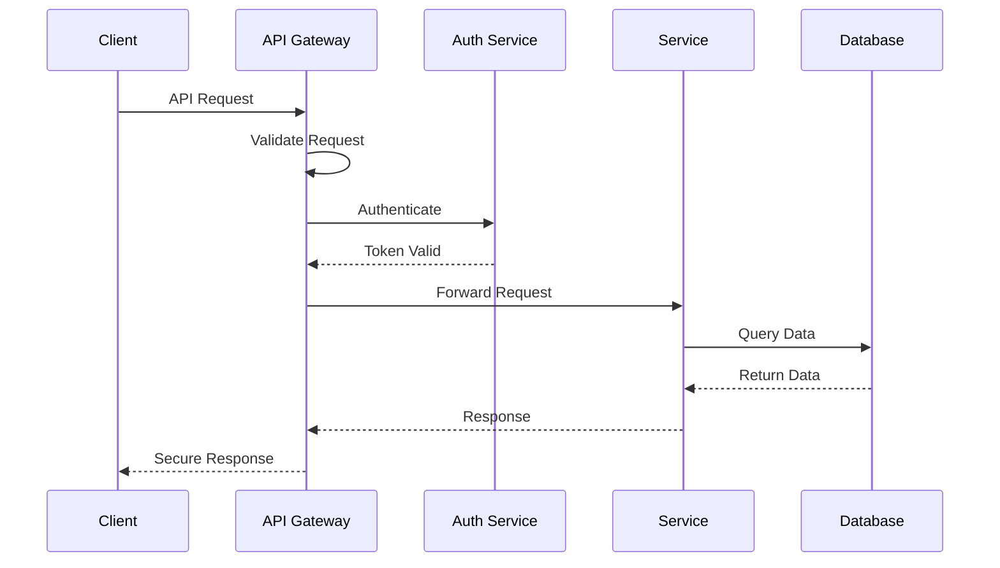

# API Security

This guide details the security measures implemented for the Neothink+ API ecosystem.

## Overview

The Neothink+ API security system implements:

- Authentication and authorization
- Rate limiting and throttling
- Input validation and sanitization
- Error handling and logging
- Security headers and CORS
- SSL/TLS configuration

## API Security Architecture



## Implementation

### API Gateway Configuration

```typescript
import { createMiddlewareClient } from '@supabase/auth-helpers-nextjs';
import { NextResponse } from 'next/server';
import type { NextRequest } from 'next/server';

export async function middleware(req: NextRequest) {
  const res = NextResponse.next();
  const supabase = createMiddlewareClient({ req, res });

  // Verify session
  const { data: { session } } = await supabase.auth.getSession();

  // Handle authentication
  if (!session && isProtectedRoute(req.nextUrl.pathname)) {
    return new NextResponse(
      JSON.stringify({ error: 'Unauthorized' }),
      { status: 401 }
    );
  }

  // Apply security headers
  applySecurityHeaders(res);

  return res;
}

function isProtectedRoute(pathname: string): boolean {
  const publicRoutes = [
    '/api/auth',
    '/api/public',
  ];
  
  return !publicRoutes.some(route => pathname.startsWith(route));
}

function applySecurityHeaders(res: NextResponse): void {
  // CORS headers
  res.headers.set('Access-Control-Allow-Origin', 'https://*.neothink.io');
  res.headers.set('Access-Control-Allow-Methods', 'GET, POST, PUT, DELETE');
  res.headers.set('Access-Control-Allow-Headers', 'Content-Type, Authorization');
  
  // Security headers
  res.headers.set('X-Content-Type-Options', 'nosniff');
  res.headers.set('X-Frame-Options', 'DENY');
  res.headers.set('X-XSS-Protection', '1; mode=block');
}
```

### Rate Limiting

```typescript
import rateLimit from 'express-rate-limit';
import RedisStore from 'rate-limit-redis';
import Redis from 'ioredis';

const redis = new Redis({
  host: process.env.REDIS_HOST,
  port: parseInt(process.env.REDIS_PORT!),
  password: process.env.REDIS_PASSWORD,
});

export const rateLimiter = rateLimit({
  store: new RedisStore({
    client: redis,
    prefix: 'rate-limit:',
  }),
  windowMs: 15 * 60 * 1000, // 15 minutes
  max: 100, // limit each IP to 100 requests per windowMs
  message: {
    error: 'Too many requests, please try again later.',
    retryAfter: 900, // 15 minutes in seconds
  },
  standardHeaders: true,
  legacyHeaders: false,
});

// Apply rate limiting to specific routes
app.use('/api/', rateLimiter);
```

### Input Validation

```typescript
import { z } from 'zod';

// Request validation schemas
export const apiSchemas = {
  createUser: z.object({
    email: z.string().email(),
    password: z.string().min(12),
    name: z.string().min(2),
  }),
  
  updateProfile: z.object({
    name: z.string().optional(),
    bio: z.string().max(500).optional(),
    settings: z.record(z.unknown()).optional(),
  }),
  
  createContent: z.object({
    title: z.string().min(1).max(200),
    content: z.string(),
    tags: z.array(z.string()).optional(),
    visibility: z.enum(['public', 'private', 'draft']),
  }),
};

// Validation middleware
export function validateRequest(schema: z.ZodSchema) {
  return async (req: Request, res: Response, next: NextFunction) => {
    try {
      await schema.parseAsync({
        body: req.body,
        query: req.query,
        params: req.params,
      });
      next();
    } catch (error) {
      res.status(400).json({
        error: 'Invalid request',
        details: error.errors,
      });
    }
  };
}
```

### Error Handling

```typescript
export class APIError extends Error {
  constructor(
    message: string,
    public code: string,
    public status: number,
    public details?: unknown
  ) {
    super(message);
    this.name = 'APIError';
  }
}

export function handleAPIError(
  error: unknown,
  req: Request,
  res: Response,
  next: NextFunction
) {
  if (error instanceof APIError) {
    // Log error
    logger.error({
      message: error.message,
      code: error.code,
      status: error.status,
      details: error.details,
      path: req.path,
      method: req.method,
      ip: req.ip,
    });

    // Send error response
    return res.status(error.status).json({
      error: error.message,
      code: error.code,
      ...(process.env.NODE_ENV === 'development' && {
        details: error.details,
      }),
    });
  }

  // Handle unknown errors
  logger.error(error);
  res.status(500).json({
    error: 'Internal server error',
    code: 'INTERNAL_ERROR',
  });
}
```

### Security Monitoring

```typescript
export class APIMonitor {
  constructor(private readonly config: MonitorConfig) {}

  async monitorRequest(req: Request, res: Response): Promise<void> {
    const startTime = process.hrtime();

    res.on('finish', () => {
      const [seconds, nanoseconds] = process.hrtime(startTime);
      const duration = seconds * 1000 + nanoseconds / 1000000;

      this.log({
        timestamp: new Date(),
        method: req.method,
        path: req.path,
        status: res.statusCode,
        duration,
        ip: req.ip,
        userAgent: req.headers['user-agent'],
        userId: req.user?.id,
      });
    });
  }

  private async log(entry: MonitorEntry): Promise<void> {
    await this.config.logger.info('api_request', entry);
  }
}
```

## Best Practices

1. **Authentication**
   - Use secure session management
   - Implement proper token validation
   - Apply rate limiting to auth endpoints
   - Monitor failed auth attempts

2. **Request Validation**
   - Validate all input parameters
   - Sanitize user input
   - Use strong typing
   - Implement schema validation

3. **Error Handling**
   - Use consistent error formats
   - Hide internal error details
   - Log all errors properly
   - Monitor error patterns

4. **Security Headers**
   - Set appropriate CORS policies
   - Use security headers
   - Enable HTTPS only
   - Configure CSP properly

## Testing

```typescript
describe('API Security', () => {
  describe('Authentication', () => {
    it('should reject requests without valid token', async () => {
      const response = await request(app)
        .get('/api/protected')
        .set('Authorization', 'Bearer invalid');
        
      expect(response.status).toBe(401);
    });
  });

  describe('Rate Limiting', () => {
    it('should limit excessive requests', async () => {
      for (let i = 0; i < 101; i++) {
        await request(app).get('/api/test');
      }
      
      const response = await request(app).get('/api/test');
      expect(response.status).toBe(429);
    });
  });

  describe('Input Validation', () => {
    it('should validate request parameters', async () => {
      const response = await request(app)
        .post('/api/users')
        .send({ email: 'invalid' });
        
      expect(response.status).toBe(400);
    });
  });
});
```

## Additional Resources

- [API Overview](./README.md)
- [Authentication Guide](../security/authentication.md)
- [Error Handling Guide](./error-handling.md)
- [Monitoring Guide](./monitoring.md)
- [Testing Guide](./testing.md) 