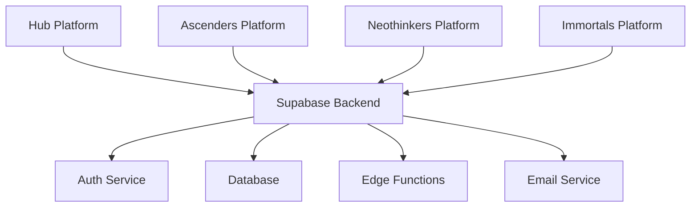
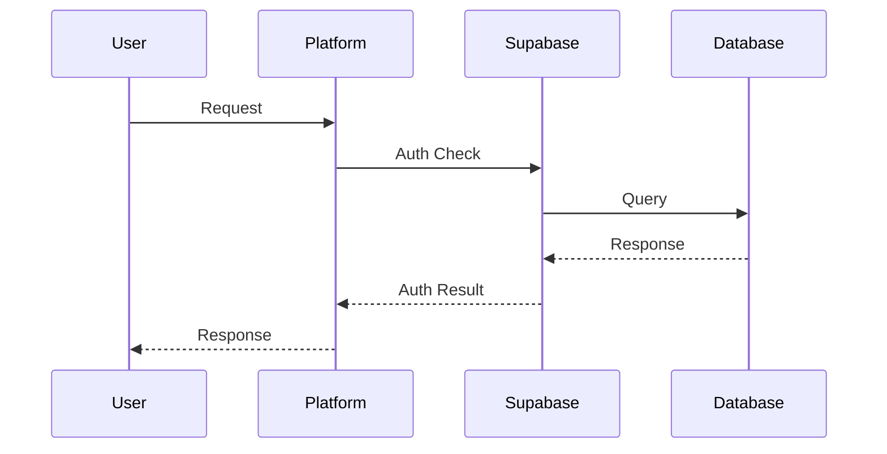
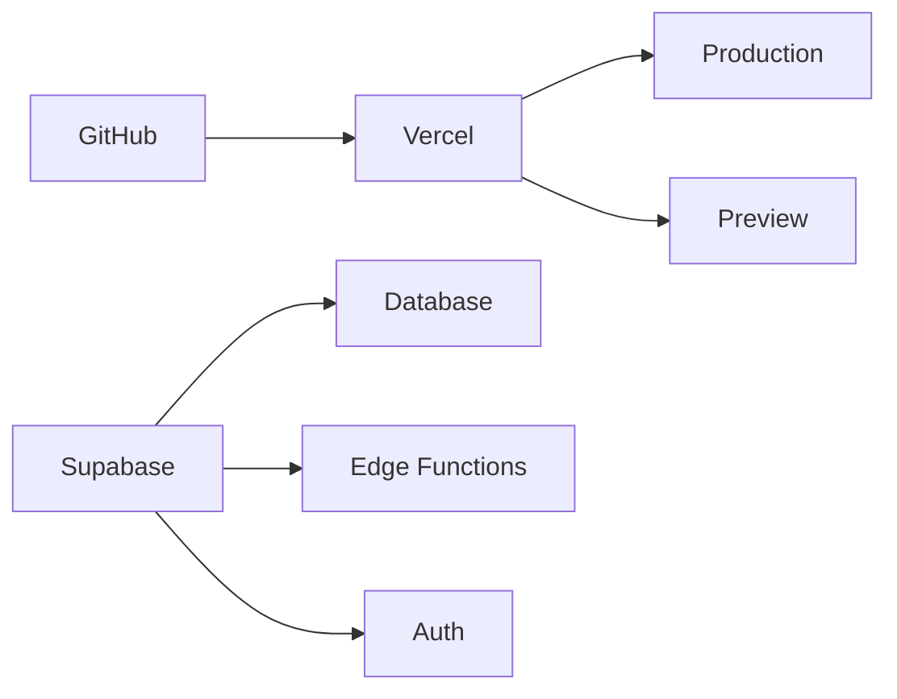

# Architecture Overview

> **Proprietary Notice:**  
> This project and all related documentation are proprietary software owned and controlled by Neothink DAO and the Mark Hamilton Family. All rights reserved. Unauthorized use, distribution, or reproduction is strictly prohibited. See the [LICENSE](../../LICENSE) file for details.

## System Architecture

The Neothink Platform monorepo uses a modular, monorepo-based architecture. Each application ("platform") is independently deployable, but all share a common Supabase backend and a set of shared packages for UI, authentication, database, and utilities.

## Key Components

1. **Frontend Platforms (apps/)**
   - Each platform is a Next.js 15 application
   - Deployed independently via Vercel
   - Share common UI, auth, and utilities from packages/
   - Platform-specific features and branding

2. **Backend Services (Supabase)**
   - Authentication and Authorization (Supabase Auth)
   - Database (PostgreSQL, managed by Supabase)
   - Edge Functions
   - Email Templates
   - Storage

3. **Shared Packages (packages/)**
   - UI Components (`ui/`)
   - Core utilities (`core/`)
   - Authentication logic (`auth/`)
   - Database utilities (`database/`)
   - AI integration (`ai-integration/`)
   - Shared types, config, and more

## Data Flow

## Security Architecture

- **Authentication:** JWT-based, managed by Supabase Auth, with secure cookie/session handling
- **Authorization:** Row Level Security (RLS) and Role-Based Access Control (RBAC) in the database; platform-specific policies
- **Data Protection:** Encrypted connections, secure storage, input validation, output sanitization
- **Rate Limiting:** Built-in middleware for public endpoints

See [Security Guide](../security/security.md) and [RLS Policy Documentation](../security/authorization.md).

## Performance Considerations

- **Frontend:** Static site generation, incremental static regeneration, edge caching, code splitting
- **Backend:** Connection pooling, query optimization, caching, rate limiting

## Monitoring and Logging

- **Frontend:** Error tracking, performance monitoring, user analytics
- **Backend:** Query logging, error tracking, performance metrics, audit logging
- **Unified Monitoring:** Shared monitoring utilities in `packages/monitoring/` and PostHog integration

## Deployment Architecture

- **CI/CD:** GitHub Actions for build/test/deploy
- **Vercel:** Automatic deployments per app; preview and production environments
- **Supabase:** Managed database, auth, and edge functions

## Environment Setup

- **Development:** Local Supabase (optional), `.env` setup, hot reloading, debug tools
- **Staging:** Preview deployments, test database, integration testing
- **Production:** Production deployments, monitoring, alerts

## Best Practices

- Typed Supabase queries and shared types
- RLS for all tables
- Secure handling of service role keys
- Rate limiting for public APIs
- Logging and monitoring for all critical events
- CSP and other security headers

## Cross-References
- [Onboarding & Quick Start](../getting-started/README.md)
- [Database Schema](../database/schema_documentation.md)
- [Security Guide](../security/security.md)
- [Deployment Guide](../deployment/VERCEL-DEPLOYMENT.md)

## Future Considerations

1. **Scalability**
   - Database sharding
   - Caching strategies
   - Load balancing
   - CDN integration

2. **Maintainability**
   - Documentation
   - Testing coverage
   - Code quality
   - Performance monitoring

3. **Security**
   - Regular audits
   - Security updates
   - Penetration testing
   - Compliance checks 