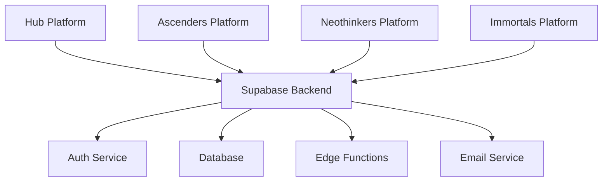
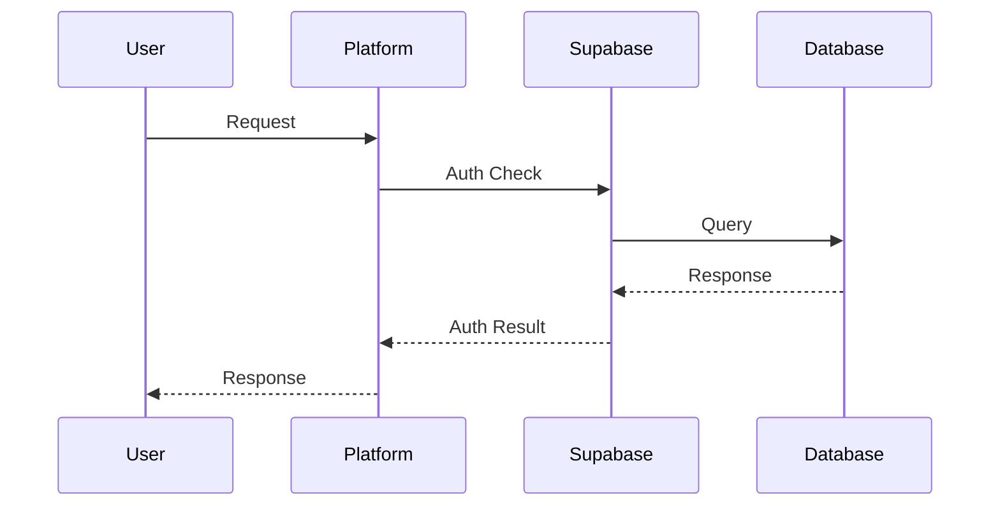
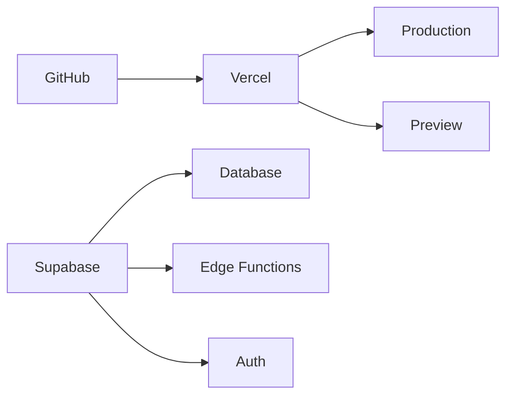

# Architecture Overview

## System Architecture

The Neothink Sites monorepo follows a microservices-like architecture where each site is independently deployable but shares common resources.

```mermaid
graph TD
    A[Hub Platform] --> D[Supabase Backend]
    B[Ascenders Platform] --> D
    C[Neothinkers Platform] --> D
    E[Immortals Platform] --> D
    
    D --> F[Auth Service]
    D --> G[Database]
    D --> H[Edge Functions]
    D --> I[Email Service]
```

## Key Components

1. **Frontend Platforms**
   - Each platform is a Next.js application
   - Independent deployment through Vercel
   - Shared components and utilities
   - Platform-specific features and branding

2. **Backend Services (Supabase)**
   - Authentication and Authorization
   - Database Management
   - Edge Functions
   - Email Templates
   - Storage

3. **Shared Resources**
   - UI Components
   - Authentication Logic
   - Database Schema
   - Email Templates
   - Utility Functions

## Data Flow

```mermaid
sequenceDiagram
    participant User
    participant Platform
    participant Supabase
    participant Database
    
    User->>Platform: Request
    Platform->>Supabase: Auth Check
    Supabase->>Database: Query
    Database-->>Supabase: Response
    Supabase-->>Platform: Auth Result
    Platform-->>User: Response
```

## Security Architecture

1. **Authentication**
   - JWT-based authentication
   - Session management per platform
   - Secure cookie handling
   - PKCE flow for OAuth

2. **Authorization**
   - Row Level Security (RLS)
   - Platform-specific policies
   - Role-based access control
   - Permission management

3. **Data Protection**
   - Encrypted connections
   - Secure storage
   - Input validation
   - Output sanitization

## Performance Considerations

1. **Frontend**
   - Static site generation
   - Incremental static regeneration
   - Edge caching
   - Code splitting

2. **Backend**
   - Connection pooling
   - Query optimization
   - Caching strategies
   - Rate limiting

## Monitoring and Logging

1. **Frontend**
   - Error tracking
   - Performance monitoring
   - User analytics
   - Session tracking

2. **Backend**
   - Query logging
   - Error tracking
   - Performance metrics
   - Audit logging

## Deployment Architecture

```mermaid
graph LR
    A[GitHub] --> B[Vercel]
    B --> C[Production]
    B --> D[Preview]
    E[Supabase] --> F[Database]
    E --> G[Edge Functions]
    E --> H[Auth]
```

## Environment Setup

1. **Development**
   - Local Supabase instance
   - Development environment variables
   - Hot reloading
   - Debug tools

2. **Staging**
   - Preview deployments
   - Test database
   - Staging environment variables
   - Integration testing

3. **Production**
   - Production deployments
   - Production database
   - Production environment variables
   - Monitoring and alerts

## Future Considerations

1. **Scalability**
   - Database sharding
   - Caching strategies
   - Load balancing
   - CDN integration

2. **Maintainability**
   - Documentation
   - Testing coverage
   - Code quality
   - Performance monitoring

3. **Security**
   - Regular audits
   - Security updates
   - Penetration testing
   - Compliance checks 