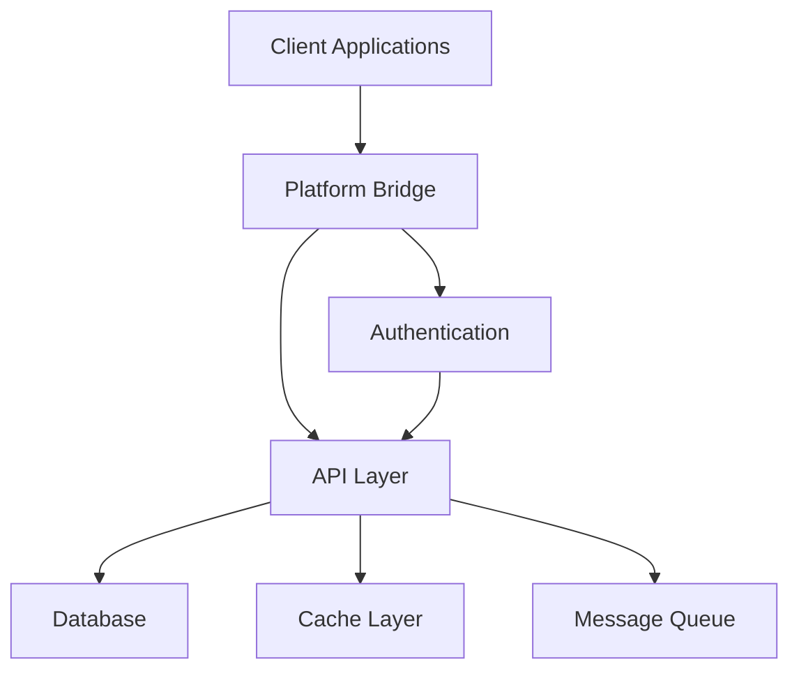
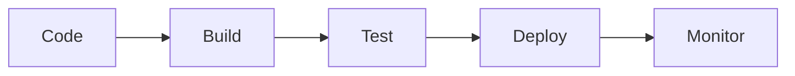

# Neothink+ Architecture Overview

## System Architecture

The Neothink+ ecosystem is built as a modern, scalable monorepo using Next.js, Supabase, and TypeScript. The architecture follows domain-driven design principles and emphasizes modularity and reusability.



## Core Components

### 1. Platform Bridge

The Platform Bridge serves as the central nervous system of the Neothink+ ecosystem, managing:

- Cross-platform navigation
- State synchronization
- Feature access control
- User session management

```typescript
interface PlatformBridge {
  // Platform Management
  registerPlatform(config: PlatformConfig): void;
  switchPlatform(slug: PlatformSlug): Promise<void>;
  
  // State Management
  syncState(state: PlatformState): Promise<void>;
  getState(): PlatformState;
  
  // Feature Management
  checkAccess(feature: string): boolean;
  enableFeature(feature: string): void;
}
```

### 2. Authentication System

Secure, JWT-based authentication system built on Supabase Auth:

- Email/password authentication
- Social authentication providers
- Magic link authentication
- Session management
- Role-based access control

### 3. Database Architecture

PostgreSQL database with Supabase extensions:

- Row Level Security (RLS)
- Real-time subscriptions
- Full-text search
- Vector embeddings
- Automated backups

```sql
-- Example RLS Policy
CREATE POLICY "Users can only access their own data"
ON public.profiles
FOR ALL
USING (auth.uid() = user_id);
```

### 4. API Layer

RESTful and GraphQL APIs with:

- Type-safe endpoints
- Request validation
- Rate limiting
- Error handling
- Documentation

```typescript
// API Route Example
export async function handler(
  req: NextApiRequest,
  res: NextApiResponse
) {
  try {
    // Validate request
    const { data } = validateRequest(req);
    
    // Process request
    const result = await processRequest(data);
    
    // Return response
    return res.status(200).json(result);
  } catch (error) {
    handleError(error, res);
  }
}
```

## Platform Architecture

### Hub Platform

Central platform managing:

- User profiles
- Cross-platform access
- Global settings
- Activity tracking

### Ascenders Platform

Advanced learning platform with:

- Learning paths
- Progress tracking
- Challenges
- Assessments

### Neothinkers Platform

Community and content platform featuring:

- Content management
- Discussion forums
- Resource library
- Collaboration tools

### Immortals Platform

Project management platform providing:

- Project tracking
- Resource allocation
- Team collaboration
- Analytics

## Technical Stack

### Frontend

- **Framework**: Next.js 14 (App Router)
- **State Management**: Platform Bridge + React Context
- **Styling**: Tailwind CSS + Shadcn UI
- **Forms**: React Hook Form + Zod
- **Data Fetching**: TanStack Query

### Backend

- **Database**: PostgreSQL + Supabase
- **Authentication**: Supabase Auth
- **API**: Next.js API Routes + tRPC
- **Real-time**: Supabase Realtime
- **Search**: PostgreSQL Full-text Search

### Infrastructure

- **Hosting**: Vercel
- **Database**: Supabase
- **CDN**: Vercel Edge Network
- **Monitoring**: Vercel Analytics + Custom Telemetry

## Development Architecture

### 1. Monorepo Structure

```
.
├── apps/                 # Platform applications
│   ├── hub/
│   ├── ascenders/
│   ├── neothinkers/
│   └── immortals/
├── packages/            # Shared packages
│   ├── ui/
│   ├── auth/
│   ├── database/
│   └── platform-bridge/
├── docs/               # Documentation
└── scripts/            # Development scripts
```

### 2. Package Architecture

```typescript
// Example package structure
export interface Package {
  name: string;
  version: string;
  dependencies: Record<string, string>;
  devDependencies: Record<string, string>;
  peerDependencies: Record<string, string>;
}
```

### 3. Testing Architecture

- Unit tests with Vitest
- Integration tests with Playwright
- E2E tests with Cypress
- API tests with Supertest

## Security Architecture

### 1. Authentication

- JWT-based authentication
- Secure session management
- Multi-factor authentication
- Password policies

### 2. Authorization

- Role-based access control
- Row Level Security
- Feature flags
- API key management

### 3. Data Protection

- Data encryption
- Secure communications
- Privacy controls
- Audit logging

## Deployment Architecture

### 1. CI/CD Pipeline



### 2. Environment Management

- Development
- Staging
- Production
- Preview deployments

### 3. Monitoring

- Error tracking
- Performance monitoring
- User analytics
- Security alerts

## Future Architecture

### 1. Planned Improvements

- GraphQL API layer
- Microservices architecture
- Enhanced caching
- AI integration

### 2. Scalability Plans

- Horizontal scaling
- Global deployment
- Performance optimization
- Resource management

## Additional Resources

- [API Documentation](../api/README.md)
- [Development Guide](../guides/development.md)
- [Security Guide](../guides/security.md)
- [Deployment Guide](../deployment/README.md) 