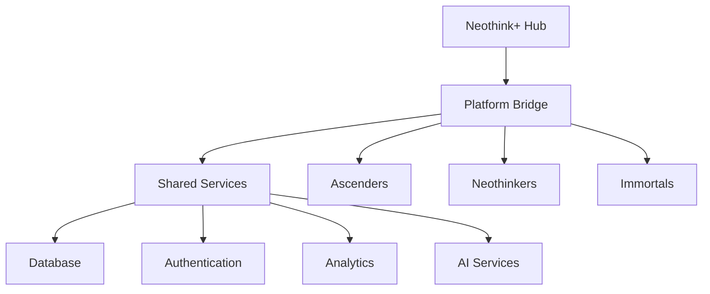
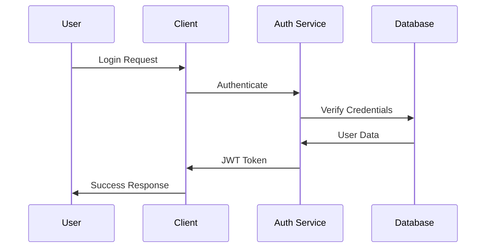
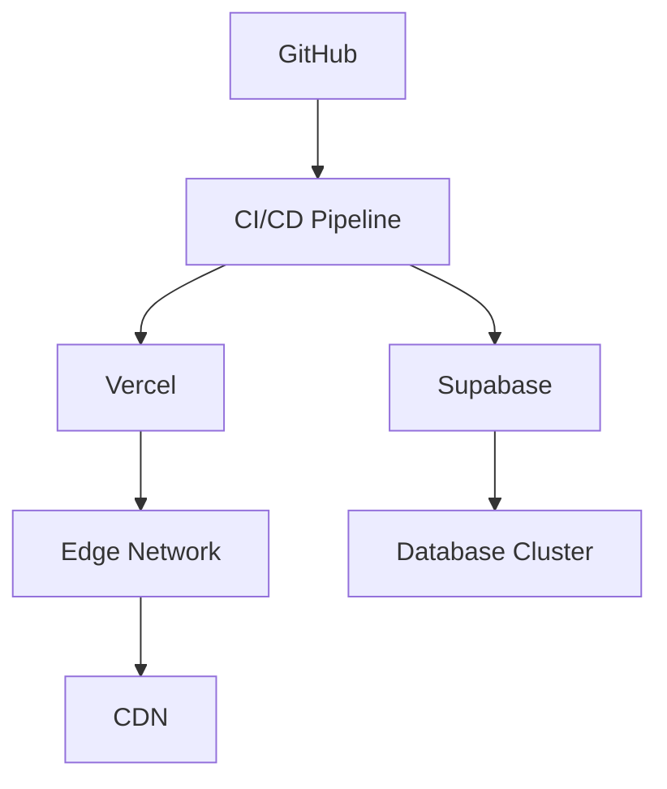

# Architecture Overview

## System Architecture

The Neothink+ ecosystem is built on a modern, scalable architecture that emphasizes platform independence while enabling seamless integration through the Neothink+ Hub.

### High-Level Architecture


```mermaid
graph TD
    A[Neothink+ Hub] --> B[Platform Bridge]
    B --> C[Shared Services]
    C --> D[Database]
    B --> E[Ascenders]
    B --> F[Neothinkers]
    B --> G[Immortals]
    C --> H[Authentication]
    C --> I[Analytics]
    C --> J[AI Services]
```

## Core Components

### 1. Platform Bridge

The Platform Bridge serves as the central nervous system of our ecosystem:

```typescript
interface PlatformBridge {
  // State Management
  getCurrentPlatform(): PlatformSlug
  switchPlatform(platform: PlatformSlug): Promise<void>
  
  // User Context
  getUserState(): PlatformState
  syncState(): Promise<void>
  
  // Error Handling
  handleError(error: SwitchError): void
}
```

### 2. Database Architecture

#### Schema Overview
```sql
-- Core Tables
CREATE TABLE users (
  id UUID PRIMARY KEY DEFAULT uuid_generate_v4(),
  email TEXT UNIQUE NOT NULL,
  created_at TIMESTAMPTZ DEFAULT NOW()
);

-- Platform State
CREATE TABLE platform_state (
  user_id UUID REFERENCES users(id),
  platform VARCHAR NOT NULL,
  preferences JSONB,
  progress JSONB,
  recent_items JSONB,
  PRIMARY KEY (user_id, platform)
);

-- Platform Access
CREATE TABLE platform_access (
  user_id UUID REFERENCES users(id),
  platform VARCHAR NOT NULL,
  access_level VARCHAR NOT NULL,
  features JSONB,
  restrictions JSONB,
  PRIMARY KEY (user_id, platform)
);

-- AI Integration
CREATE TABLE ai_embeddings (
  id UUID PRIMARY KEY DEFAULT uuid_generate_v4(),
  content_id UUID NOT NULL,
  embedding vector(1536),
  metadata JSONB
);
```

### 3. Authentication Flow


```mermaid
sequenceDiagram
    participant U as User
    participant C as Client
    participant A as Auth Service
    participant D as Database
    
    U->>C: Login Request
    C->>A: Authenticate
    A->>D: Verify Credentials
    D->>A: User Data
    A->>C: JWT Token
    C->>U: Success Response
```

### 4. AI Integration

The AI system is integrated at multiple levels:

1. **Content Enhancement**
   - Vector embeddings for semantic search
   - Content recommendations
   - Personalized learning paths

2. **User Experience**
   - Smart navigation suggestions
   - Contextual help
   - Progress optimization

3. **Platform Integration**
   - Cross-platform insights
   - Feature recommendations
   - Usage pattern analysis

## Infrastructure

### 1. Deployment Architecture


```mermaid
graph TD
    A[GitHub] --> B[CI/CD Pipeline]
    B --> C[Vercel]
    B --> D[Supabase]
    C --> E[Edge Network]
    D --> F[Database Cluster]
    E --> G[CDN]
```

### 2. Scaling Strategy

#### Vertical Scaling
- Database optimization
- Query performance
- Cache management

#### Horizontal Scaling
- Edge function distribution
- Read replicas
- Load balancing

## Security Architecture

### 1. Authentication
- JWT-based auth
- Role-based access control
- Session management
- MFA support

### 2. Data Protection
- End-to-end encryption
- At-rest encryption
- Audit logging
- Data backups

### 3. Network Security
- TLS everywhere
- Rate limiting
- DDoS protection
- WAF integration

## Monitoring and Observability

### 1. Performance Monitoring
- Real-time metrics
- Error tracking
- Performance KPIs
- User experience monitoring

### 2. Logging
- Structured logging
- Log aggregation
- Error reporting
- Audit trails

### 3. Analytics
- User behavior
- Platform usage
- Feature adoption
- Performance metrics

## Development Architecture

### 1. Monorepo Structure
```
neothink.io/
├── apps/                  # Platform applications
│   ├── hub/              # Neothink+ Hub
│   ├── ascenders/        # Ascenders platform
│   ├── neothinkers/      # Neothinkers platform
│   └── immortals/        # Immortals platform
├── packages/             # Shared packages
│   ├── ui/              # UI components
│   ├── platform-bridge/ # Platform integration
│   ├── auth/           # Authentication
│   ├── database/       # Database client
│   └── analytics/      # Analytics
└── supabase/            # Database
```

### 2. CI/CD Pipeline
1. Code Push
2. Automated Tests
3. Type Checking
4. Linting
5. Build
6. Deploy

## Best Practices

### 1. Code Organization
- Feature-based structure
- Shared components
- Type safety
- Documentation

### 2. Performance
- Code splitting
- Lazy loading
- Cache strategy
- Bundle optimization

### 3. Security
- Input validation
- Output sanitization
- Error handling
- Access control

## Further Reading

- [Development Guide](../guides/development.md)
- [API Documentation](../api/platform-bridge.md)
- [Security Guide](../guides/security.md)
- [Testing Guide](../guides/testing.md) 