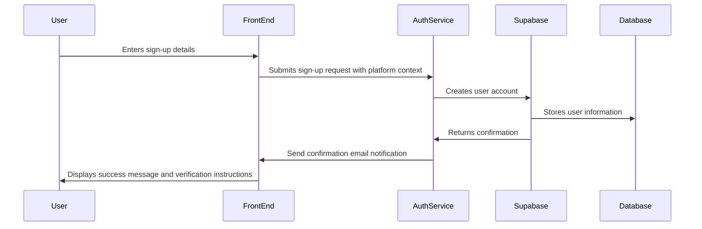
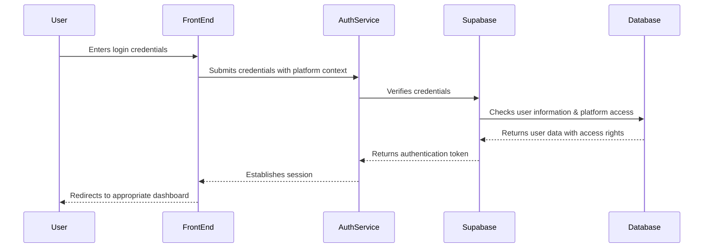
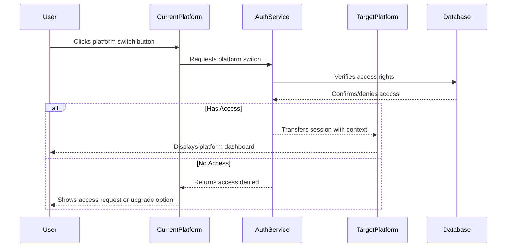
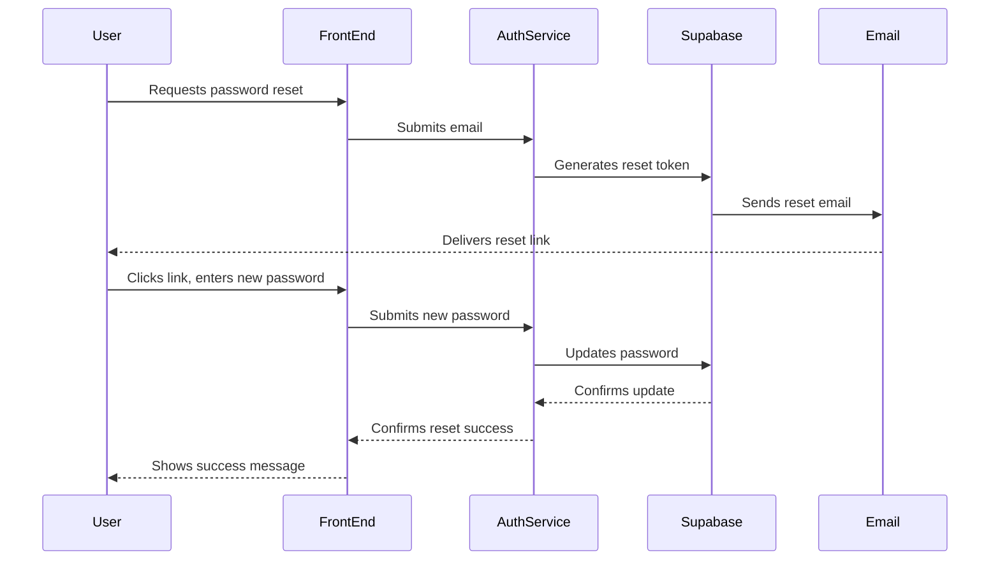

# Authentication Flow Documentation

## Overview

The Neothink ecosystem spans four distinct platforms (Hub, Ascenders, Neothinkers, Immortals), each with its own target audience and specific features. Our authentication system provides a seamless, platform-aware authentication experience, enabling users to sign up once and gain appropriate access across the ecosystem based on their role and permissions.

## Why This Approach?

Our unified authentication approach provides several key benefits:

1. **Cohesive User Experience**: Users maintain a single identity across all platforms, eliminating the need to remember multiple credentials.

2. **Streamlined Development**: Developers work with a single, consistent authentication system, reducing complexity and maintenance costs.

3. **Security Best Practices**: By centralizing authentication, we ensure consistent security measures across all platforms.

4. **Scalability**: The system is designed to handle future platforms without architectural changes.

5. **Data Integrity**: User data remains consistent across platforms, providing a holistic view of user behavior and preferences.

## User Flows

### 1. Sign-Up Flow

#### Why This Flow?

- **Email Verification**: Requiring email verification reduces fraudulent sign-ups and ensures we can contact users.
- **Platform Context**: Capturing the origin platform during sign-up helps tailor the user experience from the beginning.
- **Progressive Data Collection**: We only collect essential information during sign-up, reducing friction and increasing conversion rates.

### 2. Sign-In Flow

#### Why This Flow?

- **Platform Context**: Including platform information allows for tailored error messages and appropriate redirects.
- **Access Verification**: We check platform access rights during login to guide users appropriately.
- **Session Management**: Persistent sessions reduce the need for frequent re-authentication while maintaining security.

### 3. Platform Switching Flow

#### Why This Flow?

- **Seamless Experience**: Users shouldn't need to reauthenticate when switching between platforms.
- **Access Control**: Not all users have access to all platforms, requiring verification.
- **Context Preservation**: Maintaining user context across platforms enhances the user experience.

### 4. Password Reset Flow

#### Why This Flow?

- **Self-Service**: Allowing users to reset their passwords without admin intervention improves user experience.
- **Security**: The email-based reset flow with temporary tokens follows security best practices.
- **User-Friendly**: Clear instructions and feedback reduce support inquiries.

## Implementation Details

### Component Structure

Our authentication implementation is structured around these key components:

1. **Auth Provider**: Global context provider that gives components access to auth state.
2. **Auth Hooks**: Custom React hooks that encapsulate auth logic for components.
3. **Auth Components**: Reusable UI components for auth-related functionality.
4. **Platform Gates**: Components that conditionally render content based on platform access.

#### Why This Structure?

- **Separation of Concerns**: UI components remain focused on presentation while hooks handle logic.
- **Reusability**: Components can be reused across platforms with different styling.
- **Consistency**: Ensures a consistent auth experience across platforms.
- **Maintainability**: Centralizing auth logic makes updates and fixes more manageable.

### Platform-Specific Customization

Each platform can customize authentication in these ways:

1. **Visual Styling**: Colors, logos, and UI elements match platform branding.
2. **Redirect Paths**: Custom post-authentication redirects.
3. **Additional Fields**: Platform-specific data collection during sign-up.
4. **Custom Messaging**: Platform-specific welcome and error messages.

#### Why Allow Customization?

- **Brand Consistency**: Each platform maintains its unique visual identity.
- **User Experience**: Navigation paths and messaging can be tailored to each platform's users.
- **Data Requirements**: Different platforms may need specific user information.

## Security Considerations

1. **JWT Tokens**: Authentication uses short-lived JWT tokens with refresh capabilities.
2. **HTTPS**: All authentication traffic is encrypted.
3. **Rate Limiting**: Auth endpoints are protected against brute force attacks.
4. **Input Validation**: All user inputs are validated on both client and server.
5. **Password Policies**: Enforced password strength requirements.

#### Why These Security Measures?

- **Protection Against Common Attacks**: These measures prevent the most common authentication vulnerabilities.
- **Regulatory Compliance**: Helps meet requirements for user data protection.
- **Trust**: Users need confidence that their information is secure.

## Edge Cases and Error Handling

1. **Expired Sessions**: Graceful handling of expired sessions with automatic refresh.
2. **Network Issues**: Offline detection and retry mechanisms.
3. **Account Recovery**: Multiple paths for users to recover access.
4. **Cross-Platform Conflicts**: Resolution strategies for access conflicts.

#### Why Focus on Edge Cases?

- **User Retention**: Frustration during authentication problems often leads to user abandonment.
- **Support Reduction**: Proactive handling of common issues reduces support tickets.
- **User Confidence**: Smooth error recovery builds trust in the platform.

## Testing and Monitoring

1. **Automated Testing**: Comprehensive test suite for auth flows.
2. **Analytics**: Tracking of auth-related events and conversion rates.
3. **Error Logging**: Detailed error logging for auth failures.
4. **Performance Monitoring**: Tracking auth response times.

#### Why This Approach to Testing?

- **Quality Assurance**: Authentication is critical and must work flawlessly.
- **Continuous Improvement**: Analytics help identify and address user friction points.
- **Proactive Issue Resolution**: Monitoring helps identify problems before users report them.

## Next Steps and Roadmap

1. **Social Authentication**: Integration with major social providers.
2. **Biometric Authentication**: Support for fingerprint and face recognition on mobile.
3. **Enterprise SSO**: Support for enterprise single sign-on solutions.
4. **Adaptive Authentication**: Risk-based authentication measures.

#### Why These Next Steps?

- **User Convenience**: Additional auth methods reduce friction.
- **Enterprise Adoption**: SSO support is often required for organizational users.
- **Security Enhancement**: Adaptive methods improve security without sacrificing convenience. 