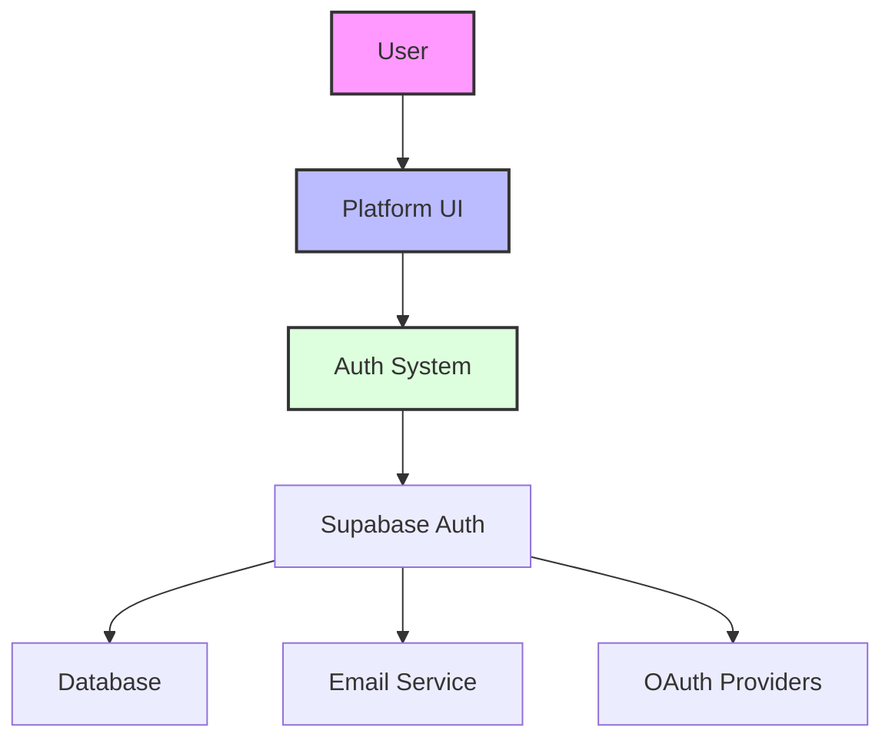
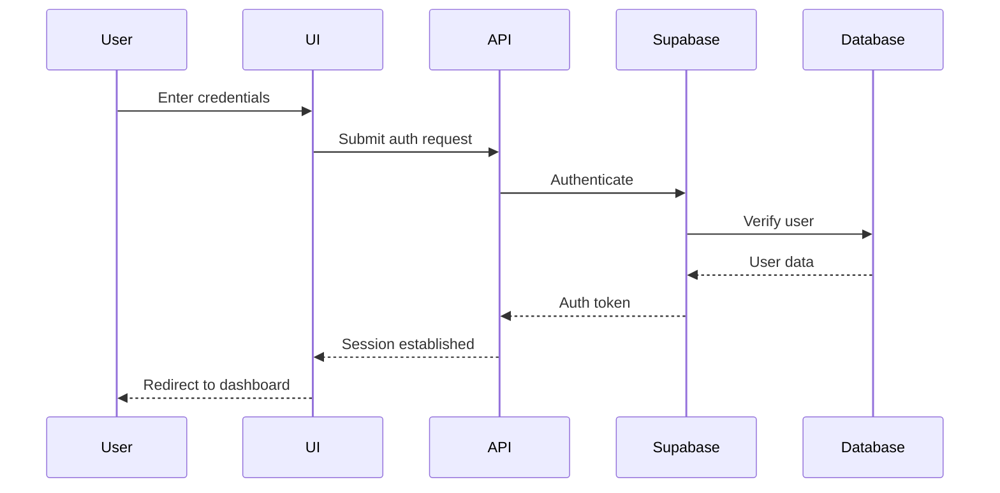

# 🔐 Authentication System

## Overview

The Neothink unified authentication system provides a seamless, secure, and consistent authentication experience across all platform applications. Built on Supabase Auth, it supports multi-tenant authentication with role-based access control for each platform.

## 🏗️ Architecture



### Core Components

1. **🗄️ Database Layer**
   - User profiles and platform access
   - Role and permission management
   - Audit logging and security

2. **🔌 API Layer**
   - Authentication endpoints
   - Platform access control
   - Role management

3. **🎨 UI Components**
   - Login/signup forms
   - Profile management
   - Role-based UI elements

## 💾 Database Schema

### Profiles Table

```sql
CREATE TABLE public.profiles (
  id UUID PRIMARY KEY REFERENCES auth.users(id),
  email TEXT NOT NULL,
  full_name TEXT,
  avatar_url TEXT,
  bio TEXT,
  created_at TIMESTAMPTZ DEFAULT now(),
  updated_at TIMESTAMPTZ DEFAULT now(),
  is_guardian BOOLEAN DEFAULT false,
  guardian_since TIMESTAMPTZ,
  platforms TEXT[] DEFAULT ARRAY[]::TEXT[],
  is_email_verified BOOLEAN DEFAULT false
);

-- Add indexes for performance
CREATE INDEX idx_profiles_email ON public.profiles(email);
CREATE INDEX idx_profiles_platforms ON public.profiles USING GIN(platforms);
```

### Role Management Tables

```sql
-- Define available roles
CREATE TABLE public.tenant_roles (
  id UUID PRIMARY KEY DEFAULT uuid_generate_v4(),
  tenant_id UUID REFERENCES public.tenants(id),
  name TEXT NOT NULL,
  slug TEXT NOT NULL,
  description TEXT,
  created_at TIMESTAMPTZ DEFAULT now(),
  UNIQUE(tenant_id, slug)
);

-- Associate users with roles
CREATE TABLE public.tenant_users (
  id UUID PRIMARY KEY DEFAULT uuid_generate_v4(),
  user_id UUID REFERENCES auth.users(id),
  tenant_id UUID REFERENCES public.tenants(id),
  role_id UUID REFERENCES public.tenant_roles(id),
  created_at TIMESTAMPTZ DEFAULT now(),
  UNIQUE(user_id, tenant_id)
);
```

## 🔧 Implementation

### Authentication Flow



### React Components

```tsx
// Protected route wrapper
export function ProtectedRoute({ children, platform }) {
  const { user, isLoading } = useAuth();
  const { hasPlatformAccess } = usePlatform();
  
  if (isLoading) return <LoadingSpinner />;
  
  if (!user) {
    return <Navigate to="/login" />;
  }
  
  if (!hasPlatformAccess(platform)) {
    return <AccessDenied />;
  }
  
  return children;
}

// Platform-specific gate
export function PlatformGate({ platforms, children, fallback }) {
  const { hasAccessToAny } = usePlatform();
  
  if (!hasAccessToAny(platforms)) {
    return fallback || <AccessDenied />;
  }
  
  return children;
}
```

## 🔒 Security Features

1. **Authentication**
   - JWT-based sessions
   - Secure cookie handling
   - PKCE flow for OAuth
   - Rate limiting

2. **Authorization**
   - Role-based access control
   - Platform-specific permissions
   - Row-level security
   - Guardian privileges

3. **Data Protection**
   - Encrypted connections
   - Password hashing
   - Input validation
   - Output sanitization

## 📱 Mobile Support

1. **Responsive Design**
   - Mobile-optimized forms
   - Touch-friendly UI
   - Biometric authentication
   - PWA support

2. **Offline Capabilities**
   - Token persistence
   - Offline access rules
   - Background sync
   - Error recovery

## 🔄 Cross-Platform Features

1. **Single Sign-On (SSO)**
   - One account for all platforms
   - Seamless platform switching
   - Unified profile management
   - Synchronized permissions

2. **Platform-Specific Access**
   - Independent access rules
   - Custom role hierarchies
   - Feature-based permissions
   - Content restrictions

## 🚀 Getting Started

### Installation

```bash
# Install dependencies
pnpm add @supabase/auth-helpers-nextjs @supabase/supabase-js

# Set up environment variables
cp .env.example .env.local
```

### Basic Usage

```tsx
// In your component
import { useAuth } from '@/lib/hooks/useAuth';

function LoginForm() {
  const { signIn, error } = useAuth();
  
  const handleSubmit = async (e) => {
    e.preventDefault();
    await signIn(email, password);
  };
  
  return (
    <form onSubmit={handleSubmit}>
      {/* Form fields */}
    </form>
  );
}
```

## 🔍 Monitoring & Debugging

1. **Logging**
   - Auth events
   - Access attempts
   - Error tracking
   - Performance metrics

2. **Debugging Tools**
   - Session inspector
   - Role validator
   - Permission checker
   - Token debugger

## 📚 Related Documentation

- [Role System](./RBAC-SYSTEM.md)
- [Database Schema](./database/SCHEMA.md)
- [Security Guide](./operations/SECURITY.md)
- [API Reference](./api/REST.md)

## 🤝 Support

Need help with authentication?
- Join our [Developer Community](https://developers.neothink.io)
- Review the [Troubleshooting Guide](./troubleshooting/README.md)
- Contact [Auth Support](mailto:auth-support@neothink.io)

---

<div align="center">

**Securing the future of human achievement.**

[Edit Documentation](https://github.com/neothink-dao/docs/edit/main/docs/auth-system.md) • [Report Issue](https://github.com/neothink-dao/docs/issues/new)

</div> 