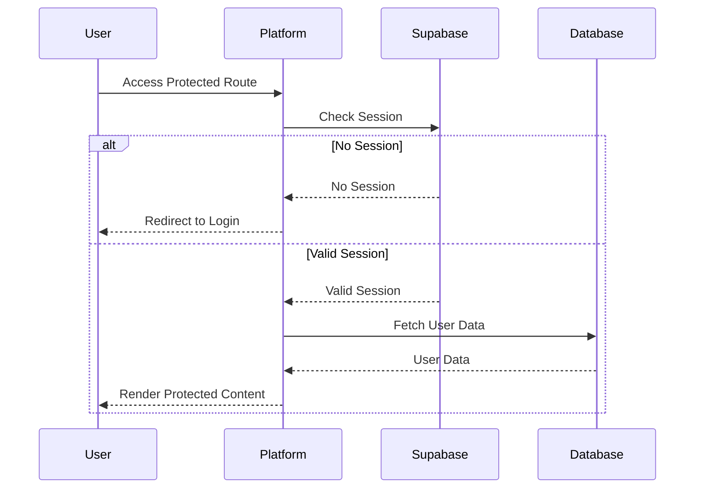

# Authentication System

## Overview

The authentication system is built on Supabase Auth and provides a unified authentication experience across all Neothink platforms.

## Authentication Flow



## Implementation Details

### 1. Session Management

```typescript
// Example session management in middleware
export async function updateSession(request: NextRequest) {
  const supabase = createClient(
    process.env.NEXT_PUBLIC_SUPABASE_URL!,
    process.env.NEXT_PUBLIC_SUPABASE_ANON_KEY!,
    {
      cookies: {
        get(name: string) {
          return request.cookies.get(name)?.value
        },
        set(name: string, value: string, options: CookieOptions) {
          request.cookies.set({
            name,
            value,
            ...options,
          })
        },
        remove(name: string, options: CookieOptions) {
          request.cookies.set({
            name,
            value: '',
            ...options,
          })
        },
      },
    }
  )
  
  return supabase.auth.getSession()
}
```

### 2. Protected Routes

```typescript
// Example protected route implementation
export default async function ProtectedPage() {
  const supabase = createServerClient()
  const { data: { session } } = await supabase.auth.getSession()
  
  if (!session) {
    redirect('/login')
  }
  
  return <ProtectedContent />
}
```

### 3. Authentication Methods

1. **Email/Password**
   - Standard email/password authentication
   - Password reset flow
   - Email verification

2. **OAuth Providers**
   - Google
   - GitHub
   - Custom OAuth providers

3. **Magic Links**
   - Passwordless authentication
   - Email-based login links

## Security Measures

1. **Session Security**
   - JWT-based sessions
   - Secure cookie settings
   - Session expiration
   - Refresh token rotation

2. **Password Security**
   - Bcrypt hashing
   - Password strength requirements
   - Rate limiting
   - Brute force protection

3. **OAuth Security**
   - PKCE flow
   - State parameter validation
   - Token validation
   - Scope management

## Error Handling

```typescript
// Example error handling
try {
  const { data, error } = await supabase.auth.signInWithPassword({
    email,
    password,
  })
  
  if (error) {
    switch (error.message) {
      case 'Invalid login credentials':
        // Handle invalid credentials
        break
      case 'Email not confirmed':
        // Handle unconfirmed email
        break
      default:
        // Handle other errors
        break
    }
  }
} catch (error) {
  // Handle unexpected errors
}
```

## Platform-Specific Considerations

1. **Hub Platform**
   - Admin authentication
   - Multi-tenant support
   - Role-based access

2. **Ascenders Platform**
   - Member authentication
   - Course access control
   - Progress tracking

3. **Neothinkers Platform**
   - Community authentication
   - Forum access control
   - Content moderation

4. **Immortals Platform**
   - Premium authentication
   - Subscription management
   - Content access control

## Testing Authentication

1. **Unit Tests**
   - Session management
   - Token validation
   - Error handling

2. **Integration Tests**
   - Login flow
   - Protected routes
   - OAuth integration

3. **Security Tests**
   - Session hijacking
   - Token manipulation
   - Rate limiting

## Troubleshooting

1. **Common Issues**
   - Session expiration
   - Token validation failures
   - OAuth callback errors
   - Cookie issues

2. **Debugging Steps**
   - Check session status
   - Verify token validity
   - Inspect network requests
   - Review error logs

3. **Recovery Procedures**
   - Session refresh
   - Token rotation
   - Cookie cleanup
   - Error recovery 