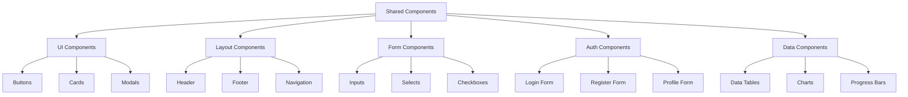

# Shared Components

## Overview

The Neothink Sites monorepo uses a shared component library to maintain consistency across platforms.

## Component Structure



## UI Components

### 1. Buttons
```typescript
// Example button component
interface ButtonProps {
  variant: 'primary' | 'secondary' | 'outline';
  size: 'sm' | 'md' | 'lg';
  children: React.ReactNode;
  onClick?: () => void;
  disabled?: boolean;
}

export const Button: React.FC<ButtonProps> = ({
  variant,
  size,
  children,
  onClick,
  disabled
}) => {
  // Implementation
};
```

### 2. Cards
```typescript
// Example card component
interface CardProps {
  title: string;
  description?: string;
  children: React.ReactNode;
  footer?: React.ReactNode;
}

export const Card: React.FC<CardProps> = ({
  title,
  description,
  children,
  footer
}) => {
  // Implementation
};
```

### 3. Modals
```typescript
// Example modal component
interface ModalProps {
  isOpen: boolean;
  onClose: () => void;
  title: string;
  children: React.ReactNode;
}

export const Modal: React.FC<ModalProps> = ({
  isOpen,
  onClose,
  title,
  children
}) => {
  // Implementation
};
```

## Layout Components

### 1. Header
```typescript
// Example header component
interface HeaderProps {
  logo: React.ReactNode;
  navigation: React.ReactNode;
  userMenu?: React.ReactNode;
}

export const Header: React.FC<HeaderProps> = ({
  logo,
  navigation,
  userMenu
}) => {
  // Implementation
};
```

### 2. Footer
```typescript
// Example footer component
interface FooterProps {
  links: Array<{
    title: string;
    href: string;
  }>;
  copyright: string;
}

export const Footer: React.FC<FooterProps> = ({
  links,
  copyright
}) => {
  // Implementation
};
```

### 3. Navigation
```typescript
// Example navigation component
interface NavigationProps {
  items: Array<{
    label: string;
    href: string;
    icon?: React.ReactNode;
  }>;
  activePath: string;
}

export const Navigation: React.FC<NavigationProps> = ({
  items,
  activePath
}) => {
  // Implementation
};
```

## Form Components

### 1. Inputs
```typescript
// Example input component
interface InputProps {
  type: 'text' | 'email' | 'password';
  label: string;
  value: string;
  onChange: (value: string) => void;
  error?: string;
}

export const Input: React.FC<InputProps> = ({
  type,
  label,
  value,
  onChange,
  error
}) => {
  // Implementation
};
```

### 2. Selects
```typescript
// Example select component
interface SelectProps {
  options: Array<{
    value: string;
    label: string;
  }>;
  value: string;
  onChange: (value: string) => void;
  label: string;
}

export const Select: React.FC<SelectProps> = ({
  options,
  value,
  onChange,
  label
}) => {
  // Implementation
};
```

### 3. Checkboxes
```typescript
// Example checkbox component
interface CheckboxProps {
  label: string;
  checked: boolean;
  onChange: (checked: boolean) => void;
}

export const Checkbox: React.FC<CheckboxProps> = ({
  label,
  checked,
  onChange
}) => {
  // Implementation
};
```

## Auth Components

### 1. Login Form
```typescript
// Example login form component
interface LoginFormProps {
  onSubmit: (data: {
    email: string;
    password: string;
  }) => void;
  error?: string;
}

export const LoginForm: React.FC<LoginFormProps> = ({
  onSubmit,
  error
}) => {
  // Implementation
};
```

### 2. Register Form
```typescript
// Example register form component
interface RegisterFormProps {
  onSubmit: (data: {
    email: string;
    password: string;
    confirmPassword: string;
  }) => void;
  error?: string;
}

export const RegisterForm: React.FC<RegisterFormProps> = ({
  onSubmit,
  error
}) => {
  // Implementation
};
```

### 3. Profile Form
```typescript
// Example profile form component
interface ProfileFormProps {
  initialData: {
    username: string;
    fullName: string;
    avatarUrl?: string;
  };
  onSubmit: (data: {
    username: string;
    fullName: string;
    avatarUrl?: string;
  }) => void;
}

export const ProfileForm: React.FC<ProfileFormProps> = ({
  initialData,
  onSubmit
}) => {
  // Implementation
};
```

## Data Components

### 1. Data Tables
```typescript
// Example data table component
interface DataTableProps<T> {
  columns: Array<{
    key: string;
    title: string;
    render?: (item: T) => React.ReactNode;
  }>;
  data: T[];
  onRowClick?: (item: T) => void;
}

export const DataTable = <T extends object>({
  columns,
  data,
  onRowClick
}: DataTableProps<T>) => {
  // Implementation
};
```

### 2. Charts
```typescript
// Example chart component
interface ChartProps {
  type: 'line' | 'bar' | 'pie';
  data: Array<{
    label: string;
    value: number;
  }>;
  options?: object;
}

export const Chart: React.FC<ChartProps> = ({
  type,
  data,
  options
}) => {
  // Implementation
};
```

### 3. Progress Bars
```typescript
// Example progress bar component
interface ProgressBarProps {
  value: number;
  max: number;
  label?: string;
  showPercentage?: boolean;
}

export const ProgressBar: React.FC<ProgressBarProps> = ({
  value,
  max,
  label,
  showPercentage
}) => {
  // Implementation
};
```

## Best Practices

1. **Component Design**
   - Use TypeScript for type safety
   - Follow atomic design principles
   - Keep components focused and reusable
   - Document props and usage

2. **Styling**
   - Use CSS modules for scoping
   - Follow BEM naming convention
   - Use design tokens for consistency
   - Support dark/light themes

3. **Testing**
   - Write unit tests for components
   - Test edge cases and error states
   - Use snapshot testing for UI components
   - Test accessibility

4. **Performance**
   - Use React.memo for pure components
   - Implement proper loading states
   - Optimize re-renders
   - Use code splitting

5. **Accessibility**
   - Follow WCAG guidelines
   - Use semantic HTML
   - Support keyboard navigation
   - Add ARIA attributes 