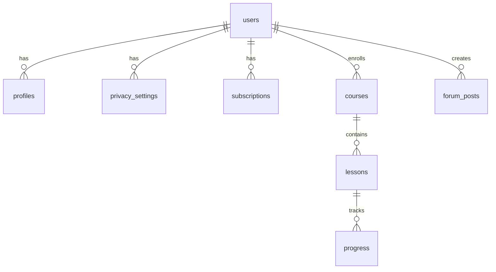

# Database Schema and Policies

## Overview

The database is built on Supabase and uses PostgreSQL with Row Level Security (RLS) for data access control.

## Schema Design



## Tables

### 1. Users (auth.users)
- Managed by Supabase Auth
- Contains authentication data
- Linked to platform-specific profiles

### 2. Profiles
```sql
CREATE TABLE profiles (
  id UUID REFERENCES auth.users PRIMARY KEY,
  username TEXT UNIQUE,
  full_name TEXT,
  avatar_url TEXT,
  platform TEXT,
  created_at TIMESTAMP WITH TIME ZONE DEFAULT TIMEZONE('utc'::text, NOW()),
  updated_at TIMESTAMP WITH TIME ZONE DEFAULT TIMEZONE('utc'::text, NOW())
);
```

### 3. Privacy Settings
```sql
CREATE TABLE privacy_settings (
  id UUID REFERENCES auth.users PRIMARY KEY,
  email_visibility BOOLEAN DEFAULT true,
  profile_visibility BOOLEAN DEFAULT true,
  activity_visibility BOOLEAN DEFAULT true,
  created_at TIMESTAMP WITH TIME ZONE DEFAULT TIMEZONE('utc'::text, NOW()),
  updated_at TIMESTAMP WITH TIME ZONE DEFAULT TIMEZONE('utc'::text, NOW())
);
```

### 4. Subscriptions
```sql
CREATE TABLE subscriptions (
  id UUID DEFAULT uuid_generate_v4() PRIMARY KEY,
  user_id UUID REFERENCES auth.users,
  plan TEXT,
  status TEXT,
  start_date TIMESTAMP WITH TIME ZONE,
  end_date TIMESTAMP WITH TIME ZONE,
  created_at TIMESTAMP WITH TIME ZONE DEFAULT TIMEZONE('utc'::text, NOW()),
  updated_at TIMESTAMP WITH TIME ZONE DEFAULT TIMEZONE('utc'::text, NOW())
);
```

### 5. Courses
```sql
CREATE TABLE courses (
  id UUID DEFAULT uuid_generate_v4() PRIMARY KEY,
  title TEXT,
  description TEXT,
  platform TEXT,
  status TEXT,
  created_at TIMESTAMP WITH TIME ZONE DEFAULT TIMEZONE('utc'::text, NOW()),
  updated_at TIMESTAMP WITH TIME ZONE DEFAULT TIMEZONE('utc'::text, NOW())
);
```

### 6. Lessons
```sql
CREATE TABLE lessons (
  id UUID DEFAULT uuid_generate_v4() PRIMARY KEY,
  course_id UUID REFERENCES courses,
  title TEXT,
  content TEXT,
  order_index INTEGER,
  created_at TIMESTAMP WITH TIME ZONE DEFAULT TIMEZONE('utc'::text, NOW()),
  updated_at TIMESTAMP WITH TIME ZONE DEFAULT TIMEZONE('utc'::text, NOW())
);
```

### 7. Progress
```sql
CREATE TABLE progress (
  id UUID DEFAULT uuid_generate_v4() PRIMARY KEY,
  user_id UUID REFERENCES auth.users,
  lesson_id UUID REFERENCES lessons,
  status TEXT,
  completed_at TIMESTAMP WITH TIME ZONE,
  created_at TIMESTAMP WITH TIME ZONE DEFAULT TIMEZONE('utc'::text, NOW()),
  updated_at TIMESTAMP WITH TIME ZONE DEFAULT TIMEZONE('utc'::text, NOW())
);
```

### 8. Forum Posts
```sql
CREATE TABLE forum_posts (
  id UUID DEFAULT uuid_generate_v4() PRIMARY KEY,
  user_id UUID REFERENCES auth.users,
  title TEXT,
  content TEXT,
  platform TEXT,
  status TEXT,
  created_at TIMESTAMP WITH TIME ZONE DEFAULT TIMEZONE('utc'::text, NOW()),
  updated_at TIMESTAMP WITH TIME ZONE DEFAULT TIMEZONE('utc'::text, NOW())
);
```

## Row Level Security (RLS) Policies

### 1. Profiles
```sql
-- Enable RLS
ALTER TABLE profiles ENABLE ROW LEVEL SECURITY;

-- Allow users to read their own profile
CREATE POLICY "Users can view own profile"
  ON profiles FOR SELECT
  USING (auth.uid() = id);

-- Allow users to update their own profile
CREATE POLICY "Users can update own profile"
  ON profiles FOR UPDATE
  USING (auth.uid() = id);
```

### 2. Privacy Settings
```sql
-- Enable RLS
ALTER TABLE privacy_settings ENABLE ROW LEVEL SECURITY;

-- Allow users to read their own settings
CREATE POLICY "Users can view own privacy settings"
  ON privacy_settings FOR SELECT
  USING (auth.uid() = id);

-- Allow users to update their own settings
CREATE POLICY "Users can update own privacy settings"
  ON privacy_settings FOR UPDATE
  USING (auth.uid() = id);
```

### 3. Subscriptions
```sql
-- Enable RLS
ALTER TABLE subscriptions ENABLE ROW LEVEL SECURITY;

-- Allow users to read their own subscriptions
CREATE POLICY "Users can view own subscriptions"
  ON subscriptions FOR SELECT
  USING (auth.uid() = user_id);

-- Allow admin to manage all subscriptions
CREATE POLICY "Admins can manage all subscriptions"
  ON subscriptions FOR ALL
  USING (auth.jwt() ->> 'role' = 'admin');
```

### 4. Courses
```sql
-- Enable RLS
ALTER TABLE courses ENABLE ROW LEVEL SECURITY;

-- Allow users to read courses for their platform
CREATE POLICY "Users can view platform courses"
  ON courses FOR SELECT
  USING (platform = current_setting('app.current_platform'));
```

### 5. Progress
```sql
-- Enable RLS
ALTER TABLE progress ENABLE ROW LEVEL SECURITY;

-- Allow users to read their own progress
CREATE POLICY "Users can view own progress"
  ON progress FOR SELECT
  USING (auth.uid() = user_id);

-- Allow users to update their own progress
CREATE POLICY "Users can update own progress"
  ON progress FOR UPDATE
  USING (auth.uid() = user_id);
```

## Database Functions

### 1. Update Timestamp
```sql
CREATE OR REPLACE FUNCTION update_updated_at_column()
RETURNS TRIGGER AS $$
BEGIN
    NEW.updated_at = TIMEZONE('utc'::text, NOW());
    RETURN NEW;
END;
$$ language 'plpgsql';
```

### 2. Create Profile Trigger
```sql
CREATE OR REPLACE FUNCTION handle_new_user()
RETURNS TRIGGER AS $$
BEGIN
    INSERT INTO profiles (id, username, platform)
    VALUES (NEW.id, NEW.email, current_setting('app.current_platform'));
    
    INSERT INTO privacy_settings (id)
    VALUES (NEW.id);
    
    RETURN NEW;
END;
$$ language 'plpgsql';
```

## Indexes

```sql
-- Profiles
CREATE INDEX idx_profiles_username ON profiles(username);
CREATE INDEX idx_profiles_platform ON profiles(platform);

-- Subscriptions
CREATE INDEX idx_subscriptions_user_id ON subscriptions(user_id);
CREATE INDEX idx_subscriptions_status ON subscriptions(status);

-- Courses
CREATE INDEX idx_courses_platform ON courses(platform);
CREATE INDEX idx_courses_status ON courses(status);

-- Progress
CREATE INDEX idx_progress_user_id ON progress(user_id);
CREATE INDEX idx_progress_lesson_id ON progress(lesson_id);
```

## Migrations

1. **Creating Migrations**
   - Use `supabase migration new <name>`
   - Write SQL in the created file
   - Test locally before applying

2. **Applying Migrations**
   - Use `supabase db push`
   - Verify in production
   - Monitor for issues

3. **Rolling Back**
   - Use `supabase db reset`
   - Restore from backup if needed
   - Document rollback steps

## Best Practices

1. **Schema Changes**
   - Always use migrations
   - Test changes locally first
   - Document changes
   - Consider backward compatibility

2. **Performance**
   - Use appropriate indexes
   - Monitor query performance
   - Optimize frequently used queries
   - Consider partitioning for large tables

3. **Security**
   - Enable RLS on all tables
   - Use least privilege principle
   - Regular security audits
   - Monitor for suspicious activity 