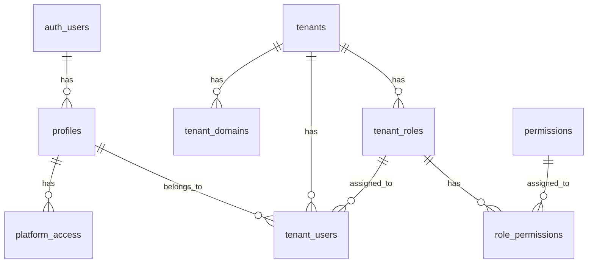
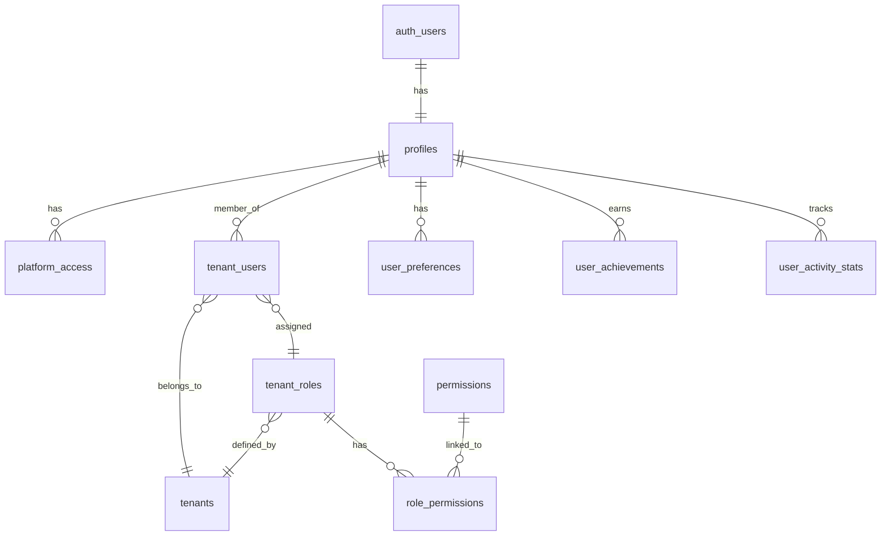
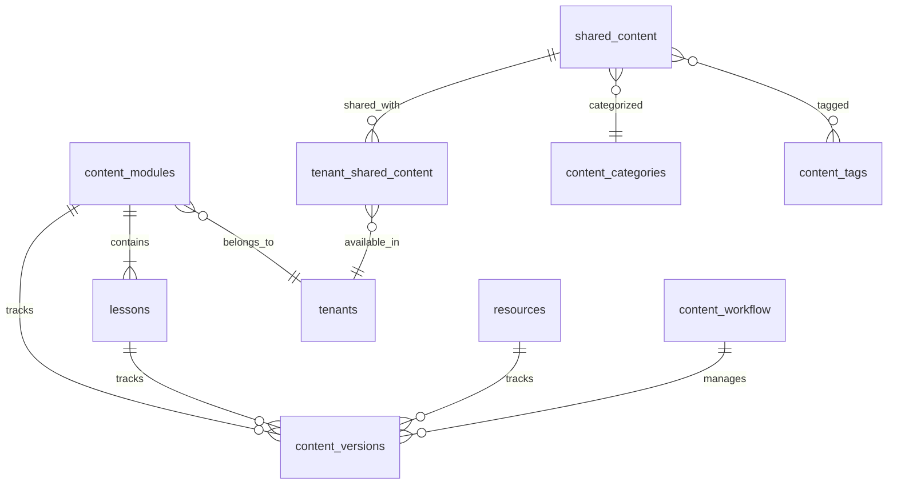
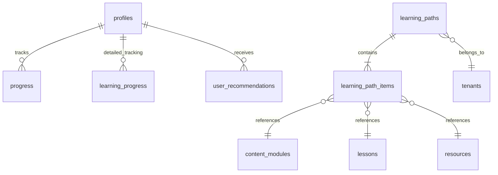
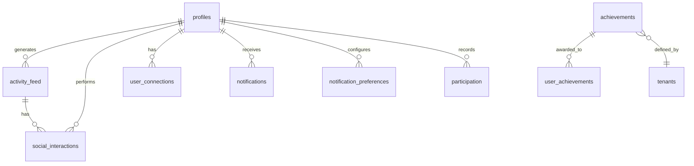
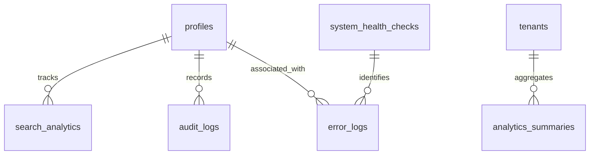

# Neothink Database Diagram

> **Proprietary Notice:**  
> This project and all related documentation are proprietary software owned and controlled by Neothink DAO and the Mark Hamilton Family. All rights reserved. Unauthorized use, distribution, or reproduction is strictly prohibited. See the [LICENSE](../../LICENSE) file for details.

> **See Also:**
> - [Schema Documentation](./schema_documentation.md)
> - [Migrations Guide](./MIGRATIONS.md)
> - [Supabase Integration](./SUPABASE-INTEGRATION.md)
> - [Getting Started](../getting-started/README.md)
> - [Security Guide](../security/security.md)


## 🔍 Overview

This document provides interactive visualizations of the Neothink platform database architecture. These diagrams illustrate the key tables, relationships, and data flows that power our multi-tenant learning ecosystem.

> **Interactive Tip**: All diagrams in this document use Mermaid.js and are interactive. Click on any entity to highlight its relationships!

## 📊 Architectural Design

The Neothink database follows a sophisticated multi-tenant architecture organized around functional domains:

| Domain | Purpose | Key Tables |
|--------|---------|------------|
| **User & Authentication** | Identity and access management | `auth.users`, `profiles`, `tenant_users` |
| **Content Management** | Learning content creation and distribution | `content_modules`, `lessons`, `resources` |
| **Learning & Progress** | User learning journey tracking | `learning_paths`, `progress`, `learning_progress` |
| **Social & Engagement** | Community interaction and gamification | `activity_feed`, `achievements`, `social_interactions` |
| **Analytics & Monitoring** | Performance monitoring and insights | `analytics_summaries`, `audit_logs`, `error_logs` |

## 🏛️ Core Architecture

The following diagram illustrates the foundation of the Neothink platform's multi-tenant architecture:



### Key Architectural Principles

1. **Centralized Authentication**: Single user identity managed by Supabase auth
2. **Platform Flexibility**: Users can belong to multiple platforms with different roles
3. **Role-Based Access**: Granular permissions through role assignments
4. **Domain Separation**: Each tenant has its own domain configuration
5. **Permission Inheritance**: Roles inherit permissions from assigned permission sets

## 👤 User Management Architecture

The user management system implements a flexible profile structure with platform-specific access controls:



### User Management Highlights

- **Extended Profiles**: Core identity data extended with platform-specific attributes
- **Multi-Platform Membership**: Users can belong to multiple platforms simultaneously
- **Personalized Experience**: User preferences drive customized platform experiences
- **Achievement System**: Gamification through platform-specific achievements
- **Activity Tracking**: Comprehensive tracking of user engagement

## 📚 Content Management Architecture

The content management system implements a modular structure with versioning and cross-platform sharing:



### Content Management Highlights

- **Hierarchical Structure**: Content organized in modules and lessons
- **Version Control**: Complete history of content changes
- **Approval Workflow**: Structured content review and approval process
- **Cross-Platform Sharing**: Content can be shared across multiple platforms
- **Rich Categorization**: Content organized with categories and tags

## 🛤️ Learning Pathways Architecture

The learning system implements structured paths with comprehensive progress tracking:



### Learning System Highlights

- **Structured Journeys**: Defined learning paths guide user progression
- **Granular Progress Tracking**: Detailed tracking at content item level
- **Learning Flexibility**: Paths can include various content types
- **Platform Specificity**: Learning paths can be platform-specific
- **Smart Recommendations**: Personalized content recommendations

## 🌐 Social Engagement Architecture

The social system implements community features with rich interaction capabilities:



### Social System Highlights

- **Activity Timeline**: Rich activity feed showing user actions
- **Diverse Interactions**: Multiple ways to interact with content and users
- **Connection System**: User-to-user connections for community building
- **Smart Notifications**: Configurable notification system
- **Achievement System**: Gamification through badges and rewards

## 📊 Analytics Architecture

The analytics system implements comprehensive data collection and reporting:



### Analytics System Highlights

- **User Behavior Tracking**: Insights into how users interact with content
- **Security Auditing**: Comprehensive audit trail for security and compliance
- **Platform Performance**: Aggregated metrics on platform usage
- **Error Monitoring**: Structured error tracking and resolution
- **Health Monitoring**: Proactive system health checks

## 🛠️ Database Diagram Tools

### Interactive Diagrams

For more detailed and interactive exploration of the database schema, we provide access to these tools:

1. **[Neothink Schema Explorer](https://schema.neothink.io)** - Our custom interactive schema visualization tool
2. **[Database Playground](https://db-playground.neothink.io)** - Test queries against a sandbox database

### External Diagramming Tools

For custom diagram creation, we recommend these industry-standard tools:

| Tool | Best For | Features |
|------|----------|----------|
| [**dbdiagram.io**](https://dbdiagram.io) | Quick diagrams | Web-based, code-driven diagrams |
| [**Lucidchart**](https://www.lucidchart.com) | Detailed diagrams | Full-featured diagramming with collaboration |
| [**Draw.io**](https://draw.io) | Free option | Versatile free diagramming tool |
| [**ERDPlus**](https://erdplus.com) | Educational use | Good for learning database modeling |

## 📱 Mobile-Friendly Views

For viewing on mobile devices, we provide simplified diagram versions:

- [View Mobile-Friendly User Schema](https://schema.neothink.io/mobile/users)
- [View Mobile-Friendly Content Schema](https://schema.neothink.io/mobile/content)
- [View Mobile-Friendly Learning Schema](https://schema.neothink.io/mobile/learning)

## 📥 Export Options

All diagrams can be exported in multiple formats:

- **PNG/JPG**: For documentation and presentations
- **SVG**: For scalable vector graphics
- **PDF**: For print-ready diagrams
- **JSON**: For importing into other tools

To export, visit our [Schema Explorer](https://schema.neothink.io) and use the export functionality.

> **How to Update This Diagram:**
>
> 1. Export the latest schema:
>    ```sh
>    npx supabase db dump --schema public > docs/database/schema.sql
>    ```
> 2. Paste `schema.sql` into [dbdiagram.io](https://dbdiagram.io/) or [QuickDBD](https://www.quickdatabasediagrams.com/) to generate an updated ERD.
> 3. Export the ERD as an image or markdown and update this file.
> 4. Commit both the updated ERD and `schema.sql` to version control.
>
> **Checklist:**
> - [ ] ERD is updated after every migration
> - [ ] ERD reflects all new/removed tables and relationships
> - [ ] ERD is referenced in onboarding and developer docs ([Getting Started](../getting-started/README.md))

---

## See Also
- [Schema Documentation](./schema_documentation.md)
- [Migrations Guide](./MIGRATIONS.md)
- [Supabase Integration](./SUPABASE-INTEGRATION.md)
- [Getting Started](../getting-started/README.md)
- [Security Guide](../security/security.md)

*Last updated: June 2025* 