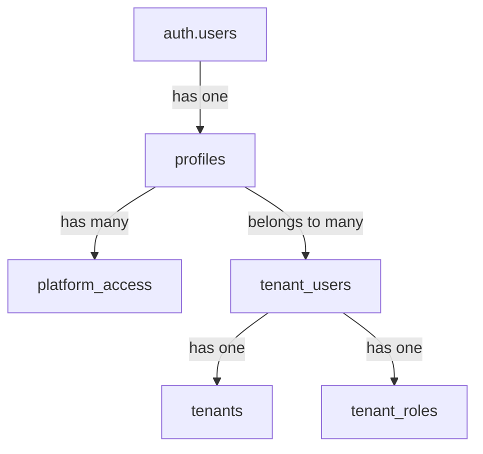
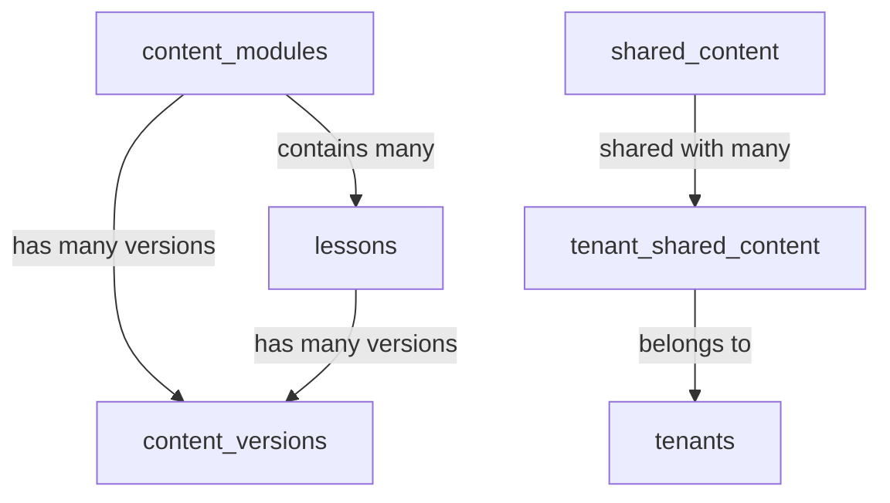
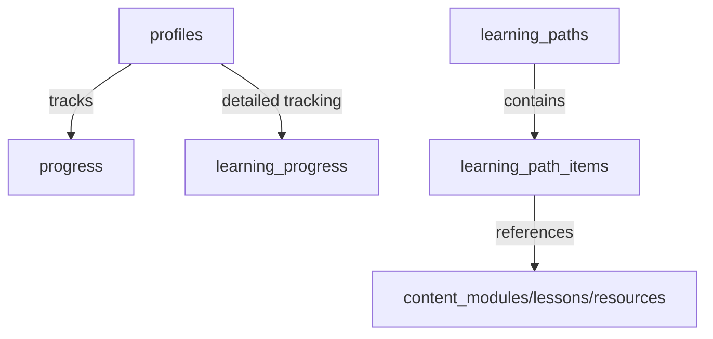
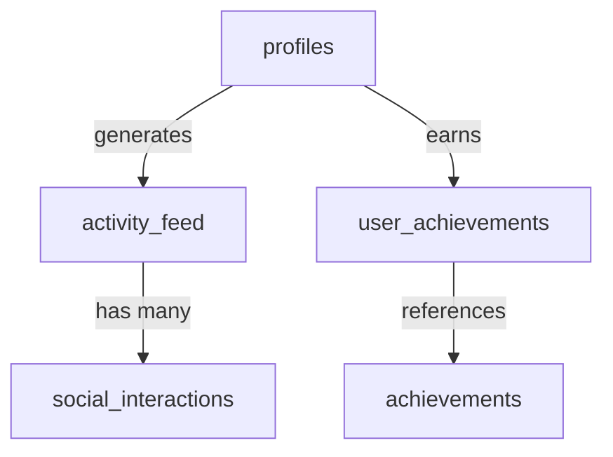

# Neothink Database Schema Documentation

> **Proprietary Notice:**  
> This project and all related documentation are proprietary software owned and controlled by Neothink DAO and the Mark Hamilton Family. All rights reserved. Unauthorized use, distribution, or reproduction is strictly prohibited. See the [LICENSE](../../LICENSE) file for details.

> **How to update this documentation:**
> - Update this file after every migration (see [Migrations Guide](./MIGRATIONS.md))
> - Ensure all new/removed tables and columns are documented
> - Reference the latest ERD in [database_diagram.md](./database_diagram.md)
> - Link this documentation in onboarding and developer guides ([Getting Started](../getting-started/README.md), [Onboarding Checklist](../getting-started/README.md#onboarding-checklist), [Admin Guide](../admin/CONTINUOUS_IMPROVEMENT.md))


## 📋 Overview

The Neothink platform ecosystem is built on a sophisticated multi-tenant architecture with a comprehensive database design that supports cross-platform authentication, content management, and user engagement features. This document provides detailed specifications of the database schema design, relationships, and key components, and is intended for both developers and admins seeking to understand or extend the platform.

> **Note for Developers & Admins**: This schema documentation is regularly updated to reflect the latest database structure. Ensure you're viewing the most recent version before implementing changes. See also: [Migrations Guide](./MIGRATIONS.md), [Supabase Integration](./SUPABASE-INTEGRATION.md), [ERD](./database_diagram.md), [Security Guide](../security/security.md), [Troubleshooting](../troubleshooting/README.md), [Support](../support/README.md).

## 📊 Database Schema Organization

The database is organized into several specialized schemas:

| Schema | Purpose | Management |
|--------|---------|------------|
| **auth** | Authentication services | Managed by Supabase |
| **public** | Application-specific tables | Custom implementation |
| **storage** | File storage functionality | Managed by Supabase |
| **realtime** | Real-time features and subscriptions | Managed by Supabase |
| **pgsodium** | Encryption and security services | PostgreSQL extension |
| **vault** | Secure storage of sensitive information | Custom implementation |

## 🏢 Multi-Tenant Architecture

### Tenants

The system is designed around four core platforms (tenants), each serving a distinct purpose in the Neothink ecosystem:

| Platform | Slug | Domain | Description |
|----------|------|--------|-------------|
| Neothink Hub | hub | go.neothink.io | Central hub connecting all platforms |
| Ascenders | ascenders | www.joinascenders.org | Professional development community |
| Neothinkers | neothinkers | www.joinneothinkers.org | Core learning community |
| Immortals | immortals | www.joinimmortals.org | Premium membership tier |

### Role-Based Access Control

Each tenant implements a role-based access control system with the following core roles:

| Role | Access Level | Description |
|------|-------------|-------------|
| **Admin** | Full | Complete administrative access |
| **Editor** | Medium | Content creation and management |
| **Viewer** | Limited | Read-only access to content |

## 📝 Database Tables Reference

> **Tip:** For each table, see also the [per-table documentation](./tables/) for detailed columns, RLS policies, and usage examples.

### User Management

#### `profiles`
Stores comprehensive user profile information including platform access flags.

```sql
CREATE TABLE profiles (
  id UUID PRIMARY KEY REFERENCES auth.users(id),
  email TEXT NOT NULL UNIQUE,
  full_name TEXT,
  avatar_url TEXT,
  bio TEXT,
  is_ascender BOOLEAN DEFAULT FALSE,
  is_neothinker BOOLEAN DEFAULT FALSE,
  is_immortal BOOLEAN DEFAULT FALSE,
  is_guardian BOOLEAN DEFAULT FALSE,
  guardian_since TIMESTAMPTZ,
  subscription_status TEXT,
  subscription_tier TEXT,
  subscription_period_start TIMESTAMPTZ,
  subscription_period_end TIMESTAMPTZ,
  platforms TEXT[],
  created_at TIMESTAMPTZ DEFAULT now(),
  updated_at TIMESTAMPTZ DEFAULT now()
);
```

#### `platform_access`
Records specific access levels to platforms with granular permission control.

```sql
CREATE TABLE platform_access (
  id UUID PRIMARY KEY DEFAULT uuid_generate_v4(),
  user_id UUID NOT NULL REFERENCES auth.users(id),
  platform_slug TEXT NOT NULL,
  access_level TEXT,
  granted_at TIMESTAMPTZ DEFAULT now(),
  expires_at TIMESTAMPTZ,
  granted_by UUID REFERENCES auth.users(id)
);
```

#### `tenant_users`
Maps users to tenants with specific roles, enabling multi-platform membership.

```sql
CREATE TABLE tenant_users (
  id UUID PRIMARY KEY DEFAULT uuid_generate_v4(),
  tenant_id UUID NOT NULL REFERENCES tenants(id),
  user_id UUID NOT NULL REFERENCES auth.users(id),
  role TEXT NOT NULL DEFAULT 'member',
  tenant_role_id UUID REFERENCES tenant_roles(id),
  status TEXT NOT NULL DEFAULT 'active',
  joined_at TIMESTAMPTZ DEFAULT now(),
  created_at TIMESTAMPTZ DEFAULT now(),
  updated_at TIMESTAMPTZ DEFAULT now()
);
```

### Content Management

#### `content_modules`
Manages course/content modules that form the foundation of learning content.

```sql
CREATE TABLE content_modules (
  id UUID PRIMARY KEY DEFAULT uuid_generate_v4(),
  platform TEXT NOT NULL,
  title TEXT NOT NULL,
  description TEXT,
  order_index INTEGER,
  is_published BOOLEAN DEFAULT FALSE,
  metadata JSONB,
  created_at TIMESTAMPTZ DEFAULT now(),
  updated_at TIMESTAMPTZ DEFAULT now()
);
```

#### `lessons`
Individual lessons within modules, providing structured learning content.

```sql
CREATE TABLE lessons (
  id UUID PRIMARY KEY DEFAULT uuid_generate_v4(),
  module_id UUID NOT NULL REFERENCES content_modules(id),
  title TEXT NOT NULL,
  content TEXT,
  order_index INTEGER,
  is_published BOOLEAN DEFAULT FALSE,
  metadata JSONB,
  created_at TIMESTAMPTZ DEFAULT now(),
  updated_at TIMESTAMPTZ DEFAULT now()
);
```

#### `resources`
Additional learning resources that supplement core content.

```sql
CREATE TABLE resources (
  id UUID PRIMARY KEY DEFAULT uuid_generate_v4(),
  platform TEXT NOT NULL,
  title TEXT NOT NULL,
  description TEXT,
  resource_type TEXT NOT NULL,
  url TEXT,
  content TEXT,
  is_published BOOLEAN DEFAULT FALSE,
  metadata JSONB,
  created_at TIMESTAMPTZ DEFAULT now(),
  updated_at TIMESTAMPTZ DEFAULT now()
);
```

#### `content_versions`
Version control system for tracking content revisions and history.

```sql
CREATE TABLE content_versions (
  id UUID PRIMARY KEY DEFAULT uuid_generate_v4(),
  content_type TEXT NOT NULL,
  content_id UUID NOT NULL,
  version_number INTEGER NOT NULL,
  title TEXT,
  content TEXT,
  description TEXT,
  metadata JSONB,
  created_by UUID REFERENCES auth.users(id),
  created_at TIMESTAMPTZ DEFAULT now(),
  status TEXT,
  review_notes TEXT,
  reviewed_by UUID REFERENCES auth.users(id),
  reviewed_at TIMESTAMPTZ
);
```

#### `content_workflow`
Manages content creation, review, and approval workflow processes.

```sql
CREATE TABLE content_workflow (
  id UUID PRIMARY KEY DEFAULT uuid_generate_v4(),
  content_type TEXT NOT NULL,
  content_id UUID NOT NULL,
  platform TEXT NOT NULL,
  current_status TEXT NOT NULL,
  assigned_to UUID REFERENCES auth.users(id),
  review_notes TEXT,
  due_date TIMESTAMPTZ,
  created_at TIMESTAMPTZ DEFAULT now(),
  updated_at TIMESTAMPTZ DEFAULT now()
);
```

#### `shared_content`
Content that can be shared across multiple platforms within the ecosystem.

```sql
CREATE TABLE shared_content (
  id UUID PRIMARY KEY DEFAULT uuid_generate_v4(),
  title TEXT NOT NULL,
  slug TEXT NOT NULL UNIQUE,
  description TEXT,
  content JSONB NOT NULL,
  category_id UUID REFERENCES content_categories(id),
  author_id UUID REFERENCES auth.users(id),
  is_published BOOLEAN DEFAULT FALSE,
  created_at TIMESTAMPTZ DEFAULT now(),
  updated_at TIMESTAMPTZ DEFAULT now()
);
```

#### `tenant_shared_content`
Maps shared content to specific tenants with platform-specific configuration.

```sql
CREATE TABLE tenant_shared_content (
  id UUID PRIMARY KEY DEFAULT uuid_generate_v4(),
  tenant_id UUID NOT NULL REFERENCES tenants(id),
  content_id UUID NOT NULL REFERENCES shared_content(id),
  is_featured BOOLEAN DEFAULT FALSE,
  display_order INTEGER DEFAULT 0,
  tenant_specific_settings JSONB,
  created_at TIMESTAMPTZ DEFAULT now(),
  updated_at TIMESTAMPTZ DEFAULT now()
);
```

### User Progress and Learning

#### `progress`
Tracks user progress through modules and lessons for comprehensive learning metrics.

```sql
CREATE TABLE progress (
  id UUID PRIMARY KEY DEFAULT uuid_generate_v4(),
  user_id UUID NOT NULL REFERENCES profiles(id),
  platform TEXT NOT NULL,
  module TEXT NOT NULL,
  lesson TEXT NOT NULL,
  status TEXT NOT NULL,
  completed_at TIMESTAMPTZ,
  created_at TIMESTAMPTZ DEFAULT now(),
  updated_at TIMESTAMPTZ DEFAULT now()
);
```

#### `learning_progress`
Detailed tracking of learning progress across all content types.

```sql
CREATE TABLE learning_progress (
  id UUID PRIMARY KEY DEFAULT uuid_generate_v4(),
  user_id UUID REFERENCES auth.users(id),
  content_type TEXT NOT NULL,
  content_id UUID NOT NULL,
  status TEXT NOT NULL,
  progress_percentage INTEGER DEFAULT 0,
  started_at TIMESTAMPTZ DEFAULT now(),
  completed_at TIMESTAMPTZ,
  last_interaction_at TIMESTAMPTZ DEFAULT now(),
  metadata JSONB
);
```

#### `learning_paths`
Defined learning paths and journeys that guide users through content sequences.

```sql
CREATE TABLE learning_paths (
  id UUID PRIMARY KEY DEFAULT uuid_generate_v4(),
  platform TEXT NOT NULL,
  path_name TEXT NOT NULL,
  description TEXT,
  difficulty_level TEXT,
  prerequisites JSONB,
  metadata JSONB,
  created_at TIMESTAMPTZ DEFAULT now(),
  updated_at TIMESTAMPTZ DEFAULT now()
);
```

#### `learning_path_items`
Items within a learning path, creating structured educational journeys.

```sql
CREATE TABLE learning_path_items (
  id UUID PRIMARY KEY DEFAULT uuid_generate_v4(),
  path_id UUID REFERENCES learning_paths(id),
  content_type TEXT NOT NULL,
  content_id UUID NOT NULL,
  order_index INTEGER NOT NULL,
  required BOOLEAN DEFAULT TRUE,
  metadata JSONB,
  created_at TIMESTAMPTZ DEFAULT now()
);
```

### User Engagement and Gamification

#### `achievements`
Defines achievements that users can earn through platform engagement.

```sql
CREATE TABLE achievements (
  id UUID PRIMARY KEY DEFAULT uuid_generate_v4(),
  platform TEXT NOT NULL,
  name TEXT NOT NULL,
  description TEXT,
  badge_url TEXT,
  points INTEGER DEFAULT 0,
  requirements JSONB,
  created_at TIMESTAMPTZ DEFAULT now(),
  updated_at TIMESTAMPTZ DEFAULT now()
);
```

#### `user_achievements`
Records achievements earned by users to track progress and gamification.

```sql
CREATE TABLE user_achievements (
  id UUID PRIMARY KEY DEFAULT uuid_generate_v4(),
  user_id UUID REFERENCES auth.users(id),
  achievement_id UUID REFERENCES achievements(id),
  earned_at TIMESTAMPTZ DEFAULT now(),
  metadata JSONB
);
```

#### `participation`
Tracks user participation in various activities for engagement metrics.

```sql
CREATE TABLE participation (
  id UUID PRIMARY KEY DEFAULT uuid_generate_v4(),
  user_id UUID NOT NULL REFERENCES profiles(id),
  platform TEXT NOT NULL,
  activity_type TEXT NOT NULL,
  points INTEGER DEFAULT 0,
  metadata JSONB,
  created_at TIMESTAMPTZ DEFAULT now(),
  updated_at TIMESTAMPTZ DEFAULT now()
);
```

#### `user_activity_stats`
Aggregated statistics on user activity for comprehensive engagement analysis.

```sql
CREATE TABLE user_activity_stats (
  id UUID PRIMARY KEY DEFAULT uuid_generate_v4(),
  user_id UUID REFERENCES auth.users(id),
  platform TEXT NOT NULL,
  activity_date DATE NOT NULL,
  total_time_spent INTERVAL,
  lessons_completed INTEGER DEFAULT 0,
  modules_completed INTEGER DEFAULT 0,
  points_earned INTEGER DEFAULT 0,
  last_activity_at TIMESTAMPTZ,
  created_at TIMESTAMPTZ DEFAULT now(),
  updated_at TIMESTAMPTZ DEFAULT now()
);
```

### Social and Interaction

#### `activity_feed`
User activity feed for social features and community engagement.

```sql
CREATE TABLE activity_feed (
  id UUID PRIMARY KEY DEFAULT uuid_generate_v4(),
  user_id UUID REFERENCES auth.users(id),
  platform TEXT NOT NULL,
  activity_type TEXT NOT NULL,
  content_type TEXT,
  content_id UUID,
  metadata JSONB,
  visibility TEXT NOT NULL,
  created_at TIMESTAMPTZ DEFAULT now(),
  updated_at TIMESTAMPTZ DEFAULT now()
);
```

#### `social_interactions`
Records user interactions with activities for rich social experiences.

```sql
CREATE TABLE social_interactions (
  id UUID PRIMARY KEY DEFAULT uuid_generate_v4(),
  user_id UUID REFERENCES auth.users(id),
  activity_id UUID REFERENCES activity_feed(id),
  interaction_type TEXT NOT NULL,
  comment_text TEXT,
  metadata JSONB,
  created_at TIMESTAMPTZ DEFAULT now(),
  updated_at TIMESTAMPTZ DEFAULT now()
);
```

#### `user_connections`
Manages connections between users for community building.

```sql
CREATE TABLE user_connections (
  id UUID PRIMARY KEY DEFAULT uuid_generate_v4(),
  user_id UUID REFERENCES auth.users(id),
  connected_user_id UUID REFERENCES auth.users(id),
  connection_type TEXT NOT NULL,
  status TEXT NOT NULL,
  created_at TIMESTAMPTZ DEFAULT now(),
  updated_at TIMESTAMPTZ DEFAULT now()
);
```

### Notifications and Preferences

#### `notifications`
User notifications for platform events and interactions.

```sql
CREATE TABLE notifications (
  id UUID PRIMARY KEY DEFAULT uuid_generate_v4(),
  user_id UUID REFERENCES auth.users(id),
  platform TEXT NOT NULL,
  title TEXT NOT NULL,
  body TEXT NOT NULL,
  metadata JSONB,
  is_read BOOLEAN DEFAULT FALSE,
  created_at TIMESTAMPTZ DEFAULT now(),
  updated_at TIMESTAMPTZ DEFAULT now()
);
```

#### `notification_preferences`
User notification preferences for personalized communication.

```sql
CREATE TABLE notification_preferences (
  id UUID PRIMARY KEY DEFAULT uuid_generate_v4(),
  user_id UUID REFERENCES auth.users(id),
  platform TEXT NOT NULL,
  email_enabled BOOLEAN DEFAULT TRUE,
  push_enabled BOOLEAN DEFAULT TRUE,
  in_app_enabled BOOLEAN DEFAULT TRUE,
  preferences JSONB,
  created_at TIMESTAMPTZ DEFAULT now(),
  updated_at TIMESTAMPTZ DEFAULT now()
);
```

#### `user_preferences`
General user preferences for personalized platform experience.

```sql
CREATE TABLE user_preferences (
  id UUID PRIMARY KEY DEFAULT uuid_generate_v4(),
  user_id UUID REFERENCES auth.users(id),
  platform TEXT NOT NULL,
  preference_type TEXT NOT NULL,
  preference_value JSONB NOT NULL,
  strength NUMERIC DEFAULT 1.0,
  created_at TIMESTAMPTZ DEFAULT now(),
  updated_at TIMESTAMPTZ DEFAULT now()
);
```

### Analytics and Recommendations

#### `analytics_summaries`
Aggregated analytics data for platform performance monitoring.

```sql
CREATE TABLE analytics_summaries (
  id UUID PRIMARY KEY DEFAULT uuid_generate_v4(),
  platform TEXT NOT NULL,
  summary_type TEXT NOT NULL,
  time_period TEXT NOT NULL,
  start_date DATE NOT NULL,
  end_date DATE NOT NULL,
  metrics JSONB NOT NULL,
  created_at TIMESTAMPTZ DEFAULT now(),
  updated_at TIMESTAMPTZ DEFAULT now()
);
```

#### `search_analytics`
Tracks search behavior for improved content discoverability.

```sql
CREATE TABLE search_analytics (
  id UUID PRIMARY KEY DEFAULT uuid_generate_v4(),
  user_id UUID REFERENCES auth.users(id),
  query TEXT NOT NULL,
  filters JSONB,
  results_count INTEGER,
  selected_result JSONB,
  session_id UUID,
  platform TEXT,
  created_at TIMESTAMPTZ DEFAULT now()
);
```

#### `user_recommendations`
Personalized content recommendations based on user behavior and preferences.

```sql
CREATE TABLE user_recommendations (
  id UUID PRIMARY KEY DEFAULT uuid_generate_v4(),
  user_id UUID REFERENCES auth.users(id),
  platform TEXT NOT NULL,
  content_type TEXT NOT NULL,
  content_id UUID NOT NULL,
  recommendation_type TEXT NOT NULL,
  relevance_score NUMERIC NOT NULL,
  factors JSONB,
  created_at TIMESTAMPTZ DEFAULT now(),
  expires_at TIMESTAMPTZ
);
```

### Monitoring and System Management

#### `audit_logs`
Comprehensive audit logging for security and compliance.

```sql
CREATE TABLE audit_logs (
  id UUID PRIMARY KEY DEFAULT uuid_generate_v4(),
  user_id UUID REFERENCES auth.users(id),
  action TEXT NOT NULL,
  entity_type TEXT NOT NULL,
  entity_id UUID,
  old_data JSONB,
  new_data JSONB,
  ip_address TEXT,
  user_agent TEXT,
  created_at TIMESTAMPTZ DEFAULT now()
);
```

#### `error_logs`
System error tracking for reliability and performance monitoring.

```sql
CREATE TABLE error_logs (
  id UUID PRIMARY KEY DEFAULT uuid_generate_v4(),
  error_type TEXT NOT NULL,
  error_message TEXT NOT NULL,
  stack_trace TEXT,
  context JSONB,
  timestamp TIMESTAMPTZ DEFAULT now(),
  severity TEXT NOT NULL,
  platform TEXT,
  user_id UUID REFERENCES auth.users(id),
  resolved BOOLEAN DEFAULT FALSE,
  resolution_notes TEXT
);
```

#### `system_health_checks`
System health monitoring for proactive platform maintenance.

```sql
CREATE TABLE system_health_checks (
  id UUID PRIMARY KEY DEFAULT uuid_generate_v4(),
  check_name TEXT NOT NULL,
  status TEXT NOT NULL,
  last_check_time TIMESTAMPTZ DEFAULT now(),
  next_check_time TIMESTAMPTZ,
  check_duration INTERVAL,
  details JSONB,
  severity TEXT
);
```

## 🔄 Key Database Relationships

### User to Platform Relationships


### Content Relationships


### User Progress Relationships


### Social and Engagement Relationships


## 🛠️ Database Extensions

The database utilizes several PostgreSQL extensions to enhance functionality:

| Extension | Purpose |
|-----------|---------|
| **pg_graphql** | GraphQL API support |
| **pgsodium** | Encryption and security |
| **pgcrypto** | Cryptographic functions |
| **pg_trgm** | Text similarity search |
| **unaccent** | Text normalization |
| **uuid-ossp** | UUID generation |

## 🔒 Security Model

The database implements a comprehensive security model built around:

### Row-Level Security (RLS)
Most tables have RLS policies to control access based on user identity and permissions:

```sql
-- Example RLS policy for content access
CREATE POLICY content_access_policy ON content_modules
  USING (
    is_published = TRUE 
    OR created_by = auth.uid() 
    OR auth.uid() IN (
      SELECT user_id FROM tenant_users
      JOIN tenant_roles ON tenant_users.tenant_role_id = tenant_roles.id
      WHERE tenant_roles.slug IN ('admin', 'editor')
    )
  );
```

### Role-Based Access Control
Access is managed through tenant roles and permissions:

```sql
-- Example of checking permissions
CREATE FUNCTION can_user_edit_content(content_id UUID) RETURNS BOOLEAN AS $$
BEGIN
  RETURN EXISTS (
    SELECT 1 FROM role_permissions rp
    JOIN tenant_roles tr ON rp.tenant_role_id = tr.id
    JOIN tenant_users tu ON tr.id = tu.tenant_role_id
    JOIN permissions p ON rp.permission_id = p.id
    WHERE tu.user_id = auth.uid()
    AND p.slug = 'content:edit'
  );
END;
$$ LANGUAGE plpgsql SECURITY DEFINER;
```

### Tenant Isolation
Multi-tenant design with proper data separation:

```sql
-- Example of tenant isolation
CREATE POLICY tenant_isolation_policy ON tenant_specific_data
  USING (tenant_id IN (
    SELECT tenant_id FROM tenant_users
    WHERE user_id = auth.uid()
  ));
```

## 🔍 Search Functionality

The database includes comprehensive search functionality:

```sql
CREATE TABLE search_vectors (
  id UUID PRIMARY KEY DEFAULT uuid_generate_v4(),
  content_type TEXT NOT NULL,
  content_id UUID NOT NULL,
  title TEXT,
  description TEXT,
  content TEXT,
  tags TEXT[],
  metadata JSONB,
  search_vector TSVECTOR,
  created_at TIMESTAMPTZ DEFAULT now(),
  updated_at TIMESTAMPTZ DEFAULT now()
);

-- Create GIN index for efficient searching
CREATE INDEX search_vectors_idx ON search_vectors USING GIN(search_vector);

-- Update search vectors with triggers
CREATE TRIGGER update_search_vectors
  AFTER INSERT OR UPDATE ON content_modules
  FOR EACH ROW EXECUTE FUNCTION update_content_search_vector();
```

## 🔮 Recommendation System

The database supports a sophisticated recommendation system:

```sql
CREATE TABLE content_similarity (
  id UUID PRIMARY KEY DEFAULT uuid_generate_v4(),
  content_type TEXT NOT NULL,
  content_id UUID NOT NULL,
  similar_content_type TEXT NOT NULL,
  similar_content_id UUID NOT NULL,
  similarity_score NUMERIC NOT NULL,
  similarity_factors JSONB,
  created_at TIMESTAMPTZ DEFAULT now(),
  updated_at TIMESTAMPTZ DEFAULT now()
);

-- Create index for efficient recommendation queries
CREATE INDEX content_similarity_content_idx 
  ON content_similarity(content_type, content_id, similarity_score DESC);
```

## 📈 Performance Considerations

For optimal database performance, consider the following:

1. **Indexing Strategy**: Key fields are indexed for efficient queries
2. **Partitioning**: Large tables use partitioning for improved performance
3. **Query Optimization**: Complex queries are optimized and use prepared statements
4. **Connection Pooling**: Implement connection pooling for efficient resource usage
5. **Regular Maintenance**: Schedule routine VACUUM and ANALYZE operations

## 🔄 Schema Evolution

The database schema evolves through a controlled migration process:

1. **Migration Scripts**: All schema changes are tracked in migration scripts (see [Migrations Guide](./MIGRATIONS.md))
2. **Version Control**: Database versions are tracked alongside application versions
3. **Backward Compatibility**: Changes maintain backward compatibility where possible
4. **Testing**: Migrations are tested in development before production deployment

> After every migration, update this documentation and the [ERD](./database_diagram.md). See [Getting Started](../getting-started/README.md), [Onboarding Checklist](../getting-started/README.md#onboarding-checklist), [Admin Guide](../admin/CONTINUOUS_IMPROVEMENT.md) for onboarding steps.

## ✅ Conclusion

The Neothink database is architected as a comprehensive, multi-tenant system supporting user management, content delivery, learning paths, social features, and analytics. It provides a solid foundation for the Neothink ecosystem, allowing for platform-specific customization while maintaining a unified user experience across all platforms.

---

## See Also
- [Migrations Guide](./MIGRATIONS.md)
- [Supabase Integration](./SUPABASE-INTEGRATION.md)
- [Database Diagram (ERD)](./database_diagram.md)
- [Getting Started](../getting-started/README.md)
- [Onboarding Checklist](../getting-started/README.md#onboarding-checklist)
- [Admin Guide](../admin/CONTINUOUS_IMPROVEMENT.md)
- [Security Guide](../security/security.md)
- [Troubleshooting](../troubleshooting/README.md)
- [Support](../support/README.md)

*Last updated: June 2025*

> **Schema Documentation Maintenance:**
>
> - [ ] Update this file after every migration
> - [ ] Ensure all new/removed tables and columns are documented
> - [ ] Reference the latest ERD in [database_diagram.md](./database_diagram.md)
> - [ ] Link this documentation in onboarding and developer guides ([Getting Started](../getting-started/README.md), [Onboarding Checklist](../getting-started/README.md#onboarding-checklist), [Admin Guide](../admin/CONTINUOUS_IMPROVEMENT.md)) 