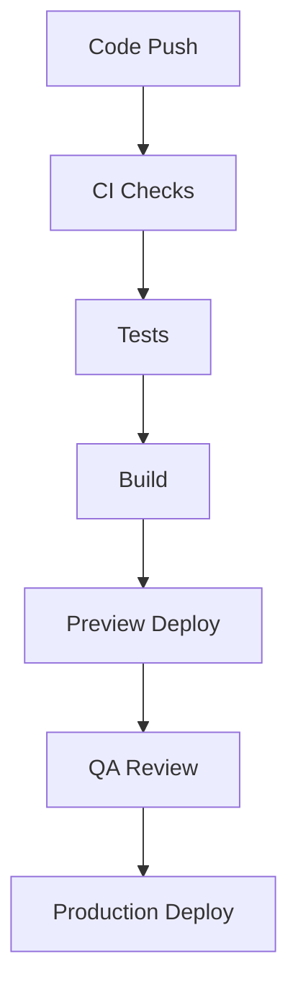

# 🚀 Deployment Guide

## Overview

This guide outlines the deployment process for the Neothink Platforms ecosystem. Each platform is deployed independently while sharing common backend resources.

## 📋 Prerequisites

- [Vercel](https://vercel.com) account with appropriate permissions
- [Supabase](https://supabase.com) project access
- Git repository access
- Domain configuration access

## 🏗️ Platform Architecture

Each platform is deployed as a separate Vercel project:

| Platform | Repository | Vercel Project | Production URL |
|----------|------------|----------------|----------------|
| Hub | [neothink-dao/neothink.io](https://github.com/neothink-dao/neothink.io) | neothink-io | go.neothink.io |
| Ascenders | [neothink-dao/ascenders](https://github.com/neothink-dao/ascenders) | join-ascenders | joinascenders.org |
| Neothinkers | [neothink-dao/neothinkers](https://github.com/neothink-dao/neothinkers) | join-neothinkers | joinneothinkers.org |
| Immortals | [neothink-dao/immortals](https://github.com/neothink-dao/immortals) | join-immortals | joinimmortals.org |

## 🔄 Deployment Process

### 1. Environment Setup

```bash
# Clone the repository
git clone https://github.com/neothink-dao/neothink-platforms.git
cd neothink-platforms

# Install dependencies
pnpm install

# Set up environment variables
cp .env.example .env.local
```

Required environment variables:
- `NEXT_PUBLIC_SUPABASE_URL`: Supabase project URL
- `NEXT_PUBLIC_SUPABASE_ANON_KEY`: Supabase anonymous key
- `SUPABASE_SERVICE_ROLE_KEY`: Supabase service role key
- `NEXT_PUBLIC_PLATFORM_NAME`: Platform name
- `NEXT_PUBLIC_PLATFORM_SLUG`: Platform identifier

### 2. Pre-Deployment Checks

```bash
# Run the deployment preparation script
pnpm run prepare-deploy

# Run tests
pnpm run test

# Build check
pnpm run build
```

### 3. Deployment Commands

```bash
# Deploy a specific platform
cd platform-directory
vercel deploy

# Deploy to production
vercel deploy --prod
```

## 🔒 Security Considerations

1. **Environment Variables**
   - Never commit sensitive values
   - Use Vercel's environment management
   - Rotate keys regularly
   - See [Security Guide](../operations/SECURITY.md)

2. **Authentication**
   - Verify auth configuration
   - Test SSO functionality
   - Check role assignments
   - See [Auth System](../auth-system.md)

3. **Database**
   - Run migrations carefully
   - Test RLS policies
   - Verify backup procedures
   - See [Database Guide](../database/SCHEMA.md)

## 📊 Monitoring

1. **Performance Monitoring**
   - Set up Vercel Analytics
   - Configure error tracking
   - Monitor API endpoints
   - See [Monitoring Guide](../operations/MONITORING.md)

2. **Health Checks**
   - Implement status endpoints
   - Set up uptime monitoring
   - Configure alerts
   - See [Performance Guide](../operations/PERFORMANCE.md)

## 🔄 CI/CD Pipeline



## 🚨 Troubleshooting

### Common Issues

1. **Build Failures**
   ```bash
   # Clear cache and rebuild
   vercel build --clear-cache
   ```

2. **Database Issues**
   ```bash
   # Check migrations
   pnpm run db:status
   ```

3. **Authentication Problems**
   ```bash
   # Verify auth configuration
   pnpm run auth:check
   ```

## 🔄 Rollback Procedures

```bash
# Revert to previous version
git revert HEAD
git push origin main

# Redeploy specific version
vercel deploy --prod
```

## 📱 Mobile Considerations

- Test responsive layouts
- Verify PWA functionality
- Check offline capabilities
- Test on multiple devices

## 🌐 Cross-Platform Features

Ensure these features work across all platforms:
- Single Sign-On (SSO)
- Shared components
- Data synchronization
- See [Cross-Platform Features](../reference/CROSS-PLATFORM-FEATURES.md)

## 🤝 Support

Need deployment help?
- Review [Troubleshooting Guide](../troubleshooting/README.md)
- Join [Developer Community](https://developers.neothink.io)
- Contact [DevOps Team](mailto:devops@neothink.io)

---

<div align="center">

**Building the future of human achievement.**

[Edit Guide](https://github.com/neothink-dao/docs/edit/main/docs/development/DEPLOYMENT-GUIDE.md) • [Report Issue](https://github.com/neothink-dao/docs/issues/new)

</div> 