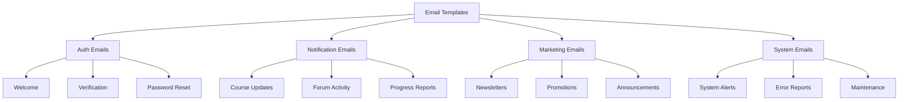

# Email Templates

## Overview

The Neothink Sites monorepo uses a shared email template system for consistent communication across platforms.

## Template Structure



## Template Components

### 1. Base Template
```typescript
// Example base email template
interface BaseEmailProps {
  title: string;
  preview: string;
  children: React.ReactNode;
  footer?: React.ReactNode;
}

export const BaseEmail: React.FC<BaseEmailProps> = ({
  title,
  preview,
  children,
  footer
}) => {
  // Implementation
};
```

### 2. Header
```typescript
// Example email header component
interface EmailHeaderProps {
  logo: string;
  platform: string;
}

export const EmailHeader: React.FC<EmailHeaderProps> = ({
  logo,
  platform
}) => {
  // Implementation
};
```

### 3. Footer
```typescript
// Example email footer component
interface EmailFooterProps {
  platform: string;
  unsubscribeLink?: string;
  socialLinks?: Array<{
    platform: string;
    url: string;
  }>;
}

export const EmailFooter: React.FC<EmailFooterProps> = ({
  platform,
  unsubscribeLink,
  socialLinks
}) => {
  // Implementation
};
```

## Auth Emails

### 1. Welcome Email
```typescript
// Example welcome email template
interface WelcomeEmailProps {
  username: string;
  platform: string;
  verificationLink?: string;
}

export const WelcomeEmail: React.FC<WelcomeEmailProps> = ({
  username,
  platform,
  verificationLink
}) => {
  // Implementation
};
```

### 2. Verification Email
```typescript
// Example verification email template
interface VerificationEmailProps {
  username: string;
  verificationLink: string;
  platform: string;
}

export const VerificationEmail: React.FC<VerificationEmailProps> = ({
  username,
  verificationLink,
  platform
}) => {
  // Implementation
};
```

### 3. Password Reset Email
```typescript
// Example password reset email template
interface PasswordResetEmailProps {
  username: string;
  resetLink: string;
  platform: string;
}

export const PasswordResetEmail: React.FC<PasswordResetEmailProps> = ({
  username,
  resetLink,
  platform
}) => {
  // Implementation
};
```

## Notification Emails

### 1. Course Update Email
```typescript
// Example course update email template
interface CourseUpdateEmailProps {
  username: string;
  courseName: string;
  updateType: 'new' | 'updated' | 'completed';
  courseLink: string;
}

export const CourseUpdateEmail: React.FC<CourseUpdateEmailProps> = ({
  username,
  courseName,
  updateType,
  courseLink
}) => {
  // Implementation
};
```

### 2. Forum Activity Email
```typescript
// Example forum activity email template
interface ForumActivityEmailProps {
  username: string;
  activityType: 'reply' | 'mention' | 'follow';
  postTitle: string;
  postLink: string;
  authorName: string;
}

export const ForumActivityEmail: React.FC<ForumActivityEmailProps> = ({
  username,
  activityType,
  postTitle,
  postLink,
  authorName
}) => {
  // Implementation
};
```

### 3. Progress Report Email
```typescript
// Example progress report email template
interface ProgressReportEmailProps {
  username: string;
  courseName: string;
  progress: number;
  nextSteps: Array<string>;
  courseLink: string;
}

export const ProgressReportEmail: React.FC<ProgressReportEmailProps> = ({
  username,
  courseName,
  progress,
  nextSteps,
  courseLink
}) => {
  // Implementation
};
```

## Marketing Emails

### 1. Newsletter Email
```typescript
// Example newsletter email template
interface NewsletterEmailProps {
  username: string;
  platform: string;
  articles: Array<{
    title: string;
    excerpt: string;
    link: string;
  }>;
}

export const NewsletterEmail: React.FC<NewsletterEmailProps> = ({
  username,
  platform,
  articles
}) => {
  // Implementation
};
```

### 2. Promotion Email
```typescript
// Example promotion email template
interface PromotionEmailProps {
  username: string;
  promotion: {
    title: string;
    description: string;
    discount: string;
    expiryDate: string;
    actionLink: string;
  };
}

export const PromotionEmail: React.FC<PromotionEmailProps> = ({
  username,
  promotion
}) => {
  // Implementation
};
```

### 3. Announcement Email
```typescript
// Example announcement email template
interface AnnouncementEmailProps {
  username: string;
  announcement: {
    title: string;
    content: string;
    actionLink?: string;
    actionText?: string;
  };
}

export const AnnouncementEmail: React.FC<AnnouncementEmailProps> = ({
  username,
  announcement
}) => {
  // Implementation
};
```

## System Emails

### 1. System Alert Email
```typescript
// Example system alert email template
interface SystemAlertEmailProps {
  alert: {
    severity: 'info' | 'warning' | 'error';
    title: string;
    message: string;
    actionRequired?: boolean;
  };
}

export const SystemAlertEmail: React.FC<SystemAlertEmailProps> = ({
  alert
}) => {
  // Implementation
};
```

### 2. Error Report Email
```typescript
// Example error report email template
interface ErrorReportEmailProps {
  error: {
    type: string;
    message: string;
    timestamp: string;
    context?: object;
  };
}

export const ErrorReportEmail: React.FC<ErrorReportEmailProps> = ({
  error
}) => {
  // Implementation
};
```

### 3. Maintenance Email
```typescript
// Example maintenance email template
interface MaintenanceEmailProps {
  maintenance: {
    startTime: string;
    endTime: string;
    affectedServices: Array<string>;
    impact: string;
  };
}

export const MaintenanceEmail: React.FC<MaintenanceEmailProps> = ({
  maintenance
}) => {
  // Implementation
};
```

## Best Practices

1. **Template Design**
   - Use responsive design
   - Support dark/light mode
   - Optimize for email clients
   - Include plain text version

2. **Content**
   - Clear and concise messaging
   - Consistent branding
   - Action-oriented CTAs
   - Personalization where appropriate

3. **Testing**
   - Test across email clients
   - Verify links and tracking
   - Check spam score
   - Validate HTML/CSS

4. **Performance**
   - Optimize images
   - Minimize CSS
   - Use web fonts carefully
   - Consider load time

5. **Accessibility**
   - Use semantic HTML
   - Include alt text
   - Ensure color contrast
   - Test with screen readers
``` 