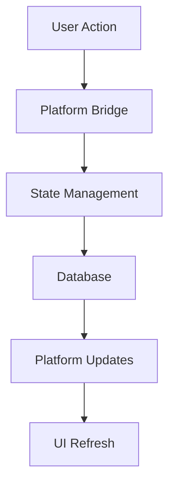

# Core Concepts

This document outlines the fundamental concepts and architecture of the Neothink+ ecosystem.

## Platform Philosophy

### Independent Value Proposition
Each platform in the Neothink+ ecosystem is designed to be independently valuable:

- **Ascenders**: Complete business and financial sovereignty system
- **Neothinkers**: Comprehensive knowledge and community platform
- **Immortals**: Complete health and longevity system

### Optional Integration
The Neothink+ Hub provides optional integration benefits while maintaining platform independence:
- Cross-platform state management
- Unified experience
- Enhanced features
- Seamless navigation

## Architecture Principles

### 1. Monorepo Structure
```
neothink.io/
├── apps/          # Platform applications
├── packages/      # Shared code
├── supabase/      # Database
└── docs/          # Documentation
```

### 2. Shared Packages
- **Platform Bridge**: Cross-platform state and navigation
- **UI Components**: Shared design system
- **Authentication**: Unified auth system
- **Database**: Shared data layer
- **Analytics**: Cross-platform tracking

### 3. Data Flow


## Platform Switching

### State Management
- Preserves context across platforms
- Manages user preferences
- Handles platform-specific data
- Maintains navigation state

### Error Handling
- Graceful degradation
- Clear error messages
- Recovery mechanisms
- State preservation

## Authentication System

### Multi-Platform Auth
- Single sign-on (optional)
- Platform-specific roles
- Granular permissions
- Session management

### Access Control
```typescript
interface PlatformAccess {
  platform: PlatformSlug
  accessLevel: 'visitor' | 'member' | 'admin'
  features: string[]
  restrictions: string[]
}
```

## Database Architecture

### Schema Design
- Platform-specific schemas
- Shared user data
- Cross-platform relations
- Migration management

### Data Access
- Row-level security
- Type safety
- Query optimization
- Real-time subscriptions

## UI/UX Principles

### Design System
- Consistent components
- Platform-specific themes
- Accessibility first
- Responsive design

### Navigation
- Cross-platform links
- State preservation
- Loading states
- Error boundaries

## Analytics Integration

### Event Tracking
- User journeys
- Platform usage
- Feature adoption
- Error monitoring

### Metrics
- Engagement rates
- Platform switches
- Feature usage
- Performance data

## AI Integration

### Vector Search
- Semantic matching
- Content discovery
- Cross-platform search
- Personalization

### GPT Integration
- Content enhancement
- User assistance
- Feature suggestions
- Learning optimization

## Security Model

### Data Protection
- End-to-end encryption
- Secure storage
- Access control
- Audit logging

### Compliance
- GDPR compliance
- Data privacy
- User consent
- Data portability

## Performance

### Optimization
- Code splitting
- Lazy loading
- Cache strategy
- Bundle optimization

### Monitoring
- Real-time metrics
- Error tracking
- Performance KPIs
- User feedback

## Development Workflow

### Code Organization
```
apps/platform/
├── app/           # Next.js app
├── components/    # UI components
├── lib/           # Utilities
└── types/         # TypeScript types
```

### Testing Strategy
- Unit tests
- Integration tests
- E2E testing
- Performance testing

## Deployment

### CI/CD Pipeline
- Automated testing
- Type checking
- Linting
- Build optimization

### Environment Management
- Development
- Staging
- Production
- Feature flags

## Best Practices

### Code Quality
- TypeScript strict mode
- ESLint rules
- Code reviews
- Documentation

### Performance
- Lighthouse scores
- Core Web Vitals
- Bundle size
- Load times

### Security
- Authentication
- Authorization
- Data encryption
- Security headers

## Further Reading

- [Architecture Details](./architecture/overview.md)
- [Development Guide](./guides/development.md)
- [Testing Guide](./guides/testing.md)
- [Security Guide](./guides/security.md) 