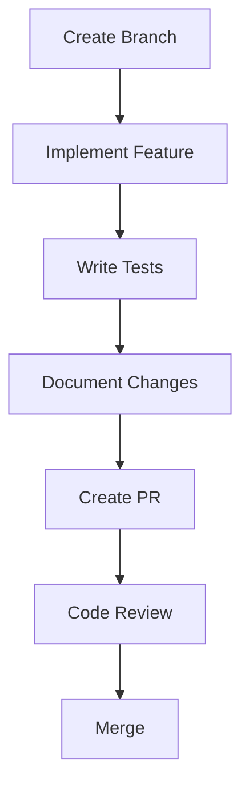

# Development Guide

## Overview

This guide provides comprehensive development guidelines for the Neothink+ ecosystem. It covers best practices, workflows, and standards that all developers should follow.

## Development Principles

### 1. Code Quality
- Write clean, maintainable code
- Follow TypeScript best practices
- Use proper typing
- Document complex logic
- Write comprehensive tests

### 2. Performance First
- Optimize for Core Web Vitals
- Implement proper caching
- Use code splitting
- Optimize bundle size
- Monitor performance metrics

### 3. Security Mindset
- Validate all inputs
- Sanitize all outputs
- Implement proper access control
- Follow security best practices
- Regular security audits

## Development Workflow

### 1. Feature Development



#### Branch Naming
```bash
feature/platform-name/feature-name
bugfix/platform-name/bug-description
hotfix/platform-name/issue-description
```

#### Commit Messages
```bash
# Format
type(scope): description

# Examples
feat(hub): add platform switching
fix(auth): resolve login issue
docs(api): update platform bridge docs
```

### 2. Code Organization

#### Platform Structure
```
apps/platform-name/
├── app/                    # Next.js app
│   ├── layout.tsx         # Root layout
│   ├── page.tsx           # Home page
│   └── features/          # Feature routes
├── components/            # UI components
│   ├── common/           # Shared components
│   └── features/         # Feature components
├── lib/                   # Utilities
│   ├── api/              # API handlers
│   ├── hooks/            # Custom hooks
│   └── utils/            # Helper functions
└── types/                # TypeScript types
```

#### Shared Package Structure
```
packages/package-name/
├── src/
│   ├── index.ts          # Public API
│   ├── components/       # Components
│   ├── hooks/           # Hooks
│   └── utils/           # Utilities
├── tests/               # Test files
└── package.json         # Package config
```

### 3. Testing Strategy

#### Unit Tests
```typescript
describe('PlatformSwitcher', () => {
  it('should switch platforms successfully', async () => {
    const switcher = new PlatformSwitcher();
    const result = await switcher.switch('ascenders');
    expect(result.success).toBe(true);
  });
});
```

#### Integration Tests
```typescript
describe('Platform Integration', () => {
  it('should maintain state across platforms', async () => {
    const state = await switchAndVerifyState('hub', 'ascenders');
    expect(state).toMatchSnapshot();
  });
});
```

#### E2E Tests
```typescript
test('user can switch platforms', async ({ page }) => {
  await page.goto('/');
  await page.click('[data-testid="platform-switcher"]');
  await page.click('[data-testid="platform-ascenders"]');
  await expect(page).toHaveURL('/ascenders');
});
```

## Development Standards

### 1. TypeScript Guidelines

#### Type Definitions
```typescript
// Use specific types
type PlatformSlug = 'hub' | 'ascenders' | 'neothinkers' | 'immortals';

// Use interfaces for objects
interface PlatformConfig {
  slug: PlatformSlug;
  name: string;
  features: string[];
}

// Use generics when appropriate
function getState<T extends PlatformState>(platform: PlatformSlug): T {
  // Implementation
}
```

#### Error Handling
```typescript
// Define error types
interface PlatformError extends Error {
  code: string;
  details: Record<string, unknown>;
}

// Handle errors properly
try {
  await switchPlatform(platform);
} catch (error) {
  if (error instanceof PlatformError) {
    handlePlatformError(error);
  }
  throw error;
}
```

### 2. Component Guidelines

#### Component Structure
```typescript
// Use functional components
const PlatformSwitcher: React.FC<PlatformSwitcherProps> = ({
  currentPlatform,
  onSwitch,
}) => {
  // Implementation
};

// Use proper prop types
interface PlatformSwitcherProps {
  currentPlatform: PlatformSlug;
  onSwitch: (platform: PlatformSlug) => Promise<void>;
}
```

#### Styling
```typescript
// Use Tailwind classes
const Button = styled.button`
  ${tw`px-4 py-2 bg-primary text-white rounded-md`}
  &:hover {
    ${tw`bg-primary-dark`}
  }
`;
```

### 3. API Guidelines

#### API Structure
```typescript
// Define API endpoints
const api = {
  platforms: {
    get: (slug: PlatformSlug) => `/api/platforms/${slug}`,
    switch: () => '/api/platforms/switch',
  },
};

// Use type-safe fetching
async function fetchPlatform(slug: PlatformSlug): Promise<Platform> {
  const response = await fetch(api.platforms.get(slug));
  return response.json();
}
```

#### Error Responses
```typescript
// Standardized error response
interface APIError {
  code: string;
  message: string;
  details?: Record<string, unknown>;
}

// Error handling
if (!response.ok) {
  const error: APIError = await response.json();
  throw new PlatformError(error.message, error.code);
}
```

## Development Tools

### 1. VS Code Extensions
- ESLint
- Prettier
- Tailwind CSS IntelliSense
- GitLens
- Error Lens

### 2. CLI Tools
```bash
# Type checking
pnpm type-check

# Linting
pnpm lint

# Testing
pnpm test
pnpm test:watch
pnpm test:coverage

# Building
pnpm build
```

### 3. Debug Tools
- React DevTools
- Redux DevTools
- Network Inspector
- Lighthouse

## Best Practices

### 1. Performance
- Use React.memo for expensive components
- Implement proper loading states
- Optimize images and assets
- Use proper caching strategies

### 2. Security
- Validate all user inputs
- Implement proper CORS
- Use Content Security Policy
- Regular security audits

### 3. Accessibility
- Use semantic HTML
- Implement ARIA attributes
- Ensure keyboard navigation
- Test with screen readers

## Resources

- [Architecture Overview](../architecture/overview.md)
- [API Documentation](../api/platform-bridge.md)
- [Testing Guide](./testing.md)
- [Security Guide](./security.md) 