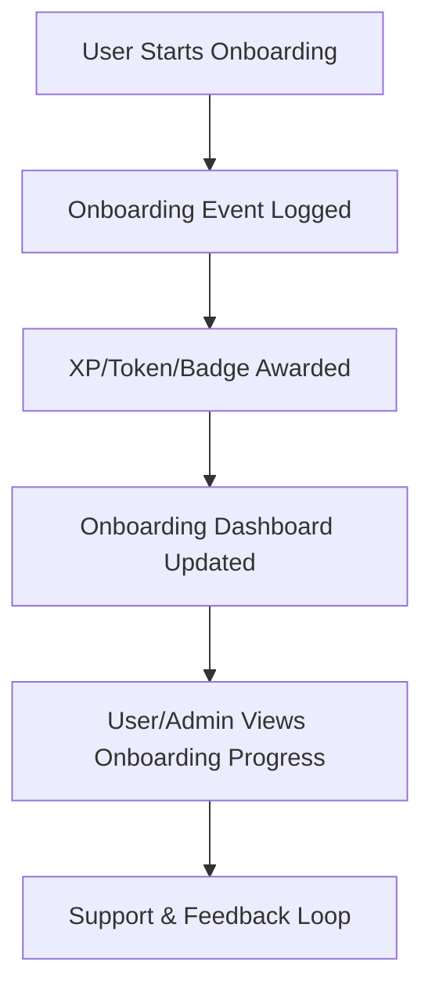

# Onboarding & Game Guides (2025)

## ✨ Welcome: User & Admin Experience

**For Users:**
- Begin your journey with a tailored onboarding flow for your chosen app (Ascenders, Neothinkers, Immortals, Superachievers).
- Learn how to earn points, unlock features, and progress through levels and badges.
- Access cross-app challenges and maximize your rewards.
- Find FAQs, troubleshooting, and support for every step.

**For Admins:**
- Review onboarding flows for each app and ensure clarity and delight.
- Monitor onboarding analytics and optimize for engagement.
- Tune onboarding rewards, milestones, and progressive disclosure.
- Use feedback to iterate and improve the onboarding experience.

## 🚀 What’s New in 2025?
- Progressive onboarding with stepwise feature unlocks.
- Cross-app synergy: rewards and progress carry across all apps.
- Enhanced analytics and feedback for onboarding optimization.

## 📚 Quick Links
- [Ascender Guide](./ascender.md)
- [Neothinker Guide](./neothinker.md)
- [Immortal Guide](./immortal.md)
- [Superachiever Guide](./superachiever.md)
- [Admin Overview](../admin/ADMIN-OVERVIEW.md)
- [Gamification API](../api/gamification.md)
- [Support](../support/README.md)

## 🗺️ Onboarding Journeys
- **Users:**
  1. Select your app/archetype
  2. Complete onboarding steps and earn initial rewards
  3. Explore features, challenges, and communities
  4. Access help and track your progress
- **Admins:**
  1. Review and optimize onboarding flows
  2. Monitor analytics and user feedback
  3. Tune rewards and milestones

## 🧭 User vs. Admin Comparison Table

| Feature/Capability      | Users (Players)                                                                                   | Admins (Game Masters)                                                                                 |
|------------------------|--------------------------------------------------------------------------------------------------|------------------------------------------------------------------------------------------------------|
| Earn Points/Tokens     | Complete onboarding, challenges, referrals, cross-app events                                       | Configure/tune onboarding rewards, add new event types                                               |
| Spend Points/Tokens    | Unlock features, access advanced onboarding, participate in onboarding governance                   | Monitor onboarding progress, approve adjustments, handle escalations                                 |
| Level Up/Progress      | Progress through onboarding tiers, earn badges, see onboarding dashboard                           | Set onboarding progression rules, define badge criteria, monitor onboarding leaderboards              |
| View Badges/Rewards    | See onboarding badges and rewards in profile                                                       | Create/manage onboarding badge types, audit badge issuance, handle disputes                          |
| Privacy & Data Rights  | Data protected by RLS, can request corrections, see audit logs for own onboarding actions           | Enforce RLS, review onboarding event logs, handle data requests, manage incident response            |
| Support & Troubleshoot | Access onboarding FAQ, troubleshooting, and support channels                                       | Respond to onboarding support tickets, investigate issues, monitor onboarding system health           |
| Analytics/Insights     | See onboarding stats, progress, and rankings                                                       | Access onboarding analytics, engagement dashboards, and cohort analysis                              |
| Governance             | Participate in onboarding governance, vote, propose ideas                                          | Set up onboarding proposals, manage voting, enforce onboarding policies                              |
| Feedback               | Submit onboarding feedback, suggest improvements, participate in surveys                           | Review onboarding feedback, iterate onboarding logic, update docs, communicate changes               |

## 🏆 How It Works: User Onboarding Journey Example

1. **Start Onboarding:** Sign up and begin your onboarding journey for your chosen archetype.
2. **Complete Steps:** Progress through onboarding steps, challenges, or referrals.
3. **Event Logged:** Each onboarding action is logged in the gamification_events table.
4. **Earn Rewards:** XP/tokens/badges are awarded for onboarding milestones.
5. **See Progress:** View your onboarding dashboard and progress.
6. **Get Support:** Access onboarding support and troubleshooting resources.

## 🛡️ How It Works: Admin Onboarding Journey Example

1. **Configure Onboarding:** Use the admin dashboard to set up onboarding flows, rewards, and multipliers.
2. **Monitor Events:** Review onboarding logs in the gamification_events and onboarding tables for audit and analytics.
3. **Tune & Improve:** Use analytics to iterate onboarding logic and address feedback.
4. **Handle Incidents:** Respond to onboarding support tickets and enforce RLS/security.
5. **Continuous Improvement:** Update onboarding docs, policies, and flows based on analytics and user/admin input.

## ❓ FAQ & Troubleshooting (Expanded)

**For Users:**
- How do I start onboarding?
- What are onboarding badges and how do I get them?
- Why didn’t I get a reward for an onboarding step?
- How do I see my onboarding progress?
- Who can see my onboarding data?
- How do I get onboarding help or report an issue?

**For Admins:**
- How do I add a new onboarding step or reward?
- How do I tune onboarding multipliers or streaks?
- How do I audit a user’s onboarding or investigate a support ticket?
- How do I manage onboarding badge criteria and disputes?
- How do I enforce onboarding RLS and security best practices?
- How do I use onboarding analytics to improve engagement?

## 📈 Visual Diagram: Onboarding Flow (Markdown)

## 🔄 Continuous Improvement
- Onboarding docs and flows are reviewed and updated regularly based on user/admin feedback and analytics.
- All changes are tracked in the [Changelog](../../CHANGELOG.md).

---

For detailed game guides, see the links above for each app/archetype.
