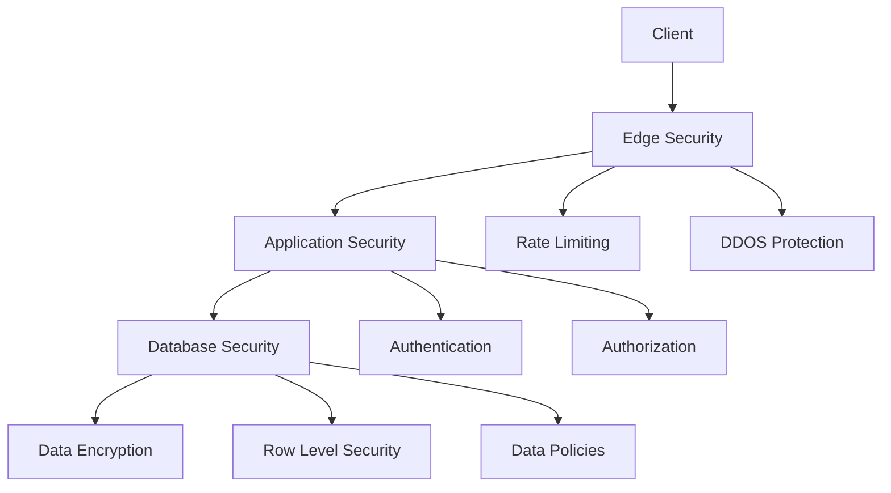

# Security Architecture

Welcome to the Neothink Platform security documentation. This guide details our comprehensive security architecture and best practices implemented across all platforms.

## Security Overview

### Architecture Diagram


## Security Layers

### 1. Edge Security
- Cloudflare integration
- DDoS protection
- WAF (Web Application Firewall)
- SSL/TLS encryption
- Bot protection

### 2. Application Security
- Request validation
- CSRF protection
- XSS prevention
- Input sanitization
- Output encoding

### 3. Authentication
- Multi-factor authentication
- Passwordless options
- OAuth2 integration
- Session management
- JWT handling

### 4. Authorization
- Role-based access control
- Permission management
- Tenant isolation
- Resource policies
- Access auditing

### 5. Database Security
- Row level security
- Column encryption
- Access policies
- Query sanitization
- Connection pooling

## Security Features

### 1. Rate Limiting
```typescript
interface RateLimitConfig {
  window: '1m' | '5m' | '15m' | '1h' | '24h';
  max_requests: number;
  user_identifier: 'ip' | 'session' | 'api_key';
}

// Example configuration
const rateLimits: RateLimitConfig[] = [
  {
    window: '1m',
    max_requests: 60,
    user_identifier: 'ip'
  },
  {
    window: '1h',
    max_requests: 1000,
    user_identifier: 'session'
  }
];
```

### 2. Authentication Flow
```typescript
interface AuthFlow {
  type: 'password' | 'magic_link' | 'oauth' | 'passwordless';
  mfa_required: boolean;
  session_duration: number;
  refresh_token_rotation: boolean;
}

// Example implementation
const authConfig: AuthFlow = {
  type: 'magic_link',
  mfa_required: true,
  session_duration: 7200,
  refresh_token_rotation: true
};
```

### 3. RBAC System
```typescript
interface Role {
  name: string;
  permissions: Permission[];
  scope: 'global' | 'tenant' | 'platform';
}

interface Permission {
  resource: string;
  action: 'create' | 'read' | 'update' | 'delete';
  conditions?: object;
}
```

## Security Monitoring

### 1. Event Logging
- Security events
- Authentication attempts
- Authorization checks
- System changes
- API access

### 2. Threat Detection
- Anomaly detection
- Behavior analysis
- Pattern matching
- Alert triggers
- Response automation

### 3. Audit Trail
- User actions
- System changes
- Data access
- Configuration updates
- Security events

## Compliance

### 1. Data Protection
- GDPR compliance
- Data encryption
- Privacy controls
- Data retention
- Export capabilities

### 2. Security Standards
- SOC 2 compliance
- ISO 27001
- HIPAA compliance
- PCI DSS
- NIST framework

## Incident Response

### 1. Detection
- Automated monitoring
- Alert systems
- Log analysis
- User reports
- System checks

### 2. Response
- Incident classification
- Response procedures
- Communication plan
- Recovery steps
- Post-mortem analysis

## Security Best Practices

### 1. Password Policy
```typescript
interface PasswordPolicy {
  min_length: number;
  require_uppercase: boolean;
  require_lowercase: boolean;
  require_numbers: boolean;
  require_special: boolean;
  max_age_days: number;
  history_count: number;
}

const passwordPolicy: PasswordPolicy = {
  min_length: 12,
  require_uppercase: true,
  require_lowercase: true,
  require_numbers: true,
  require_special: true,
  max_age_days: 90,
  history_count: 24
};
```

### 2. Session Management
```typescript
interface SessionConfig {
  max_duration: number;
  idle_timeout: number;
  refresh_window: number;
  max_concurrent: number;
}

const sessionConfig: SessionConfig = {
  max_duration: 86400,
  idle_timeout: 3600,
  refresh_window: 300,
  max_concurrent: 5
};
```

## Security Tools

### 1. Security Dashboard
- Real-time monitoring
- Threat visualization
- Alert management
- Log analysis
- Performance metrics

### 2. Admin Tools
- User management
- Role assignment
- Permission control
- Security settings
- Audit logs

## Database Security

### 1. Row Level Security
```sql
-- Example RLS policy
CREATE POLICY "tenant_isolation_policy" ON "public"."content"
  FOR ALL
  USING (
    auth.uid() IN (
      SELECT user_id 
      FROM tenant_users 
      WHERE tenant_id = content.tenant_id
    )
  );
```

### 2. Column Encryption
```sql
-- Example encrypted column
CREATE TABLE sensitive_data (
  id UUID PRIMARY KEY,
  data_encrypted BYTEA,
  nonce BYTEA,
  created_at TIMESTAMPTZ DEFAULT now()
);
```

## API Security

### 1. Authentication
- API key management
- Token validation
- Scope checking
- Rate limiting
- Usage monitoring

### 2. Request Validation
- Schema validation
- Input sanitization
- Type checking
- Size limits
- Format validation

## Security Updates

### 1. Patch Management
- Security patches
- Version control
- Deployment process
- Testing procedures
- Rollback plans

### 2. Vulnerability Management
- Security scanning
- Risk assessment
- Remediation
- Verification
- Documentation

## Additional Resources

### Documentation
- Security guidelines
- Best practices
- Implementation guides
- Tool documentation
- Policy documents

### Training
- Security awareness
- Tool usage
- Incident response
- Best practices
- Compliance requirements

## Contact Information

### Security Team
- Security officer
- Incident response
- Compliance team
- Support staff
- Emergency contacts 