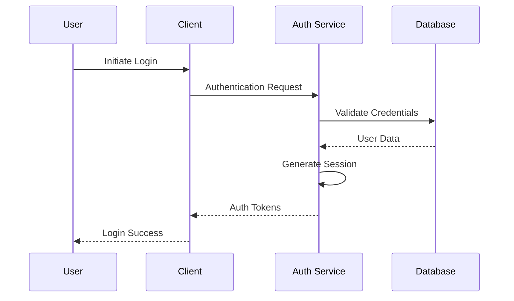

# Authentication

This guide details the authentication system implemented across the Neothink+ ecosystem.

## Overview

The Neothink+ authentication system provides:

- Secure user authentication
- Multi-factor authentication (MFA)
- Session management
- Password policies
- OAuth integration
- Magic link authentication

## Authentication Flow



## Implementation

### Basic Authentication

```typescript
import { createClient } from '@supabase/supabase-js'

const supabase = createClient(
  process.env.NEXT_PUBLIC_SUPABASE_URL!,
  process.env.NEXT_PUBLIC_SUPABASE_ANON_KEY!
)

export async function signIn({ email, password }: SignInCredentials) {
  const { data, error } = await supabase.auth.signInWithPassword({
    email,
    password,
  })
  
  if (error) throw error
  return data
}
```

### Magic Link Authentication

```typescript
export async function sendMagicLink(email: string) {
  const { error } = await supabase.auth.signInWithOtp({
    email,
    options: {
      emailRedirectTo: `${window.location.origin}/auth/callback`,
    },
  })
  
  if (error) throw error
}
```

### Multi-Factor Authentication

```typescript
export async function setupMFA(userId: string) {
  const { data, error } = await supabase.auth.mfa.enroll({
    factorType: 'totp',
  })
  
  if (error) throw error
  return data
}

export async function verifyMFA(code: string) {
  const { data, error } = await supabase.auth.mfa.challenge({
    factorId: 'totp',
    code,
  })
  
  if (error) throw error
  return data
}
```

## Session Management

### Session Configuration

```typescript
export const sessionConfig = {
  // Session duration (7 days)
  maxAge: 7 * 24 * 60 * 60,
  
  // Update session if it's older than 24 hours
  updateAge: 24 * 60 * 60,
  
  // Persist session across browser restarts
  persistSession: true,
  
  // Detect session changes across tabs/windows
  detectSessionInUrl: true,
}
```

### Session Handling

```typescript
export async function getSession() {
  const { data: { session }, error } = await supabase.auth.getSession()
  
  if (error) throw error
  return session
}

export async function refreshSession() {
  const { data: { session }, error } = await supabase.auth.refreshSession()
  
  if (error) throw error
  return session
}
```

## Password Policies

```typescript
export const passwordPolicy = {
  minLength: 12,
  requireUppercase: true,
  requireLowercase: true,
  requireNumbers: true,
  requireSpecialChars: true,
  maxAge: 90, // days
  preventReuse: true,
  lockoutThreshold: 5,
  lockoutDuration: 15, // minutes
}

export function validatePassword(password: string): boolean {
  return (
    password.length >= passwordPolicy.minLength &&
    /[A-Z]/.test(password) &&
    /[a-z]/.test(password) &&
    /[0-9]/.test(password) &&
    /[^A-Za-z0-9]/.test(password)
  )
}
```

## OAuth Integration

### Supported Providers

- Google
- GitHub
- Discord
- Twitter
- LinkedIn

### OAuth Configuration

```typescript
export const oauthConfig = {
  providers: {
    google: {
      scope: ['email', 'profile'],
      prompt: 'select_account',
    },
    github: {
      scope: ['user:email'],
    },
    discord: {
      scope: ['identify', 'email'],
    },
  },
  redirectUrl: `${process.env.NEXT_PUBLIC_APP_URL}/auth/callback`,
}
```

### OAuth Implementation

```typescript
export async function signInWithProvider(provider: Provider) {
  const { data, error } = await supabase.auth.signInWithOAuth({
    provider,
    options: {
      redirectTo: oauthConfig.redirectUrl,
      scopes: oauthConfig.providers[provider].scope,
    },
  })
  
  if (error) throw error
  return data
}
```

## Security Considerations

1. **Rate Limiting**
   - Login attempts are limited to 5 per minute per IP
   - Password reset requests are limited to 3 per hour per email

2. **Session Security**
   - Sessions are invalidated on password change
   - Concurrent sessions are limited to 5 per user
   - Sessions are bound to IP and user agent

3. **Password Security**
   - Passwords are hashed using Argon2
   - Failed attempts are tracked and trigger lockouts
   - Password history is maintained to prevent reuse

## Error Handling

```typescript
export class AuthError extends Error {
  constructor(
    message: string,
    public code: string,
    public status: number
  ) {
    super(message)
    this.name = 'AuthError'
  }
}

export function handleAuthError(error: any) {
  switch (error.code) {
    case 'auth/invalid-email':
      throw new AuthError('Invalid email address', error.code, 400)
    case 'auth/user-disabled':
      throw new AuthError('Account has been disabled', error.code, 403)
    case 'auth/user-not-found':
      throw new AuthError('User not found', error.code, 404)
    case 'auth/wrong-password':
      throw new AuthError('Invalid password', error.code, 401)
    default:
      throw new AuthError('Authentication failed', 'auth/unknown', 500)
  }
}
```

## Testing

```typescript
describe('Authentication', () => {
  it('should sign in with valid credentials', async () => {
    const credentials = {
      email: 'test@example.com',
      password: 'ValidP@ssw0rd',
    }
    
    const result = await signIn(credentials)
    expect(result.user).toBeDefined()
    expect(result.session).toBeDefined()
  })
  
  it('should fail with invalid credentials', async () => {
    const credentials = {
      email: 'test@example.com',
      password: 'wrong',
    }
    
    await expect(signIn(credentials)).rejects.toThrow(AuthError)
  })
})
```

## Additional Resources

- [Security Overview](./README.md)
- [Authorization Guide](./authorization.md)
- [Session Management](./sessions.md)
- [OAuth Configuration](./oauth.md)
- [MFA Setup Guide](./mfa.md) 