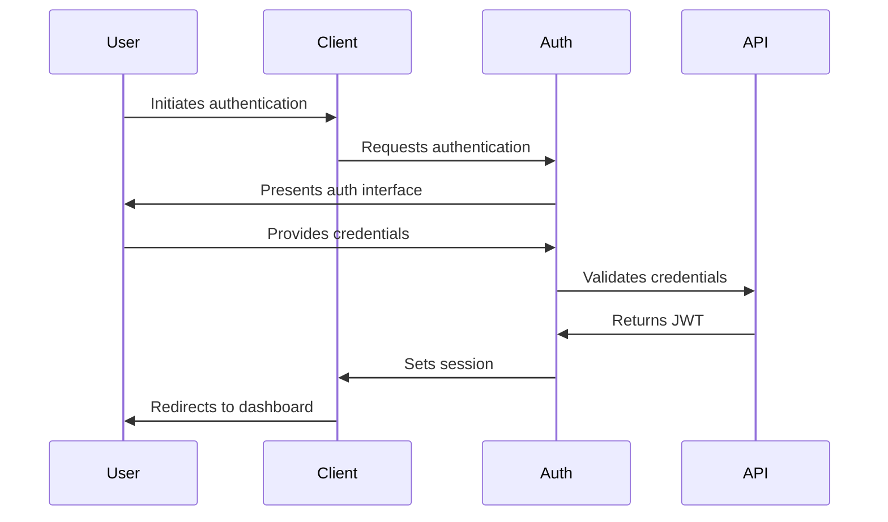

# Authentication in Neothink+

This document provides a comprehensive overview of authentication in the Neothink+ ecosystem.

## Overview

The Neothink+ ecosystem uses Supabase Authentication for secure user management across all platforms. This provides:

- Secure email/password authentication
- OAuth social providers
- Magic link authentication
- JWT-based session management
- Role-based access control (RBAC)

## Authentication Flow


```mermaid
sequenceDiagram
    participant User
    participant Client
    participant Auth
    participant API
    
    User->>Client: Initiates authentication
    Client->>Auth: Requests authentication
    Auth->>User: Presents auth interface
    User->>Auth: Provides credentials
    Auth->>API: Validates credentials
    API->>Auth: Returns JWT
    Auth->>Client: Sets session
    Client->>User: Redirects to dashboard
```

## Implementation Details

### 1. Setup and Configuration

```typescript
// supabase/config.ts
export const authConfig = {
  autoRefreshToken: true,
  persistSession: true,
  detectSessionInUrl: true,
  flowType: 'pkce',
};

// Initialize client
const supabase = createClient(
  process.env.NEXT_PUBLIC_SUPABASE_URL!,
  process.env.NEXT_PUBLIC_SUPABASE_ANON_KEY!,
  { auth: authConfig }
);
```

### 2. User Authentication

```typescript
// Sign Up
async function signUp(email: string, password: string) {
  const { data, error } = await supabase.auth.signUp({
    email,
    password,
    options: {
      emailRedirectTo: `${location.origin}/auth/callback`,
      data: {
        full_name: name,
        avatar_url: '',
      },
    },
  });
  return { data, error };
}

// Sign In
async function signIn(email: string, password: string) {
  const { data, error } = await supabase.auth.signInWithPassword({
    email,
    password,
  });
  return { data, error };
}

// Sign Out
async function signOut() {
  const { error } = await supabase.auth.signOut();
  return { error };
}
```

### 3. Session Management

```typescript
// Check active session
async function getSession() {
  const { data: { session }, error } = await supabase.auth.getSession();
  return { session, error };
}

// Subscribe to auth changes
supabase.auth.onAuthStateChange((event, session) => {
  if (event === 'SIGNED_IN') {
    // Handle sign in
  } else if (event === 'SIGNED_OUT') {
    // Handle sign out
  }
});
```

### 4. Protected Routes

```typescript
// middleware.ts
import { createMiddlewareClient } from '@supabase/auth-helpers-nextjs';

export async function middleware(req: NextRequest) {
  const res = NextResponse.next();
  const supabase = createMiddlewareClient({ req, res });
  const { data: { session } } = await supabase.auth.getSession();

  if (!session && req.nextUrl.pathname.startsWith('/protected')) {
    return NextResponse.redirect(new URL('/auth/login', req.url));
  }

  return res;
}
```

## Security Considerations

### 1. Password Requirements

- Minimum 8 characters
- At least one uppercase letter
- At least one lowercase letter
- At least one number
- At least one special character

### 2. Rate Limiting

```typescript
const rateLimit = {
  signIn: {
    attempts: 5,
    window: '15m',
  },
  passwordReset: {
    attempts: 3,
    window: '60m',
  },
};
```

### 3. Session Security

- JWT expiration: 1 hour
- Refresh token expiration: 7 days
- Secure, HTTP-only cookies
- CSRF protection enabled

## Error Handling

```typescript
async function handleAuthError(error: AuthError) {
  switch (error.status) {
    case 400:
      return 'Invalid credentials';
    case 401:
      return 'Unauthorized access';
    case 404:
      return 'User not found';
    case 429:
      return 'Too many attempts';
    default:
      return 'An unexpected error occurred';
  }
}
```

## Platform-Specific Considerations

### Hub Platform

- Default authentication provider
- Manages global user profiles
- Handles cross-platform authentication

### Other Platforms

- Inherit authentication from Hub
- Platform-specific access control
- Custom authorization rules

## Testing

```typescript
describe('Authentication', () => {
  it('should sign in user with valid credentials', async () => {
    const { data, error } = await signIn('test@example.com', 'password');
    expect(error).toBeNull();
    expect(data.session).toBeDefined();
  });

  it('should handle invalid credentials', async () => {
    const { data, error } = await signIn('test@example.com', 'wrong');
    expect(error).toBeDefined();
    expect(data.session).toBeNull();
  });
});
```

## Troubleshooting

Common issues and solutions:

1. **Session not persisting**
   - Check cookie settings
   - Verify SSL configuration
   - Clear browser cache

2. **Authentication failures**
   - Validate email format
   - Check password requirements
   - Verify rate limits

3. **Cross-platform issues**
   - Check token synchronization
   - Verify platform access rules
   - Review session sharing

## Additional Resources

- [Supabase Auth Documentation](https://supabase.com/docs/guides/auth)
- [Security Best Practices](../guides/security.md)
- [API Authentication](../api/authentication.md)
- [User Management](../guides/user-management.md) 