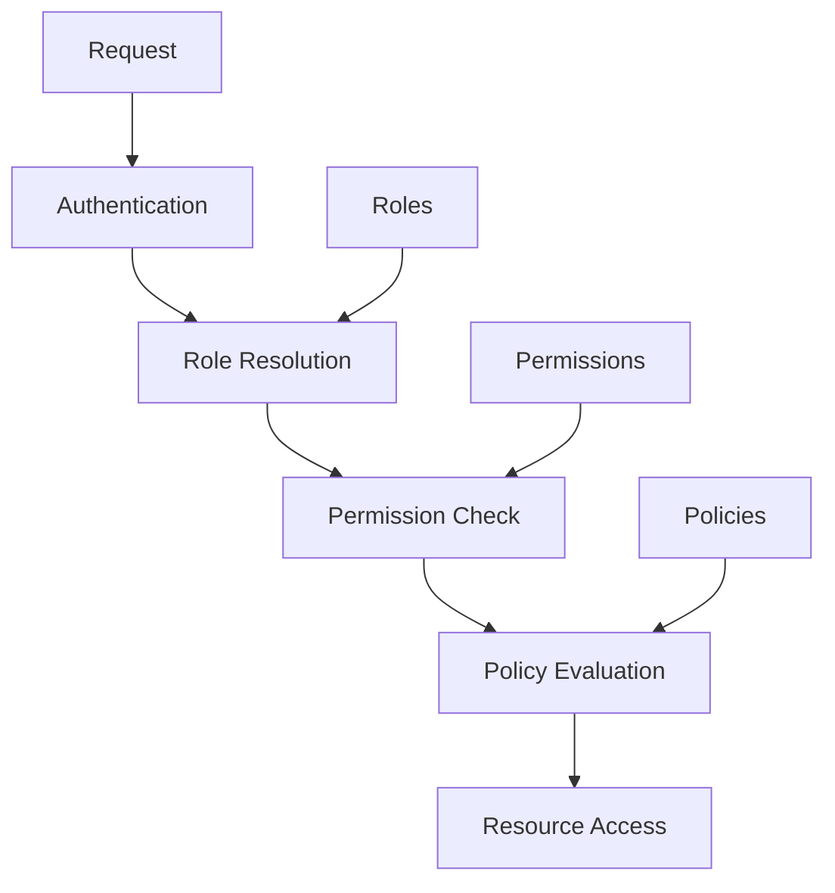

# Authorization

This guide details the authorization system implemented across the Neothink+ ecosystem.

## Overview

The Neothink+ authorization system implements:

- Role-Based Access Control (RBAC)
- Platform-specific permissions
- Resource-level access control
- Dynamic policy evaluation
- Attribute-based access control (ABAC)

## Authorization Architecture



## Implementation

### Role-Based Access Control

```typescript
interface Role {
  id: string;
  name: string;
  description: string;
  permissions: Permission[];
  scope: 'global' | 'platform' | 'tenant';
}

interface Permission {
  action: 'create' | 'read' | 'update' | 'delete';
  resource: string;
  conditions?: Record<string, any>;
}

// Role definitions
export const roles = {
  admin: {
    id: 'admin',
    name: 'Administrator',
    description: 'Full system access',
    permissions: ['*'],
    scope: 'global',
  },
  moderator: {
    id: 'moderator',
    name: 'Moderator',
    description: 'Content management access',
    permissions: ['content:*', 'users:read'],
    scope: 'platform',
  },
  user: {
    id: 'user',
    name: 'User',
    description: 'Standard user access',
    permissions: ['content:read', 'profile:*'],
    scope: 'tenant',
  },
} as const;
```

### Permission Management

```typescript
export class PermissionManager {
  constructor(private readonly user: User) {}

  async hasPermission(
    action: string,
    resource: string,
    context?: Record<string, any>
  ): Promise<boolean> {
    const userRoles = await this.getUserRoles();
    const permissions = this.flattenRolePermissions(userRoles);
    
    return this.evaluatePermission(permissions, action, resource, context);
  }

  private async getUserRoles(): Promise<Role[]> {
    const { data, error } = await supabase
      .from('user_roles')
      .select('role_id')
      .eq('user_id', this.user.id);
      
    if (error) throw error;
    return data.map(row => roles[row.role_id]);
  }

  private flattenRolePermissions(roles: Role[]): Permission[] {
    return roles.flatMap(role => role.permissions);
  }

  private evaluatePermission(
    permissions: Permission[],
    action: string,
    resource: string,
    context?: Record<string, any>
  ): boolean {
    return permissions.some(permission => 
      this.matchesPermission(permission, action, resource, context)
    );
  }
}
```

### Policy Enforcement

```typescript
export class PolicyEnforcer {
  constructor(
    private readonly permissionManager: PermissionManager
  ) {}

  async enforcePolicy(
    policy: Policy,
    context: Record<string, any>
  ): Promise<boolean> {
    const { action, resource, conditions } = policy;
    
    // Check basic permission
    const hasPermission = await this.permissionManager
      .hasPermission(action, resource);
      
    if (!hasPermission) return false;
    
    // Evaluate conditions
    return this.evaluateConditions(conditions, context);
  }

  private evaluateConditions(
    conditions: Record<string, any>,
    context: Record<string, any>
  ): boolean {
    // Implement condition evaluation logic
    return true;
  }
}
```

### Platform-Specific Authorization

```typescript
export class PlatformAuthorization {
  constructor(
    private readonly platform: string,
    private readonly permissionManager: PermissionManager
  ) {}

  async authorizeAccess(
    action: string,
    resource: string
  ): Promise<boolean> {
    // Check platform-specific permissions
    const platformPermission = `${this.platform}:${action}:${resource}`;
    const hasPermission = await this.permissionManager
      .hasPermission(platformPermission);
      
    if (!hasPermission) return false;
    
    // Additional platform-specific checks
    return this.checkPlatformRules();
  }

  private async checkPlatformRules(): Promise<boolean> {
    // Implement platform-specific authorization rules
    return true;
  }
}
```

## Database-Level Security

### Row Level Security (RLS)

```sql
-- Enable RLS
ALTER TABLE "public"."content" ENABLE ROW LEVEL SECURITY;

-- Create policies
CREATE POLICY "read_public_content" ON "public"."content"
  FOR SELECT
  USING (
    is_public = true OR
    auth.uid() IN (
      SELECT user_id FROM user_roles
      WHERE role_id IN ('admin', 'moderator')
    )
  );

CREATE POLICY "modify_own_content" ON "public"."content"
  FOR ALL
  USING (
    auth.uid() = created_by
  );
```

## Middleware Implementation

```typescript
export async function authorizationMiddleware(
  req: NextRequest,
  res: NextResponse
) {
  const user = await getCurrentUser();
  const permissionManager = new PermissionManager(user);
  
  // Extract request details
  const { action, resource } = parseRequest(req);
  
  // Check permission
  const hasPermission = await permissionManager
    .hasPermission(action, resource);
    
  if (!hasPermission) {
    return new NextResponse(
      JSON.stringify({ error: 'Unauthorized' }),
      { status: 403 }
    );
  }
  
  return NextResponse.next();
}
```

## Testing

```typescript
describe('Authorization', () => {
  let permissionManager: PermissionManager;
  
  beforeEach(() => {
    permissionManager = new PermissionManager(mockUser);
  });
  
  it('should grant access for valid permissions', async () => {
    const hasPermission = await permissionManager
      .hasPermission('read', 'content');
      
    expect(hasPermission).toBe(true);
  });
  
  it('should deny access for invalid permissions', async () => {
    const hasPermission = await permissionManager
      .hasPermission('delete', 'users');
      
    expect(hasPermission).toBe(false);
  });
});
```

## Best Practices

1. **Principle of Least Privilege**
   - Grant minimum required permissions
   - Regularly review and audit access
   - Remove unused permissions

2. **Role Management**
   - Keep roles focused and specific
   - Document role purposes
   - Implement role hierarchies
   - Regular role reviews

3. **Permission Granularity**
   - Use specific permissions
   - Avoid wildcard permissions
   - Implement resource-level permissions
   - Consider context in permissions

4. **Security Considerations**
   - Validate all authorization checks
   - Log authorization decisions
   - Implement timeout mechanisms
   - Handle edge cases gracefully

## Error Handling

```typescript
export class AuthorizationError extends Error {
  constructor(
    message: string,
    public code: string,
    public status: number = 403
  ) {
    super(message);
    this.name = 'AuthorizationError';
  }
}

export function handleAuthorizationError(error: Error): never {
  if (error instanceof AuthorizationError) {
    throw error;
  }
  
  throw new AuthorizationError(
    'Authorization failed',
    'AUTHORIZATION_FAILED'
  );
}
```

## Additional Resources

- [Security Overview](./README.md)
- [Authentication Guide](./authentication.md)
- [Role Configuration](./roles.md)
- [Permission Management](./permissions.md)
- [Policy Framework](./policies.md) 