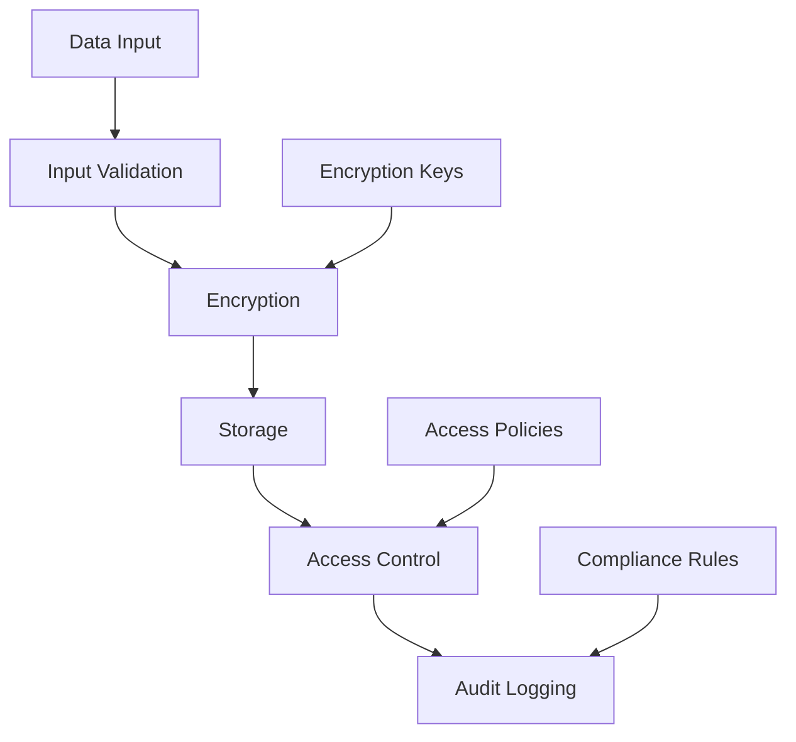

# Data Protection

This guide details the data protection measures implemented across the Neothink+ ecosystem.

## Overview

The Neothink+ data protection system implements:

- End-to-end encryption
- Data privacy controls
- Secure data storage
- Data access auditing
- Compliance frameworks

## Data Protection Architecture



## Implementation

### Data Encryption

```typescript
import { createCipheriv, createDecipheriv, randomBytes } from 'crypto';

export class DataEncryption {
  private readonly algorithm = 'aes-256-gcm';
  private readonly keyLength = 32;
  private readonly ivLength = 12;
  private readonly authTagLength = 16;

  constructor(private readonly encryptionKey: Buffer) {}

  async encrypt(data: string): Promise<{
    encrypted: Buffer;
    iv: Buffer;
    authTag: Buffer;
  }> {
    const iv = randomBytes(this.ivLength);
    const cipher = createCipheriv(
      this.algorithm,
      this.encryptionKey,
      iv,
      { authTagLength: this.authTagLength }
    );

    const encrypted = Buffer.concat([
      cipher.update(data, 'utf8'),
      cipher.final()
    ]);

    return {
      encrypted,
      iv,
      authTag: cipher.getAuthTag()
    };
  }

  async decrypt(
    encrypted: Buffer,
    iv: Buffer,
    authTag: Buffer
  ): Promise<string> {
    const decipher = createDecipheriv(
      this.algorithm,
      this.encryptionKey,
      iv,
      { authTagLength: this.authTagLength }
    );

    decipher.setAuthTag(authTag);

    return Buffer.concat([
      decipher.update(encrypted),
      decipher.final()
    ]).toString('utf8');
  }
}
```

### Data Privacy Controls

```typescript
export class PrivacyManager {
  constructor(private readonly user: User) {}

  async enforcePrivacyControls(
    data: any,
    context: PrivacyContext
  ): Promise<any> {
    // Apply privacy rules
    const sanitizedData = this.sanitizeData(data);
    
    // Apply masking rules
    const maskedData = this.applyDataMasking(sanitizedData);
    
    // Apply retention rules
    await this.enforceRetentionPolicy(context);
    
    return maskedData;
  }

  private sanitizeData(data: any): any {
    // Remove sensitive information
    return this.removeSensitiveData(data);
  }

  private applyDataMasking(data: any): any {
    // Mask sensitive fields
    return this.maskSensitiveFields(data);
  }

  private async enforceRetentionPolicy(
    context: PrivacyContext
  ): Promise<void> {
    // Implement retention policy
    await this.applyRetentionRules(context);
  }
}
```

### Secure Storage

```typescript
export class SecureStorage {
  constructor(
    private readonly encryption: DataEncryption,
    private readonly privacyManager: PrivacyManager
  ) {}

  async store(
    data: any,
    context: StorageContext
  ): Promise<string> {
    // Apply privacy controls
    const processedData = await this.privacyManager
      .enforcePrivacyControls(data, context);
    
    // Encrypt data
    const { encrypted, iv, authTag } = await this.encryption
      .encrypt(JSON.stringify(processedData));
    
    // Store encrypted data
    const id = await this.saveToStorage(encrypted, iv, authTag);
    
    return id;
  }

  async retrieve(
    id: string,
    context: StorageContext
  ): Promise<any> {
    // Retrieve encrypted data
    const { encrypted, iv, authTag } = await this.getFromStorage(id);
    
    // Decrypt data
    const decrypted = await this.encryption
      .decrypt(encrypted, iv, authTag);
    
    return JSON.parse(decrypted);
  }
}
```

## Database Security

### Column-Level Encryption

```sql
-- Create encryption function
CREATE OR REPLACE FUNCTION encrypt_column(
  data text,
  key_id text
) RETURNS bytea AS $$
BEGIN
  RETURN pgp_sym_encrypt(
    data,
    (SELECT key_value FROM encryption_keys WHERE id = key_id)
  );
END;
$$ LANGUAGE plpgsql SECURITY DEFINER;

-- Create decryption function
CREATE OR REPLACE FUNCTION decrypt_column(
  encrypted_data bytea,
  key_id text
) RETURNS text AS $$
BEGIN
  RETURN pgp_sym_decrypt(
    encrypted_data,
    (SELECT key_value FROM encryption_keys WHERE id = key_id)
  );
END;
$$ LANGUAGE plpgsql SECURITY DEFINER;

-- Example usage
CREATE TABLE sensitive_data (
  id uuid PRIMARY KEY DEFAULT gen_random_uuid(),
  data_encrypted bytea,
  key_id text NOT NULL REFERENCES encryption_keys(id)
);
```

### Data Masking

```sql
-- Create masking function
CREATE OR REPLACE FUNCTION mask_data(
  input text,
  mask_char char DEFAULT 'X',
  visible_chars int DEFAULT 4
) RETURNS text AS $$
BEGIN
  RETURN CASE
    WHEN input IS NULL THEN NULL
    WHEN LENGTH(input) <= visible_chars THEN input
    ELSE
      LEFT(input, visible_chars) ||
      REPEAT(mask_char, GREATEST(0, LENGTH(input) - visible_chars))
  END;
END;
$$ LANGUAGE plpgsql IMMUTABLE;

-- Example usage
SELECT mask_data('1234567890', '*', 4); -- Returns '1234******'
```

## Audit Logging

```typescript
export class AuditLogger {
  constructor(private readonly context: AuditContext) {}

  async logDataAccess(
    action: DataAction,
    resource: string,
    details: Record<string, any>
  ): Promise<void> {
    await this.log({
      timestamp: new Date(),
      action,
      resource,
      user: this.context.user,
      ip: this.context.ip,
      userAgent: this.context.userAgent,
      details
    });
  }

  private async log(entry: AuditEntry): Promise<void> {
    const { data, error } = await supabase
      .from('audit_logs')
      .insert(entry);
      
    if (error) throw error;
  }
}
```

## Compliance Framework

```typescript
export class ComplianceManager {
  constructor(
    private readonly config: ComplianceConfig
  ) {}

  async enforceCompliance(
    data: any,
    context: ComplianceContext
  ): Promise<void> {
    // GDPR compliance
    if (this.config.gdpr.enabled) {
      await this.enforceGDPR(data, context);
    }
    
    // HIPAA compliance
    if (this.config.hipaa.enabled) {
      await this.enforceHIPAA(data, context);
    }
    
    // Custom compliance rules
    await this.enforceCustomRules(data, context);
  }

  private async enforceGDPR(
    data: any,
    context: ComplianceContext
  ): Promise<void> {
    // Implement GDPR rules
  }

  private async enforceHIPAA(
    data: any,
    context: ComplianceContext
  ): Promise<void> {
    // Implement HIPAA rules
  }
}
```

## Best Practices

1. **Data Minimization**
   - Collect only necessary data
   - Implement data retention policies
   - Regular data cleanup
   - Purpose limitation

2. **Encryption**
   - Use strong encryption algorithms
   - Secure key management
   - Regular key rotation
   - Encryption at rest and in transit

3. **Access Control**
   - Principle of least privilege
   - Regular access reviews
   - Strong authentication
   - Audit logging

4. **Privacy**
   - Privacy by design
   - User consent management
   - Data subject rights
   - Privacy impact assessments

## Error Handling

```typescript
export class DataProtectionError extends Error {
  constructor(
    message: string,
    public code: string,
    public status: number = 500
  ) {
    super(message);
    this.name = 'DataProtectionError';
  }
}

export function handleDataProtectionError(error: Error): never {
  if (error instanceof DataProtectionError) {
    throw error;
  }
  
  throw new DataProtectionError(
    'Data protection error',
    'DATA_PROTECTION_FAILED'
  );
}
```

## Additional Resources

- [Security Overview](./README.md)
- [Authentication Guide](./authentication.md)
- [Authorization Guide](./authorization.md)
- [Encryption Guide](./encryption.md)
- [Compliance Guide](./compliance.md) 