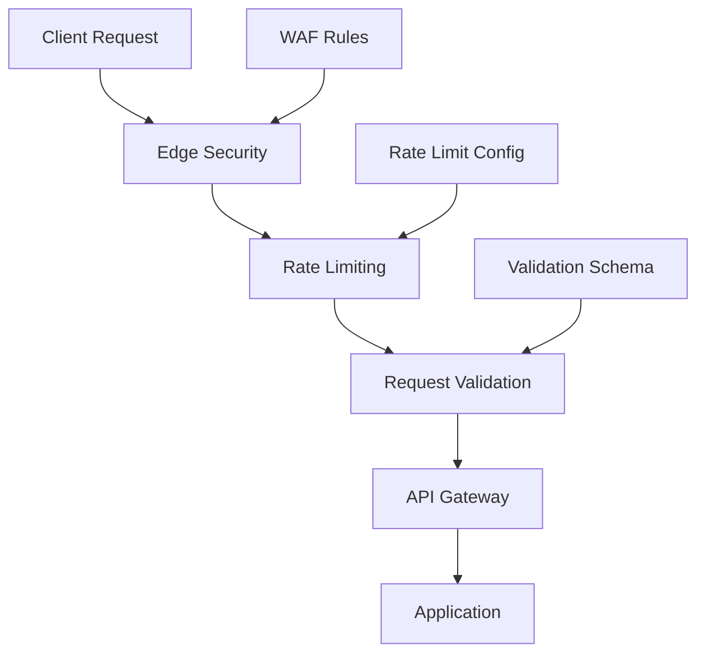

# Network Security

This guide details the network security measures implemented across the Neothink+ ecosystem.

## Overview

The Neothink+ network security system implements:

- API security
- Rate limiting
- DDoS protection
- SSL/TLS configuration
- Request validation
- Network monitoring

## Network Security Architecture



## Implementation

### API Security

```typescript
import { rateLimit } from 'express-rate-limit';
import helmet from 'helmet';
import cors from 'cors';

export const securityConfig = {
  // CORS configuration
  cors: {
    origin: ['https://*.neothink.io'],
    methods: ['GET', 'POST', 'PUT', 'DELETE'],
    allowedHeaders: ['Content-Type', 'Authorization'],
    exposedHeaders: ['X-Total-Count'],
    credentials: true,
    maxAge: 86400,
  },
  
  // Security headers
  helmet: {
    contentSecurityPolicy: {
      directives: {
        defaultSrc: ["'self'"],
        scriptSrc: ["'self'", "'unsafe-inline'"],
        styleSrc: ["'self'", "'unsafe-inline'"],
        imgSrc: ["'self'", 'data:', 'https:'],
        connectSrc: ["'self'", 'https://*.neothink.io'],
      },
    },
    hsts: {
      maxAge: 31536000,
      includeSubDomains: true,
      preload: true,
    },
    frameguard: {
      action: 'deny',
    },
  },
  
  // Rate limiting
  rateLimit: {
    windowMs: 15 * 60 * 1000, // 15 minutes
    max: 100, // limit each IP to 100 requests per windowMs
  },
};

// Apply security middleware
export function configureNetworkSecurity(app: Express) {
  // Apply CORS
  app.use(cors(securityConfig.cors));
  
  // Apply Helmet security headers
  app.use(helmet(securityConfig.helmet));
  
  // Apply rate limiting
  app.use(rateLimit(securityConfig.rateLimit));
}
```

### Request Validation

```typescript
import { z } from 'zod';

// Request validation schema
const requestSchema = z.object({
  body: z.object({
    // Define expected request body shape
  }),
  query: z.object({
    // Define expected query parameters
  }),
  params: z.object({
    // Define expected URL parameters
  }),
});

// Validation middleware
export function validateRequest(schema: z.ZodSchema) {
  return async (req: Request, res: Response, next: NextFunction) => {
    try {
      await schema.parseAsync({
        body: req.body,
        query: req.query,
        params: req.params,
      });
      next();
    } catch (error) {
      res.status(400).json({
        error: 'Invalid request',
        details: error.errors,
      });
    }
  };
}
```

### DDoS Protection

```typescript
export const ddosConfig = {
  // Cloudflare configuration
  cloudflare: {
    // DDoS protection settings
    securityLevel: 'medium',
    challengeTTL: 3600,
    challengePassage: 300,
    
    // WAF rules
    wafRules: [
      {
        id: 'block-sql-injection',
        priority: 1,
        action: 'block',
      },
      {
        id: 'rate-limit-api',
        priority: 2,
        action: 'challenge',
      },
    ],
  },
  
  // Application-level protection
  app: {
    // Request size limits
    bodyLimit: '10kb',
    
    // Connection limits
    maxConnections: 1000,
    
    // Timeout settings
    timeout: 5000,
  },
};
```

### SSL/TLS Configuration

```typescript
export const tlsConfig = {
  // HTTPS configuration
  https: {
    minVersion: 'TLSv1.2',
    cipherSuites: [
      'ECDHE-ECDSA-AES128-GCM-SHA256',
      'ECDHE-RSA-AES128-GCM-SHA256',
      'ECDHE-ECDSA-AES256-GCM-SHA384',
      'ECDHE-RSA-AES256-GCM-SHA384',
    ],
    honorCipherOrder: true,
    preferServerCipherSuites: true,
  },
  
  // Certificate configuration
  cert: {
    provider: 'lets-encrypt',
    renewBefore: 30, // days
    mustStaple: true,
    ocspStapling: true,
  },
};
```

### Network Monitoring

```typescript
export class NetworkMonitor {
  constructor(private readonly config: MonitorConfig) {}

  async monitorRequest(req: Request): Promise<void> {
    await this.log({
      timestamp: new Date(),
      method: req.method,
      path: req.path,
      ip: req.ip,
      userAgent: req.headers['user-agent'],
      responseTime: this.getResponseTime(req),
      statusCode: res.statusCode,
    });
  }

  private async log(entry: MonitorEntry): Promise<void> {
    const { data, error } = await supabase
      .from('network_logs')
      .insert(entry);
      
    if (error) throw error;
  }
}
```

## Security Headers

```typescript
export const securityHeaders = {
  // Content Security Policy
  'Content-Security-Policy': [
    "default-src 'self'",
    "script-src 'self' 'unsafe-inline'",
    "style-src 'self' 'unsafe-inline'",
    "img-src 'self' data: https:",
    "connect-src 'self' https://*.neothink.io",
  ].join('; '),
  
  // HSTS
  'Strict-Transport-Security': 'max-age=31536000; includeSubDomains; preload',
  
  // Frame options
  'X-Frame-Options': 'DENY',
  
  // XSS protection
  'X-XSS-Protection': '1; mode=block',
  
  // Content type options
  'X-Content-Type-Options': 'nosniff',
  
  // Referrer policy
  'Referrer-Policy': 'strict-origin-when-cross-origin',
  
  // Feature policy
  'Permissions-Policy': [
    'camera=()',
    'microphone=()',
    'geolocation=()',
  ].join(', '),
};
```

## Best Practices

1. **API Security**
   - Use HTTPS everywhere
   - Implement proper authentication
   - Validate all inputs
   - Set appropriate CORS policies

2. **Rate Limiting**
   - Set appropriate limits
   - Use sliding windows
   - Implement retry-after
   - Monitor usage patterns

3. **DDoS Protection**
   - Use CDN protection
   - Implement rate limiting
   - Monitor traffic patterns
   - Have incident response plan

4. **Request Validation**
   - Validate all inputs
   - Use strong typing
   - Implement schema validation
   - Sanitize user input

## Error Handling

```typescript
export class NetworkSecurityError extends Error {
  constructor(
    message: string,
    public code: string,
    public status: number = 403
  ) {
    super(message);
    this.name = 'NetworkSecurityError';
  }
}

export function handleNetworkError(error: Error): never {
  if (error instanceof NetworkSecurityError) {
    throw error;
  }
  
  throw new NetworkSecurityError(
    'Network security error',
    'NETWORK_SECURITY_FAILED'
  );
}
```

## Additional Resources

- [Security Overview](./README.md)
- [Authentication Guide](./authentication.md)
- [Authorization Guide](./authorization.md)
- [Data Protection](./data-protection.md)
- [API Security](../api/security.md) 