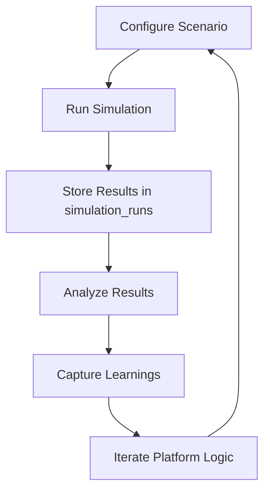

# Simulation Guide: Gamification & Tokenomics

## Overview
This guide explains how to use the simulation feature to test, analyze, and improve gamification and tokenomics strategies across all Neothink platforms. Simulations help you predict the impact of changes, optimize user journeys, and drive continuous improvement.

---

## 🧭 User vs. Admin Simulation Comparison

| Feature/Capability        | Users (Players)                                             | Admins (Game Masters)                                                |
|--------------------------|-------------------------------------------------------------|---------------------------------------------------------------------|
| Run Simulations          | Try "what if" scenarios for your own journey                | Configure and run batch/Monte Carlo simulations for cohorts          |
| Scenario Templates       | Use provided templates for common journeys                  | Create, edit, and save simulation templates                          |
| Parameter Adjustment     | Adjust personal actions/goals                               | Adjust platform-wide parameters (XP, multipliers, badges, etc.)      |
| Result Analysis          | See predicted rewards, badges, and progression              | Analyze distributions, outliers, and cohort results                  |
| Feedback & Iteration     | Suggest improvements, rate usefulness                       | Use analytics and feedback to tune platform logic                    |
| Data Privacy & Security  | Only you (and admins) can see your simulation data          | RLS ensures secure, auditable simulation management                  |

---

## 🏆 How It Works: Example Simulation Journeys

### User Journey
1. Choose a simulation template (e.g., "Onboarding Success").
2. Adjust planned actions (e.g., "Complete 5 challenges in week 1").
3. Run simulation and view predicted rewards, badges, and levels.
4. Use results to plan your real journey.

### Admin Journey
1. Select or create a scenario (e.g., "Increase XP multiplier by 20% for onboarding").
2. Define parameters: user cohort, multiplier, badge thresholds.
3. Run batch or Monte Carlo simulation (e.g., 1,000 users).
4. Analyze summary/detailed results: conversion rates, drop-offs, reward distribution.
5. Capture learnings and iterate on platform logic.

---

## ❓ FAQ & Troubleshooting
- How do I create a new simulation scenario?
- What parameters can I adjust?
- How do I interpret simulation results?
- How do I compare multiple simulation runs?
- Who can see my simulation data?
- How do I report a simulation bug or suggest a new feature?

---

## 📈 Visual Diagram: Simulation Flow

---

## 🔄 Continuous Improvement
- Simulations are reviewed and improved regularly based on analytics and feedback.
- All changes are tracked in the [Changelog](../../CHANGELOG.md).

---

## Quick Links
- [Admin Overview](../admin/ADMIN-OVERVIEW.md)
- [Gamification API](../api/gamification.md)
- [Database Schema](../architecture/database.md)
- [Support](../support/README.md)
