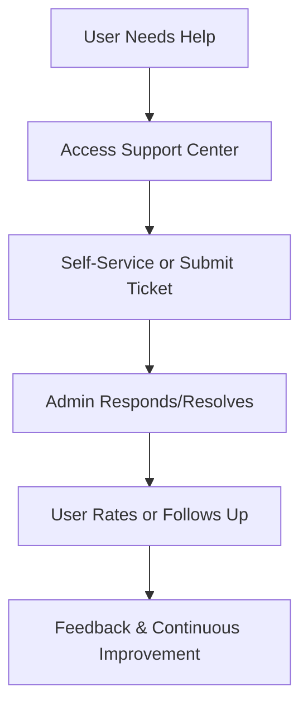

# Feedback & Support (2025)

## ✨ User & Admin Guide

**For Users:**
- Access FAQs, troubleshooting, and support contacts for every app and journey stage.
- Learn how to submit feedback, bug reports, and feature requests.
- Understand how your feedback shapes platform improvements.

**For Admins:**
- Review and respond to user feedback, bug reports, and feature requests.
- Use analytics to prioritize improvements and resolve issues.
- Step-by-step guides for handling support, feedback, and escalation.

## 🚀 What’s New in 2025?
- Unified feedback channels for all apps.
- Real-time analytics on feedback and support requests.
- Enhanced escalation paths and transparency for users.

## 📚 Quick Links
- [Contact Template](./contact-template.md)
- [Admin Overview](../admin/ADMIN-OVERVIEW.md)
- [Gamification API](../api/gamification.md)
- [Database & Schema](../architecture/database.md)
- [Security & RLS](../../SECURITY.md)

## 🗺️ Feedback & Support Journeys
- **Users:**
  1. Access support docs and contacts
  2. Submit feedback or report issues
  3. Track responses and improvements
- **Admins:**
  1. Review and triage feedback
  2. Respond and resolve issues
  3. Use analytics to improve support

## 🧭 User vs. Admin Comparison Table

| Feature/Capability      | Users (Players)                                                                                   | Admins (Game Masters)                                                                                 |
|------------------------|--------------------------------------------------------------------------------------------------|------------------------------------------------------------------------------------------------------|
| Support Access         | Access support channels, troubleshooting, and FAQ                                                 | Manage support tickets, respond to user/admin issues, track escalations                              |
| Data Rights            | Request data corrections, privacy, and audit logs                                                 | Fulfill data requests, enforce privacy/RLS, manage incident response                                 |
| Feedback               | Submit feedback, suggest improvements, participate in surveys                                     | Review feedback, iterate support flows, communicate changes                                          |
| Troubleshooting        | Use self-service troubleshooting guides and FAQ                                                   | Investigate issues, update troubleshooting docs, monitor system health                               |
| Analytics/Insights     | See support stats, resolution times, and satisfaction                                             | Access full support analytics, monitor trends, optimize support workflows                            |
| Continuous Improvement | See updates to support docs and flows                                                             | Update support docs, track feedback, improve support based on analytics                              |

---

## 🏆 How It Works: Support Journey Example (User)

1. **Need Help:** Encounter an issue, question, or feedback opportunity.
2. **Access Support:** Use the support center, FAQ, or contact form.
3. **Self-Service:** Find answers in FAQ/troubleshooting or submit a ticket.
4. **Resolution:** Receive help, correction, or escalation as needed.
5. **Feedback:** Rate support, suggest improvements, or follow up.

---

## 🛡️ How It Works: Support Journey Example (Admin)

1. **Monitor Support:** Track incoming tickets, feedback, and issues.
2. **Respond & Resolve:** Address tickets, escalate as needed, and update docs.
3. **Analyze Trends:** Use analytics to spot recurring issues or opportunities.
4. **Iterate:** Update support flows, docs, and communication based on feedback.

---

## ❓ FAQ & Troubleshooting (Expanded)

**For Users:**
- How do I get help?
- Where can I find troubleshooting guides?
- How do I request data corrections or privacy info?
- How do I escalate an issue?
- How do I submit feedback?

**For Admins:**
- How do I manage support tickets?
- How do I fulfill data/privacy requests?
- How do I update troubleshooting docs?
- How do I analyze support analytics?
- How do I iterate on support flows?

---

## 📈 Visual Diagram: Support Flow (Markdown)

---

## 🔄 Continuous Improvement
- Support docs and flows are reviewed and updated regularly based on user/admin feedback and analytics.
- All changes are tracked in the [Changelog](../../CHANGELOG.md).

## 🔄 Continuous Improvement
- Feedback and support flows are reviewed and improved regularly based on analytics and user/admin input.
