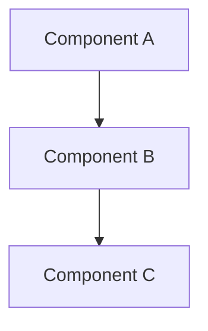

<!--
@type: architecture
@category: system-design
@related: [related-files]
@tags: [architecture, design, system]
@last-updated: YYYY-MM-DD
@ai-context: Architecture documentation for [component/system]
-->

# [Architecture Title]

## 🎯 Overview

[Provide a clear, concise overview of the architectural component or system]

## 📋 Table of Contents

1. [Design Principles](#design-principles)
2. [System Components](#system-components)
3. [Data Flow](#data-flow)
4. [Integration Points](#integration-points)
5. [Security Considerations](#security-considerations)
6. [Performance Characteristics](#performance-characteristics)
7. [Scalability](#scalability)
8. [References](#references)

## 📝 Main Content

### Design Principles

<!-- @ai-context: This section outlines the core design principles -->
[Content with clear explanations and examples]

### System Components

<!-- @ai-context: This section details the system components and their interactions -->
[Content with clear explanations and examples]

<!-- @codeblock-start: component-diagram -->

<!-- @codeblock-end: component-diagram -->

### Data Flow

<!-- @ai-context: This section explains the data flow through the system -->
[Content with clear explanations and examples]

### Integration Points

<!-- @ai-context: This section describes how the system integrates with other components -->
[Content with clear explanations and examples]

### Security Considerations

<!-- @ai-context: This section outlines security measures and considerations -->
[Content with clear explanations and examples]

### Performance Characteristics

<!-- @ai-context: This section details performance metrics and optimization strategies -->
[Content with clear explanations and examples]

### Scalability

<!-- @ai-context: This section explains scalability considerations and strategies -->
[Content with clear explanations and examples]

## 🔍 Best Practices

<!-- @ai-context: This section outlines implementation best practices -->
[Best practices with clear examples and explanations]

## ⚠️ Common Pitfalls

<!-- @ai-context: This section describes common issues and solutions -->
[Common issues with solutions and prevention tips]

## 📚 References

<!-- @links-start: references -->
- [Reference 1](link1)
- [Reference 2](link2)
<!-- @links-end: references -->

## 🔄 Maintenance

<!-- @ai-context: This section describes maintenance procedures -->
[Maintenance procedures and update guidelines]

## 📈 Metrics

<!-- @ai-context: This section defines success metrics -->
[Success metrics and monitoring guidelines] 